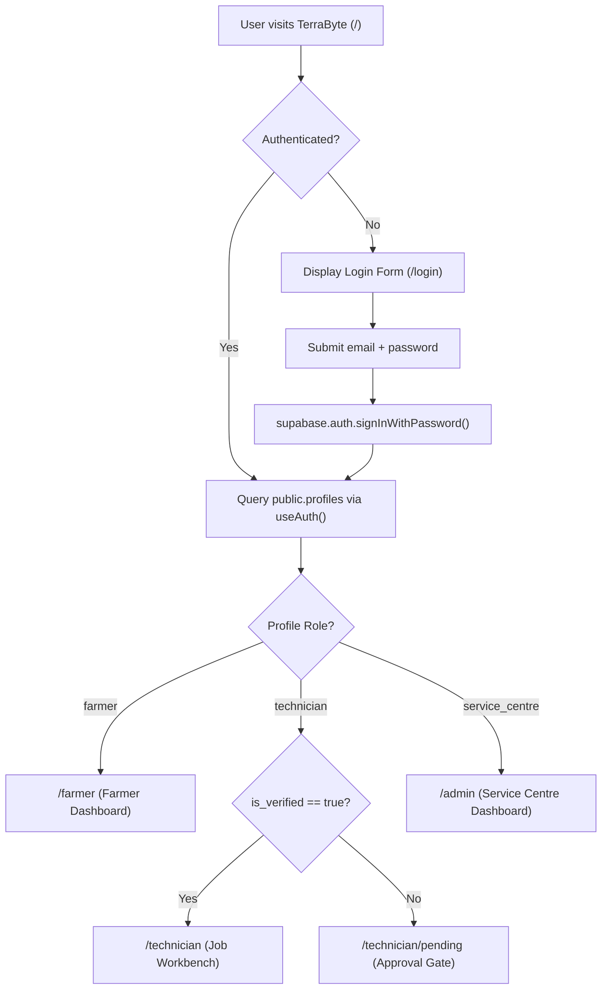
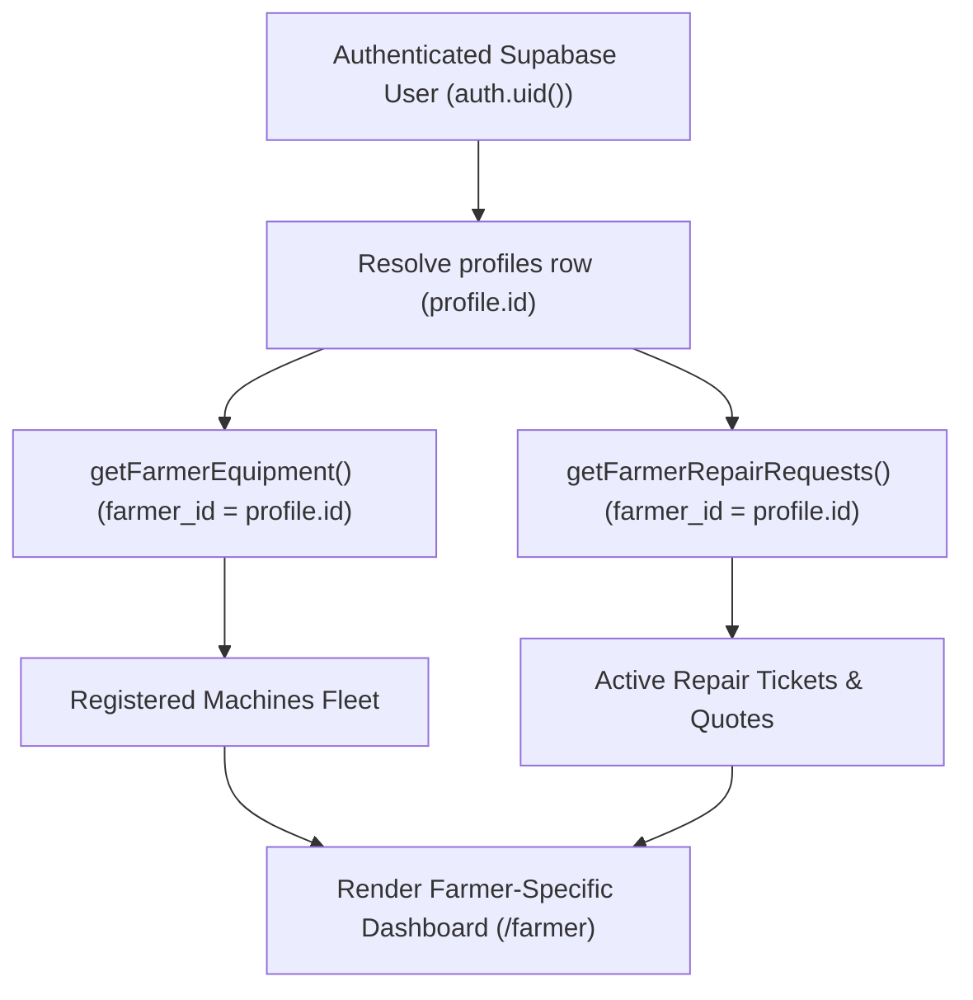
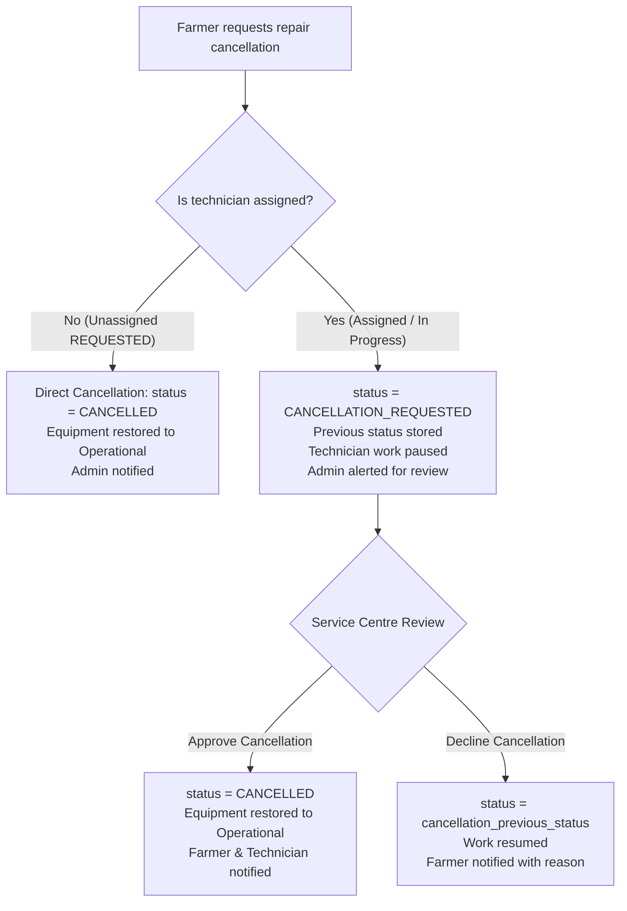
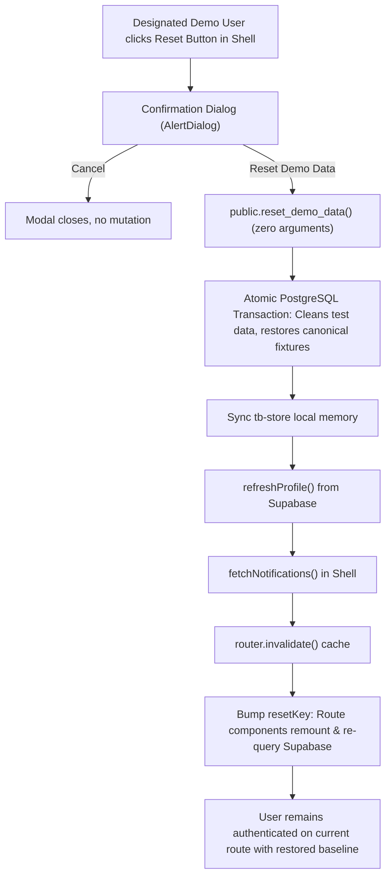

# TerraByte — Application Flow & User Journeys

## 1. Authentication & Role Resolution Architecture

TerraByte uses a unified single entry point for all users, relying on native **Supabase Auth** and database-backed profile resolution:



### 1.1 Real vs Demo Identity Presentation
1. **Explicit Identity Detection**:
   - The system checks whether the authenticated user's email strictly matches one of the 5 canonical demo evaluation personas (`isDesignatedDemoAccount(email)`):
     - `farmer.nagpur@terrabyte.demo` (Balasaheb Patil)
     - `farmer2.nagpur@terrabyte.demo` (Suresh Jadhav)
     - `farmer3.nagpur@terrabyte.demo` (Anil Pawar)
     - `tech.nagpur@terrabyte.demo` (Ramesh Kumar)
     - `admin.nagpur@terrabyte.demo` (Nagpur Service Centre)
2. **Badge Presentation (`DemoTag`)**:
   - **Canonical Demo Accounts**: Render the `"DEMO DATA"` badge in the dashboard header.
   - **Real Users (e.g. Ankit Chamke)**: `DemoTag` returns `null`. Real users NEVER see `"DEMO DATA"` anywhere in the interface.
3. **Reset Demo Visibility**:
   - The `RotateCcw` reset button in the Shell header is strictly visible only to authenticated users belonging to the 5 canonical demo accounts. Real users never see this button or dialog.

---

## 2. Farmer User Journey

### 2.1 Live Data Resolution Architecture

The Farmer experience is strictly scoped to the authenticated caller's identity:



1. **Authentication & Identity**: Caller signs in $\rightarrow$ `useAuth()` resolves `public.profiles` for `auth.uid()`, determining the unique `profile.id`. In-flight promise deduplication ensures `loadProfile()` runs only once during initial mount.
2. **Concurrent Independent Fetching**: Once `profile.id` is available, `getFarmerEquipment(profile.id)` and `getFarmerRepairRequests(profile.id, { activeOnly: true })` load in parallel without waterfall latency or redundant profile lookups.
3. **Equipment Scoping**: `getFarmerEquipment()` queries `public.equipment` filtered strictly by `.eq("farmer_id", profile.id)`.
4. **Repair Requests Scoping & Status Filtering**:
   - `getFarmerRepairRequests()` queries `public.repair_requests` filtered strictly by `.eq("farmer_id", profile.id)` and `.not("status", "in", '("COMPLETED","CANCELLED")')`.
   - **Active vs. Completed Filtering**: The home dashboard prioritizes genuinely active repairs and genuine pending farmer actions (`QUOTE_PENDING`, `QUOTE_REVISED`, and unassigned requested repairs).
   - **Service History Flow**: Completed repairs whose handover is confirmed and committed to `service_history` do not clutter the home page active stack. They flow to Service History (`/farmer/equipment`), machine logbooks (`/farmer/equipment/$id`), and direct repair links.
5. **Dashboard Rendering**: Displays solely the caller's active repair cards (e.g. `TB-8841` for Balasaheb Patil, `TB-8902` for Suresh Jadhav, `TB-8898` for Anil Pawar, or 0 active repairs for newly onboarded farmers) and their registered fleet. No mock data, first-row fallbacks, or historical completed repairs override this view.

### 2.2 Reporting an Equipment Breakdown & Technician Request Flow
1. From `/farmer`, farmer taps **"Report Equipment Breakdown"** $\rightarrow$ opens `/farmer/report-breakdown`.
2. **Step 1: Machine Selection**: Chooses broken machine from registered fleet. Machines undergoing active repair are locked out to prevent duplicate tickets.
3. **Step 2: Symptoms & Description**:
   - Toggles visual symptom chips (e.g. *"Loss of power"*, *"Hydraulic lift failure"*, *"Black smoke"*).
   - Enters description via keyboard or 1-tap **voice typing** (Web Speech API with Indian English support).
   - Attaches field photos via camera/gallery input.
4. **Step 3: Assistive Preliminary Assessment & Breakdown Logging**:
   - Diagnostic rule engine evaluates symptoms and displays preliminary assessment card:
     - Likely affected system (e.g., *Fuel injection / filtration*).
     - Urgency rating (*Moderate to High*).
     - Suspected parts categories (*Fuel filter, Injector nozzle*).
     - Actionable immediate advice (*"Avoid operating machine under heavy load until inspected"*).
     - Disclaimer: *Assistive preliminary assessment; confirmed diagnosis made on site by technician.*
   - Ticket is inserted into Supabase (`status = 'REQUESTED'`, `technician_id = null`, timeline event: "Breakdown reported").
5. **Step 4: Action-Needed State Machine & Technician Request Dispatch**:
   - **Breakdown Reported (Technician Not Yet Requested)**:
     - Status: `REQUESTED`, `technician_id: null`.
     - Farmer Home presentation: **"Action needed"** (accent border and header banner).
     - Status pill: *"Send request to technician"*.
     - Card CTA button: *"Send request to technician"*.
     - *Crucial Semantic Rule*: The UI does **not** falsely display *"Finding Your Technician"* until the farmer has actually initiated the technician request/dispatch flow.
   - **Technician Request Initiated**:
     - From `/farmer/repair/$id`, the farmer reviews matched certified technicians and clicks **"Request Repair"** or broadcasts to the Service Centre.
     - Status pill transitions to *"Finding Your Technician"*.
   - **Technician Assigned**:
     - Once accepted by a technician (or assigned by admin), status advances to `ACCEPTED`.
     - Card displays assigned technician name (e.g., *"Ramesh Kumar"*), contact info, and ETA.

### 2.3 Monitoring Repair & Approving Quotation
1. Farmer tracks repair status via 7-step visual stepper:
   $$\text{Request Sent} \rightarrow \text{Technician Assigned} \rightarrow \text{Quote Ready} \rightarrow \text{Quote Approved} \rightarrow \text{In Progress} \rightarrow \text{Testing} \rightarrow \text{Repaired}$$
2. When technician submits a quote (`QUOTE_PENDING`):
   - Farmer inspects itemized parts table (names, part specs, unit rates, supplier origin) and labour charges.
   - Farmer taps **"Approve Quote"** (work commences) or **"Request Revision"** (technician adjusts pricing).
3. If quote revision is active (`QUOTE_REVISED`):
   - Farmer home renders ticket under **"Action needed · Revised Quote Ready"** once updated pricing is prepared.
   - Displays technician clarification notes alongside original quote items.
4. If parts are missing (`WAITING_FOR_PARTS`):
   - Displays warning pill with missing part details and updated arrival ETA.
5. When technician completes testing and finalizes repair (`COMPLETED`):
   - Machinery status is updated to `Operational`.
   - Permanent service history record is automatically generated in `service_history` bound to equipment ID.
   - Farmer receives notification: *"Repair TB-xxxx has been completed and saved to service history."*
   - Farmer repair detail displays *"Repair Complete & Saved to Service History"* with completed work notes, parts replaced, final amount, and link to permanent machine logbook.
   - Technician workbench displays *"Repair completed and recorded in equipment service history."*
   - Admin command displays *"Repair complete & saved to service history."*
   - Contradictory claims of pending handover confirmation are eliminated.

---

### 2.4 Governed Cancellation Approval Flow (Phase 5.4 Foundation)



1. **Unassigned Cancellation**:
   - Newly requested repairs without an assigned technician (`status = 'REQUESTED'`, `technician_id IS NULL`) can be cancelled directly by the farmer.
   - Status updates directly to `CANCELLED`; equipment returns to `Operational`.
2. **Governed Cancellation Requests**:
   - Assigned or in-flight repairs (`ACCEPTED`, `QUOTE_PENDING`, `QUOTE_REVISED`, `IN_PROGRESS`, `WAITING_FOR_PARTS`) cannot be cancelled unilaterally.
   - Farmer submits a cancellation request with structured reason and explanation.
   - State advances to `CANCELLATION_REQUESTED`; `cancellation_previous_status` preserves the current state.
   - Assigned technician's workbench displays a work-hold notice.
3. **Service Centre Decision**:
   - **Approval**: Admin confirms cancellation. Status moves to `CANCELLED`, machinery is marked `Operational`, farmer and technician receive notifications.
   - **Rejection**: Admin declines cancellation with an explanation. Ticket reverts to its previous status; work resumes; farmer receives notice.

---

## 3. Demo Reset Flow (Evaluation Personas Only)



1. **Access Gate**: Trigger is visible **only** to the 5 designated demo accounts (`farmer.nagpur@terrabyte.demo`, `farmer2.nagpur@terrabyte.demo`, `farmer3.nagpur@terrabyte.demo`, `tech.nagpur@terrabyte.demo`, `admin.nagpur@terrabyte.demo`).
2. **Confirmation**: Modal explains that demo equipment, repairs, quotes, and timeline return to baseline while user accounts and real user records remain unaffected.
3. **Execution**: Backend RPC executes an atomic transaction. Client refreshes profile, notifications, invalidates router cache, and remounts child route components.
4. **Result**: The current farmer's dashboard deterministically reloads their canonical baseline dataset without a full browser reload.

---

## 4. Field Technician User Journey

1. **Workbench Feed (`/technician/`)**: Queries assigned jobs and unassigned requests matching technician specialization.
2. **Job Execution (`/technician/job/$id`)**:
   - Accepts job, specifying arrival ETA.
   - Performs on-site diagnostics and submits itemized quotes.
   - Puts job on `WAITING_FOR_PARTS` when components are held at taluka distributors.
   - Conducts field load testing and records permanent maintenance notes before completing ticket.
3. **Profile & Availability**: Toggles live availability switch and maintains verified workshop credentials.

---

## 5. Service Centre Operations (Nagpur Central Command)

1. **Operations Queue (`/admin/`)**:
   - Central command monitoring repair pipeline in Nagpur District (`NAGPUR DISTRICT · LIVE`).
   - Tracks SLA exceptions (unassigned >20 min, overdue quotes, parts delays).
   - Monitors technician workload across registered Nagpur workshops.
2. **Dispatch & Assignment (`/admin/repair/$id`)**:
   - Reviews incoming breakdown tickets.
   - Matches and assigns jobs to verified technicians based on proximity and expertise.
3. **Technician Verification (`/admin/technicians`)**:
   - Reviews and approves or revokes technician workshop accounts.

---

## 6. Repair Lifecycle & Governed Cancellation State Machine

```
[1. REQUESTED (Unassigned)] ───────────────────────────────► [CANCELLED] (Direct Farmer Cancellation)
      │
      ▼ (Assigned)
[1b. REQUESTED (Assigned)] ──┐
      │                      │
      ▼                      │
[2. ACCEPTED] ───────────────┤
      │                      │
      ▼                      │
[3. QUOTE_PENDING] ◄────┐    │
      │                 │    ├─► [CANCELLATION_REQUESTED] (Farmer Requests Cancellation)
      ├─► [QUOTE_REVISED] ┘  │          │
      ▼                      │          ├─► [CANCELLED] (Admin Approves; Equipment -> Operational)
[4. IN_PROGRESS] ────────────┤          │
      │                      │          └─► [Previous Status] (Admin Rejects; Work Resumes)
      ├─► [WAITING_FOR_PARTS]┤
      │          │           │
      │◄─────────┘           │
      ▼                      │
[5. IN_PROGRESS (Testing)] ──┘
      │
      ▼
[6. COMPLETED] ──► Permanent Service Record Created & Equipment Operational
```

---

## 7. Notification & Session Lifecycle

```mermaid
sequenceDiagram
    autonumber
    actor User as User A
    participant Shell as Shell Header (tb.tsx)
    participant Channel as Supabase Realtime
    participant DB as PostgreSQL public.notifications

    User->>Shell: Authenticates (userId = A)
    Shell->>DB: getNotificationsForCurrentUser({ limit: 25 })
    DB-->>Shell: Newest 25 notifications for A
    Shell->>Channel: Subscribes to notifications-live-A
    Note over Shell: Unread count calculated from active 25 rows

    User->>Shell: Signs out (userId = null)
    Note over Shell: IMMEDIATELY clears notifications = [], unreadCount = 0
    Shell->>Channel: Unsubscribes channel

    actor NextUser as User B
    NextUser->>Shell: Logs in (userId = B)
    Note over Shell: State cleared; no leakage of A's alerts
    Shell->>DB: getNotificationsForCurrentUser({ limit: 25 })
    DB-->>Shell: Newest 25 notifications for B
    Shell->>Channel: Subscribes to notifications-live-B
```

1. **Bounded History Ingestion**: Initial and polled notification queries fetch a maximum of 25 newest records, preventing unbounded network payload degradation.
2. **Immediate User Switch Flushing**: In-flight and local notification state is synchronously cleared when `userId` becomes null or changes, guaranteeing complete data isolation between consecutive logins in the same browser session.
3. **Throttled Toggle Ingestion**: Opening the notification popover suppresses duplicate network fetches if data was received within the preceding 5 seconds, while honoring live Supabase Realtime push events and 15-second background fallback intervals.
4. **Lifecycle Notification Triggers**:
   - **Technician Verification Approval**: When Service Centre verifies an account (`/admin/technicians`), dispatches an idempotent notification to the technician with link `/technician`.
   - **Physical Work Initiation**: When technician begins work (`startRepair`), dispatches an idempotent notification to the farmer with link `/farmer/repair/:id`.
   - **Technician Registration Triage**: When a new technician self-registers, PostgreSQL trigger `trg_notify_admin_on_technician_registration` dispatches an alert to administrators with link `/admin/technicians`.
5. **Popover Visual Hierarchy & Category Taxonomy**:
   - Notifications derive category pills (`Breakdown`, `Quote`, `Parts`, `Testing`, `Repair`, `Account`, `Assignment`, `Alert`, `Notice`) with dedicated semantic icons.
   - Unread items feature distinct background accent (`bg-primary/[0.04]`), bold typography, and an unread dot with focus ring.
   - Actionable alerts provide an explicit "View details" chevron link directing callers to the appropriate view.
6. **Realtime Scope Boundary**:
   - Realtime behavior in Phase 5.3 is strictly scoped to the existing notification channel (`postgres_changes` on `public.notifications`) and 15-second polling fallback.
   - Any broader multi-user interactive realtime/session synchronization improvements across the active application are deferred to **Phase 7 (Realtime Sync & Production Hardening)**.


