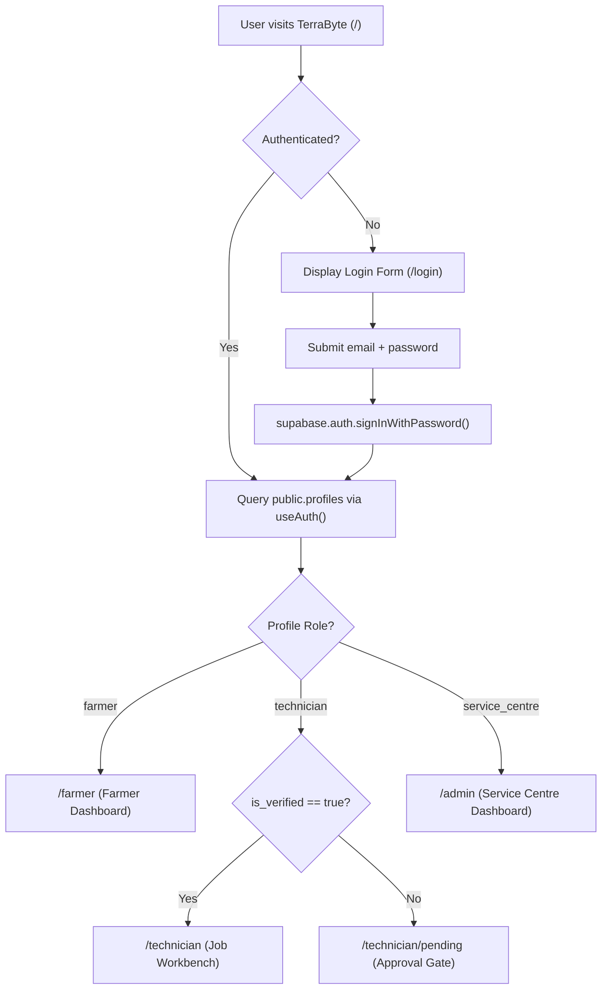
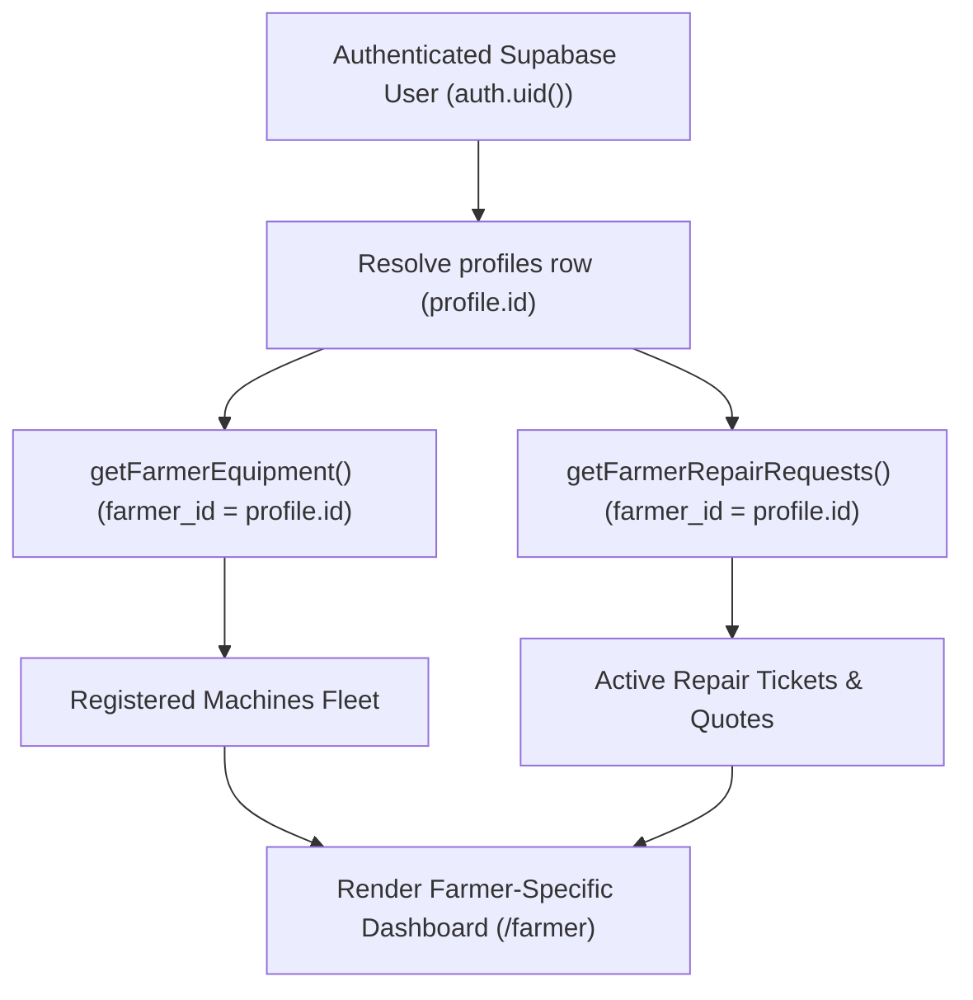
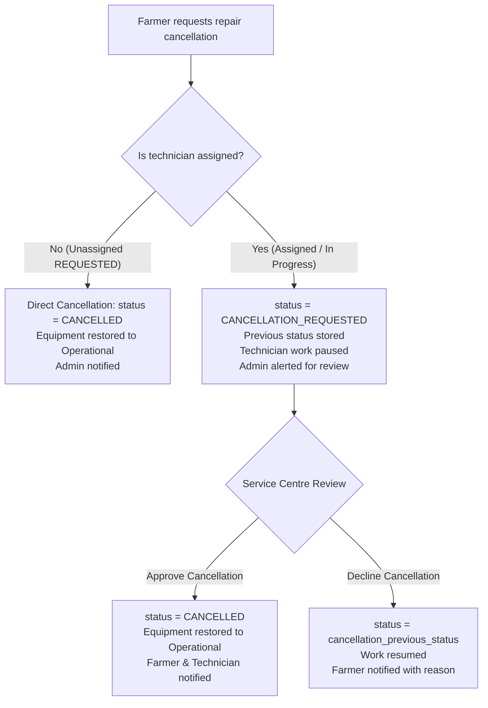
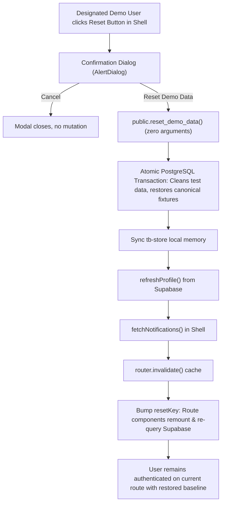
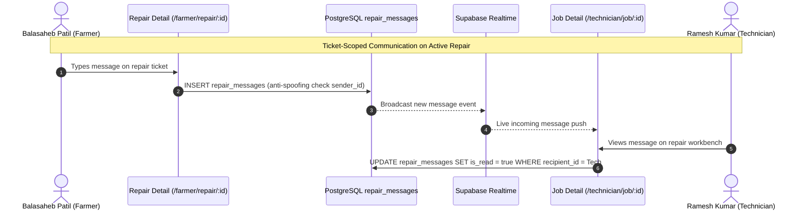
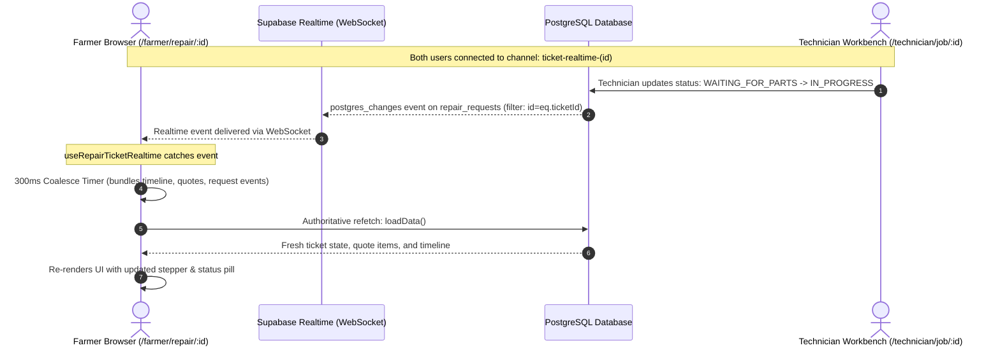

# TerraByte — Application Flow & User Journeys

## 1. Authentication & Role Resolution Architecture

TerraByte uses a unified single entry point for all users, relying on native **Supabase Auth** and database-backed profile resolution:



### 1.1 Real vs Demo Identity Presentation
1. **Explicit Identity Detection**:
   - The system checks whether the authenticated user's email strictly matches one of the 5 canonical demo evaluation personas (`isDesignatedDemoAccount(email)`):
     - `farmer.nagpur@terrabyte.demo` (Balasaheb Patil)
     - `farmer2.nagpur@terrabyte.demo` (Suresh Jadhav)
     - `farmer3.nagpur@terrabyte.demo` (Anil Pawar)
     - `tech.nagpur@terrabyte.demo` (Ramesh Kumar)
     - `admin.nagpur@terrabyte.demo` (Nagpur Service Centre)
2. **Badge Presentation (`DemoTag`)**:
   - **Canonical Demo Accounts**: Render the `"DEMO DATA"` badge in the dashboard header.
   - **Real Users (e.g. Ankit Chamke)**: `DemoTag` returns `null`. Real users NEVER see `"DEMO DATA"` anywhere in the interface.
3. **Reset Demo Visibility**:
   - The `RotateCcw` reset button in the Shell header is strictly visible only to authenticated users belonging to the 5 canonical demo accounts. Real users never see this button or dialog.

---

## 2. Farmer User Journey

### 2.1 Live Data Resolution Architecture

The Farmer experience is strictly scoped to the authenticated caller's identity:



1. **Authentication & Identity**: Caller signs in $\rightarrow$ `useAuth()` resolves `public.profiles` for `auth.uid()`, determining the unique `profile.id`. In-flight promise deduplication ensures `loadProfile()` runs only once during initial mount.
2. **Concurrent Independent Fetching**: Once `profile.id` is available, `getFarmerEquipment(profile.id)` and `getFarmerRepairRequests(profile.id, { activeOnly: true })` load in parallel without waterfall latency or redundant profile lookups.
3. **Equipment Scoping**: `getFarmerEquipment()` queries `public.equipment` filtered strictly by `.eq("farmer_id", profile.id)`.
4. **Repair Requests Scoping & Status Filtering**:
   - `getFarmerRepairRequests()` queries `public.repair_requests` filtered strictly by `.eq("farmer_id", profile.id)` and `.not("status", "in", '("COMPLETED","CANCELLED")')`.
   - **Active vs. Completed Filtering**: The home dashboard prioritizes genuinely active repairs and genuine pending farmer actions (`QUOTE_PENDING`, `QUOTE_REVISED`, and unassigned requested repairs).
   - **Service History Flow**: Completed repairs whose handover is confirmed and committed to `service_history` do not clutter the home page active stack. They flow to Service History (`/farmer/equipment`), machine logbooks (`/farmer/equipment/$id`), and direct repair links.
5. **Dashboard Rendering**: Displays solely the caller's active repair cards (e.g. `TB-8841` for Balasaheb Patil, `TB-8902` for Suresh Jadhav, `TB-8898` for Anil Pawar, or 0 active repairs for newly onboarded farmers) and their registered fleet. No mock data, first-row fallbacks, or historical completed repairs override this view.

### 2.2 Reporting an Equipment Breakdown & Technician Request Flow
1. From `/farmer`, farmer taps **"Report Equipment Breakdown"** $\rightarrow$ opens `/farmer/report-breakdown`.
2. **Step 1: Machine Selection**: Chooses broken machine from registered fleet. Machines undergoing active repair are locked out to prevent duplicate tickets.
3. **Step 2: Symptoms & Description**:
   - Toggles visual symptom chips (e.g. *"Loss of power"*, *"Hydraulic lift failure"*, *"Black smoke"*).
   - Enters description via keyboard or 1-tap **voice typing** (Web Speech API with Indian English support).
   - Attaches field photos via camera/gallery input.
4. **Step 3: Assistive Preliminary Assessment & Breakdown Logging**:
   - Diagnostic rule engine evaluates symptoms and displays preliminary assessment card:
     - Likely affected system (e.g., *Fuel injection / filtration*).
     - Urgency rating (*Moderate to High*).
     - Suspected parts categories (*Fuel filter, Injector nozzle*).
     - Actionable immediate advice (*"Avoid operating machine under heavy load until inspected"*).
     - Disclaimer: *Assistive preliminary assessment; confirmed diagnosis made on site by technician.*
   - Ticket is inserted into Supabase (`status = 'REQUESTED'`, `technician_id = null`, timeline event: "Breakdown reported").
5. **Step 4: Action-Needed State Machine & Technician Request Dispatch**:
   - **Breakdown Reported (Technician Not Yet Requested)**:
     - Status: `REQUESTED`, `technician_id: null`.
     - Farmer Home presentation: **"Action needed"** (accent border and header banner).
     - Status pill: *"Send request to technician"*.
     - Card CTA button: *"Send request to technician"*.
     - *Crucial Semantic Rule*: The UI does **not** falsely display *"Finding Your Technician"* until the farmer has actually initiated the technician request/dispatch flow.
   - **Technician Request Initiated**:
     - From `/farmer/repair/$id`, the farmer reviews matched certified technicians and clicks **"Request Repair"** or broadcasts to the Service Centre.
     - Status pill transitions to *"Finding Your Technician"*.
   - **Technician Assigned**:
     - Once accepted by a technician (or assigned by admin), status advances to `ACCEPTED`.
     - Card displays assigned technician name (e.g., *"Ramesh Kumar"*), contact info, and ETA.

### 2.3 Monitoring Repair & Approving Quotation
1. Farmer tracks repair status via 7-step visual stepper:
   $$\text{Request Sent} \rightarrow \text{Technician Assigned} \rightarrow \text{Quote Ready} \rightarrow \text{Quote Approved} \rightarrow \text{In Progress} \rightarrow \text{Testing} \rightarrow \text{Repaired}$$
2. When technician submits a quote (`QUOTE_PENDING`):
   - Farmer inspects itemized parts table (names, part specs, unit rates, supplier origin) and labour charges.
   - Farmer taps **"Approve Quote"** (work commences) or **"Request Revision"** (technician adjusts pricing).
3. If quote revision is active (`QUOTE_REVISED`):
   - Farmer home renders ticket under **"Action needed · Revised Quote Ready"** once updated pricing is prepared.
   - Displays technician clarification notes alongside original quote items.
4. If parts are missing (`WAITING_FOR_PARTS`):
   - Displays warning pill with missing part details and updated arrival ETA.
5. When technician completes testing and finalizes repair (`COMPLETED`):
   - Technician performs final test run under operational load and taps **"Complete & sign off"**.
   - Machinery status is updated to `Operational`.
   - Permanent service history record is automatically generated in `service_history` bound to equipment ID (idempotent; 0 duplicates).
   - Farmer receives notification: *"Repair TB-xxxx has been completed and saved to service history."*
   - Service Centre admin receives actionable notification: *"Repair TB-xxxx completed & verified by technician. Ready for review."* (category `Repair`, link `/admin/repair/:id`).
   - Farmer repair detail displays *"Repair Complete & Saved to Service History"* with completed work notes, parts replaced, final amount, and link to permanent machine logbook.
   - Technician workbench displays *"Repair completed and recorded in equipment service history."* with no further operational actions offered.
   - Admin workbench displays **Completion Details** card and hides reassignment actions.
   - Contradictory claims of pending handover confirmation are eliminated.

---

### 2.4 Governed Cancellation Approval Flow (Phase 5.4 Foundation)



1. **Unassigned Direct Cancellation**:
   - Newly requested repairs without an assigned technician (`status = 'REQUESTED'`, `technician_id IS NULL`) display the bottom action `"Cancel request"`.
   - Clicking opens the accessible Radix `Dialog` detailing that cancellation is immediate.
   - Farmer selects a structured reason from `CANCELLATION_REASONS` (e.g., *"Repaired locally / alternative arrangement"*, *"Cost / quote concerns"*, *"Delay / timing constraints"*, *"Machine no longer needed"*, *"Other"*) with optional context notes.
   - Confirming calls `cancelRepairRequest()`, restores equipment to `Operational`, shows a success toast, and navigates back to `/farmer`.
2. **Governed Cancellation Requests**:
   - Assigned or in-flight repairs (`REQUESTED` + assigned, `ACCEPTED`, `QUOTE_PENDING`, `QUOTE_REVISED`, `IN_PROGRESS`, `WAITING_FOR_PARTS`) display `"Request cancellation"`.
   - Clicking opens the Radix `Dialog` explaining that the request is placed under Service Centre review and pauses the repair.
   - Farmer selects a structured reason and optional explanation.
   - Confirming calls `requestCancellation()`, transitions status to `CANCELLATION_REQUESTED`, snapshots `cancellation_previous_status`, displays a confirmation toast, and reloads the ticket in-place.
3. **Farmer Status Banners & Controls**:
   - **Under Review (`CANCELLATION_REQUESTED`)**: Renders a top holding banner (*"Cancellation Request Under Review"*) displaying the submitted reason, note, timestamp, and hold explanation. The bottom cancellation action is hidden, and `Stepper` indicates `"Cancellation Pending Review"` with a warning pulse on the active step.
   - **Cancelled (`CANCELLED`)**: Renders a closed banner (*"Repair Cancelled"*) showing the cancellation reason, note, Service Centre resolution remarks, and a link to the machine record. Conflicting actions (such as calling the technician) are suppressed.
4. **Service Centre Review & Operations Pipeline (`/admin`)**:
   - **Alert Banner & Quick Links**: When tickets are in `CANCELLATION_REQUESTED`, the Operations dashboard renders a prominent amber alert banner listing all pending tickets with job number, farmer name, reason, and quick-link chips directly opening the review workbench.
   - **Pipeline Filter**: The operations table includes a dedicated `"Cancellation Requests"` tab filter alongside visual amber pulse indicators and a `"Review"` CTA button on affected rows.
   - **Review Workbench (`/admin/repair/:id`)**: Accessed via dashboard quick-links or notification alerts. Renders a dedicated **Cancellation Review Card** detailing ticket ID, farmer name, equipment details, previous status snapshot, reason, note, timestamp, assigned technician, and work-hold status.
   - **Approval Flow**: Admin clicks **"Approve cancellation"**, opening a confirmation dialog explaining that the ticket will be permanently cancelled, the assigned technician and farmer will be notified, and equipment will be restored to `Operational`. Admin may include optional remarks (`cancellation_admin_response`). Submitting invokes `approveCancellation()`.
   - **Decline Flow**: Admin clicks **"Decline cancellation"**, opening a confirmation dialog explaining that the ticket will revert to `cancellation_previous_status` and repair work will resume. Admin must provide a non-empty explanation (`adminResponse`). Submitting invokes `rejectCancellation()`.
   - **Post-Resolution States**:
     - On `CANCELLED` tickets, renders a closed status banner displaying the administrative resolution remarks.
     - On tickets where cancellation was declined and work resumed, displays an informational notice documenting the decline reason and timestamp for audit transparency.
     - Activity log chronologically records farmer cancellation requests and admin approval/rejection decisions.
5. **Technician Work-Hold & Awareness Journey (`/technician`)**:
   - **Dashboard Isolation & Dedicated Sections (`/technician/`)**:
     - Jobs in `CANCELLATION_REQUESTED` are partitioned out of `Active jobs` to eliminate accidental work progression.
     - Displayed in a dedicated **`On hold · Cancellation pending (N)`** section styled with an amber border, warning badge, animated pulse dot, reason preview, and explicit notice that work is paused awaiting Service Centre review.
     - Jobs in `CANCELLED` appear in a dedicated **`Cancelled (N)`** section with muted styling, retaining visibility of closed/cancelled jobs for technician audit and record-keeping.
   - **Job Detail Work-Hold Banner (`/technician/job/:id`)**:
     - When viewing a job in `CANCELLATION_REQUESTED`, a prominent **Cancellation Request Under Review** work-hold banner is rendered with job number, farmer name, equipment model, cancellation reason, farmer note, timestamp, previous status snapshot, and clear instructions: *"The farmer has requested cancellation for this repair. All diagnostic and repair work is on hold pending review by the Service Centre. Please do not proceed with repairs, parts procurement, or testing until a decision is made."*
     - All active progression actions (quote submission/revision, start repair, parts hold, testing, complete repair) are strictly suppressed while on hold.
     - Prior quotation and parts-hold context cards are preserved in read-only mode so existing diagnostic and parts context remains visible without mutation capability.
     - Outbound farmer communication (`CallButton`) remains available during work-hold for coordination.
   - **Approved Cancellation (Closed State)**:
     - When approved by admin, the ticket transitions to `CANCELLED`.
     - Displays a **Repair Cancelled** closed banner with cancellation reason, farmer note, and admin resolution remarks.
     - Outbound call CTA is suppressed on cancelled tickets.
     - Technician assignment guard permits viewing cancelled historical jobs.
   - **Rejected Cancellation (Work Resumed)**:
     - When rejected by admin, the ticket returns to `cancellation_previous_status`.
     - Displays a **Cancellation Request Declined · Work Resumed** notice with the admin's mandatory justification.
     - Full operational controls corresponding to the restored status are automatically re-enabled for the technician.

---

## 3. Demo Reset Flow (Evaluation Personas Only)



1. **Access Gate**: Trigger is visible **only** to the 5 designated demo accounts (`farmer.nagpur@terrabyte.demo`, `farmer2.nagpur@terrabyte.demo`, `farmer3.nagpur@terrabyte.demo`, `tech.nagpur@terrabyte.demo`, `admin.nagpur@terrabyte.demo`).
2. **Confirmation**: Modal explains that demo equipment, repairs, quotes, and timeline return to baseline while user accounts and real user records remain unaffected.
3. **Execution**: Backend RPC executes an atomic transaction. Client refreshes profile, notifications, invalidates router cache, and remounts child route components.
4. **Result**: The current farmer's dashboard deterministically reloads their canonical baseline dataset without a full browser reload.

---

## 4. Field Technician User Journey

1. **Workbench Feed (`/technician/`)**: Queries assigned jobs and unassigned requests matching technician specialization.
2. **Job Execution (`/technician/job/$id`)**:
   - Accepts job, specifying arrival ETA.
   - Performs on-site diagnostics and submits itemized quotes.
   - Puts job on `WAITING_FOR_PARTS` when components are held at taluka distributors.
   - Respects governed work-hold states (`CANCELLATION_REQUESTED`) with locked progression controls when farmer requests cancellation.
    - Conducts field load testing under operational load and taps "Complete & sign off" with final notes to finalize repair, create permanent service record, and restore equipment to Operational.
3. **Profile & Availability**: Toggles live availability switch and maintains verified workshop credentials.

---

## 5. Service Centre Operations (Nagpur Central Command)

1. **Operations Queue (`/admin/`)**:
   - Central command monitoring repair pipeline in Nagpur District (`NAGPUR DISTRICT · LIVE`).
   - Tracks SLA exceptions (unassigned >20 min, overdue quotes, parts delays, quote revisions awaiting technician).
   - Dedicated filter tabs: `"All"`, `"Assigned"`, `"Quotes"`, `"In Progress"`, `"Cancellation Requests"`, `"Completed"`, and `"Cancelled"`.
   - Excludes closed repairs (`COMPLETED`, `CANCELLED`) from the active operational queue and metrics while ensuring fast discoverability and one-click access via dedicated tabs.
   - Monitors technician workload across registered Nagpur workshops.
2. **Dispatch & Assignment (`/admin/repair/$id`)**:
   - Reviews incoming breakdown tickets.
   - Matches and assigns jobs to verified technicians based on proximity and expertise.
   - When viewing completed tickets (`COMPLETED`): renders dedicated **Completion Details** card (completion timestamp, testing status, technician notes, equipment status) and suppresses reassignment actions.
   - When viewing cancelled tickets (`CANCELLED`): suppresses reassignment actions and renders cancellation resolution notes.
3. **Technician Verification (`/admin/technicians`)**:
   - Reviews and approves or revokes technician workshop accounts.

---

## 6. Repair Lifecycle & Governed Cancellation State Machine

```
[1. REQUESTED (Unassigned)] ───────────────────────────────► [CANCELLED] (Direct Farmer Cancellation)
      │
      ▼ (Assigned)
[1b. REQUESTED (Assigned)] ──┐
      │                      │
      ▼                      │
[2. ACCEPTED] ───────────────┤
      │                      │
      ▼                      │
[3. QUOTE_PENDING] ◄────┐    │
      │                 │    ├─► [CANCELLATION_REQUESTED] (Farmer Requests Cancellation)
      ├─► [QUOTE_REVISED] ┘  │          │
      ▼                      │          ├─► [CANCELLED] (Admin Approves; Equipment -> Operational)
[4. IN_PROGRESS] ────────────┤          │
      │                      │          └─► [Previous Status] (Admin Rejects; Work Resumes)
      ├─► [WAITING_FOR_PARTS]┤
      │          │           │
      │◄─────────┘           │
      ▼                      │
[5. IN_PROGRESS (Testing)] ──┘
      │
      ▼ (Technician "Complete & sign off")
[6. COMPLETED] ──► Permanent Service Record Created, Equipment Operational, Farmer & Admin Notified
```

---

## 7. Notification & Session Lifecycle

```mermaid
sequenceDiagram
    autonumber
    actor User as User A
    participant Shell as Shell Header (tb.tsx)
    participant Channel as Supabase Realtime
    participant DB as PostgreSQL public.notifications

    User->>Shell: Authenticates (userId = A)
    Shell->>DB: getNotificationsForCurrentUser({ limit: 25 })
    DB-->>Shell: Newest 25 notifications for A
    Shell->>Channel: Subscribes to notifications-live-A
    Note over Shell: Unread count calculated from active 25 rows

    User->>Shell: Signs out (userId = null)
    Note over Shell: IMMEDIATELY clears notifications = [], unreadCount = 0
    Shell->>Channel: Unsubscribes channel

    actor NextUser as User B
    NextUser->>Shell: Logs in (userId = B)
    Note over Shell: State cleared; no leakage of A's alerts
    Shell->>DB: getNotificationsForCurrentUser({ limit: 25 })
    DB-->>Shell: Newest 25 notifications for B
    Shell->>Channel: Subscribes to notifications-live-B
```

1. **Bounded History Ingestion**: Initial and polled notification queries fetch a maximum of 25 newest records, preventing unbounded network payload degradation.
2. **Immediate User Switch Flushing**: In-flight and local notification state is synchronously cleared when `userId` becomes null or changes, guaranteeing complete data isolation between consecutive logins in the same browser session.
3. **Throttled Toggle Ingestion**: Opening the notification popover suppresses duplicate network fetches if data was received within the preceding 5 seconds, while honoring live Supabase Realtime push events and 15-second background fallback intervals.
4. **Lifecycle Notification Triggers**:
   - **Technician Verification Approval**: When Service Centre verifies an account (`/admin/technicians`), dispatches an idempotent notification to the technician with link `/technician`.
   - **Physical Work Initiation**: When technician begins work (`startRepair`), dispatches an idempotent notification to the farmer with link `/farmer/repair/:id`.
   - **Technician Registration Triage**: When a new technician self-registers, PostgreSQL trigger `trg_notify_admin_on_technician_registration` dispatches an alert to administrators with link `/admin/technicians`.
5. **Popover Visual Hierarchy & Category Taxonomy**:
   - Notifications derive category pills (`Breakdown`, `Quote`, `Parts`, `Testing`, `Repair`, `Account`, `Assignment`, `Alert`, `Notice`) with dedicated semantic icons.
   - Unread items feature distinct background accent (`bg-primary/[0.04]`), bold typography, and an unread dot with focus ring.
   - Actionable alerts provide an explicit "View details" chevron link directing callers to the appropriate view.
6. **Realtime Scope Boundary**:
   - Realtime behavior in Phase 5.3 is strictly scoped to the existing notification channel (`postgres_changes` on `public.notifications`) and 15-second polling fallback.
   - Any broader multi-user interactive realtime/session synchronization improvements across the active application are deferred to **Phase 7 (Realtime Sync & Production Hardening)**.

---

## 8. Ticket-Scoped Communication & Quote Revision Lifecycle



1. **Ticket-Scoped Encapsulation**: Messages are strictly tied to a `repair_request_id`, ensuring conversations remain in context of the specific breakdown, diagnosis, parts negotiation, or schedule alignment.
2. **Access Control & Anti-Spoofing**: PostgreSQL RLS ensures only authorized ticket participants (farmer, assigned technician) and administrators can access or send messages. Senders cannot spoof identity (`sender_id = current_profile_id()`), and only the designated recipient can mark messages as read.
3. **Canonical Quote Baseline (TB-4489)**:
   - Balasaheb Patil (`f1`) holds canonical ticket `TB-4489` in `QUOTE_REVISED` status with quote clarification *"Can you finish by 3 PM instead of 6 PM?"*.
   - Quote v1 fixture in `public.reset_demo_data()` anchors baseline at ₹2,800 (Labour ₹800, Rotavator seal kit ₹1,400, Gear oil ₹600).
   - Ramesh Kumar (`t1`) formulates a revised Quote v2 addressing time and cost adjustments with full version diffing.
4. **Quote Revision & Comparison UX**:
   - `<QuoteComparison />` renders summary diffs (total, parts, labour) and itemized line differences (`+ Added`, `- Removed`, `Modified`, `Unchanged`).
   - Distinct callout boxes preserve the farmer's revision request and technician's explanation separately without overwriting historical notes.
   - When Quote v2 is submitted, farmer repairs route transitions from waiting state to "Revised quote ready for your review (v2)" with active Approve/Decline actions.
   - `<RepairChat />` enables real-time ticket discussion across farmer, technician, and admin portals.

---

## 9. Repair Completion & Service History Lifecycle (Phase 5.6)

```mermaid
sequenceDiagram
    autonumber
    actor Tech as Ramesh Kumar (Technician)
    participant TechUI as Job Workbench (/technician/job/:id)
    participant Service as repair-requests.ts (completeRepair)
    participant DB as PostgreSQL (repairs, equipment, service_history, notifs)
    participant FarmerUI as Farmer Repair (/farmer/repair/:id)
    participant AdminUI as Admin Workbench (/admin/repair/:id)

    Tech->>TechUI: Completes physical repair and testing under operational load
    Tech->>TechUI: Taps "Complete & sign off", enters final repair notes
    TechUI->>Service: completeRepair(id, { notes, tested: true })
    Service->>DB: UPDATE repair_requests SET status = 'COMPLETED', is_testing = false, completion_details = {...}
    Service->>DB: UPDATE equipment SET status = 'Operational'
    Service->>DB: INSERT service_history (INV-TB-xxxx, parts, labour, invoice) [Idempotent]
    Service->>DB: INSERT notifications (Farmer: "Repair TB-xxxx completed and saved to service history.")
    Service->>DB: INSERT notifications (Admin: "Repair TB-xxxx completed & verified by technician. Ready for review.")
    DB-->>FarmerUI: Live/polled update: "Repair Complete & Saved to Service History"
    DB-->>AdminUI: Live/polled update: Completion Details card rendered; reassignment hidden
```

1. **Deterministic Immediate Completion**: Technician sign-off transitions ticket directly from `IN_PROGRESS` (testing) to `COMPLETED`. No intermediate `HANDOVER_PENDING` state exists.
2. **Permanent Service Record Commitment**: `createServiceHistoryFromRepair()` idempotently generates an immutable maintenance entry linked to the equipment asset, preventing duplication.
3. **Multi-Party Notification**: Both the equipment owner (farmer) and Service Centre dispatchers receive immediate completion notifications.
4. **Closed-State Governance**: Completed and cancelled tickets are cleanly isolated into dedicated dashboard tabs on `/admin`, keeping the active operations queue focused while retaining 1-click access to closed job records. Reassignment controls are hidden on closed tickets.

---

## 10. Multi-User Realtime Synchronization Flow (Phase 7)



1. **Lightweight Invalidation Signals**: Realtime events carry table change signals rather than full application payloads. Authoritative refetching is delegated to the caller's existing loader function to eliminate state synchronization drift.
2. **Burst Coalescing**: Rapid multi-row database mutations (e.g., ticket status change + timeline insert + quote update) trigger a single coalesced refetch via a 300ms debounce timer.
3. **Ticket & List Scoping**: Subscriptions are strictly isolated by ticket UUID (`ticket-realtime-<uuid>`) or user role list channel (`farmer-repairs-<farmerId>`, `admin-pipeline-repairs`), preventing cross-ticket or cross-user socket flooding.
4. **Window Focus Recovery**: In addition to websocket events, window focus listeners ensure that browser tabs running in the background automatically re-sync when brought to the foreground.
