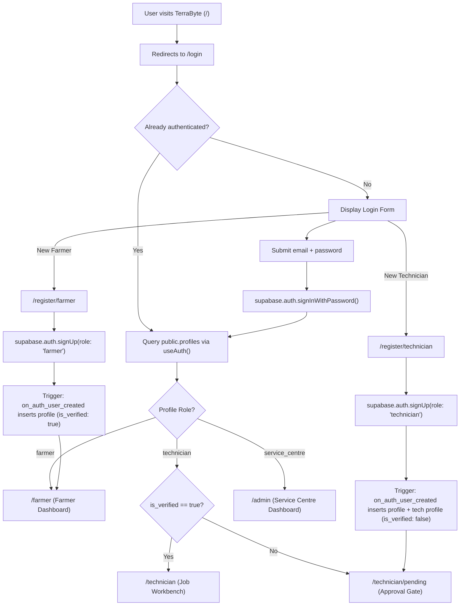

# TerraByte — Application Flow & User Journeys

## 1. Authentication & Role Resolution Architecture

TerraByte uses a unified single entry point for all users, relying on native **Supabase Auth** and database-backed profile resolution:



### Flow Classification: Live vs. Local Store

| Journey / Screen | Architecture Type | Data Source |
| :--- | :--- | :--- |
| **Authentication (`/login`, `/register/*`)** | **LIVE SUPABASE** | `auth.users`, `public.profiles`, `public.technician_profiles` |
| **Technician Pending Gate (`/technician/pending`)** | **LIVE SUPABASE** | Polling `public.profiles.is_verified` via `refreshProfile()` |
| **Admin Technician Approval (`/admin/technicians`)** | **LIVE SUPABASE** | Query and mutation on `public.profiles` (`is_verified`) |
| **Farmer Dashboard (`/farmer/`)** | **MOCK / LOCAL** | In-memory/localStorage store (`src/lib/tb-store.ts`) |
| **Breakdown Reporting (`/farmer/report-breakdown`)**| **MOCK / LOCAL** | In-memory/localStorage store (`src/lib/tb-store.ts`) |
| **Equipment Profile (`/farmer/equipment/*`)** | **MOCK / LOCAL** | In-memory/localStorage store (`src/lib/tb-store.ts`) |
| **Repair Tracking (`/farmer/repair/$id`)** | **MOCK / LOCAL** | In-memory/localStorage store (`src/lib/tb-store.ts`) |
| **Technician Workbench (`/technician/`)** | **MOCK / LOCAL** | In-memory/localStorage store (`src/lib/tb-store.ts`) |
| **Job Execution & Quotes (`/technician/job/$id`)** | **MOCK / LOCAL** | In-memory/localStorage store (`src/lib/tb-store.ts`) |
| **Service Centre Operations (`/admin/`)** | **MOCK / LOCAL** | In-memory/localStorage store (`src/lib/tb-store.ts`) |

---

## 2. Farmer User Journey

### 2.1 Registration & Onboarding (Live Supabase)
1. Farmer navigates to `/register/farmer`.
2. Fills in full name, village/area (e.g. Pimpalgaon, Nashik), phone number, email, and password.
3. Submits form $\rightarrow$ calls `supabase.auth.signUp()`.
4. Trigger `on_auth_user_created` creates `public.profiles` row with `role = 'farmer'` and `is_verified = true`.
5. Farmer session is established and redirected directly to `/farmer`.

### 2.2 Reporting an Equipment Breakdown (Local Store / Phase 3 Live Target)
1. From `/farmer`, farmer taps **"Report Equipment Breakdown"** $\rightarrow$ opens `/farmer/report-breakdown`.
2. **Step 1: Machine Selection**: Chooses broken machine from registered fleet (e.g., *Mahindra 575 DI*). Machines currently undergoing active repair are locked out to prevent duplicate tickets.
3. **Step 2: Symptoms & Description**:
   - Toggles visual symptom chips (e.g., *"Loss of power"*, *"Black smoke"*, *"Overheating"*).
   - Enters plain-language description via keyboard or 1-tap **voice typing** (Web Speech API with `en-IN` language support).
   - Attaches field photos via camera/gallery input.
4. **Step 3: Instant Preliminary Assessment**:
   - Client diagnostic engine evaluates symptoms and displays preliminary assessment card:
     - Likely affected system (e.g., *Fuel injection / filtration*).
     - Urgency rating (*Moderate to High*).
     - Suspected parts categories (*Fuel filter, Injector nozzle*).
     - Actionable immediate advice (*"Avoid operating machine under heavy load until inspected"*).
     - Clear disclaimer: *Assistive preliminary assessment; confirmed diagnosis made on site by technician.*
5. **Step 4: Dispatch Request**:
   - Farmer confirms village location and submits request.
   - Generates unique ticket (e.g., `TB-8841`) with status `REQUESTED`.
   - Navigates immediately to `/farmer/repair/$id`.

### 2.3 Monitoring Repair & Approving Quotation (Local Store / Phase 3 Live Target)
1. Farmer tracks repair status via 7-step visual stepper:
   $$\text{Request Sent} \rightarrow \text{Technician Assigned} \rightarrow \text{Quote Ready} \rightarrow \text{Quote Approved} \rightarrow \text{In Progress} \rightarrow \text{Testing} \rightarrow \text{Repaired}$$
2. When technician submits a quote, status advances to `QUOTE_PENDING`:
   - Farmer inspects itemized parts table (names, part specs, unit rates, supplier origin) and labour charges.
   - Farmer taps **"Approve Quote"** (work commences) or **"Request Revision"** (technician adjusts pricing).
3. If parts are missing, status indicates `WAITING_FOR_PARTS`:
   - Displays prominent warning pill with exact missing part and updated arrival ETA.
4. When technician finishes testing, farmer confirms machine operation and reviews digital service log.

---

## 3. Field Technician User Journey

### 3.1 Application & Verification Gate (Live Supabase)
1. Aspiring technician visits `/register/technician`.
2. Enters full name, workshop name (e.g. *Green Earth Mobile Repairs*), service territory, phone, email, and password.
3. Submits form $\rightarrow$ calls `supabase.auth.signUp()`.
4. Trigger `on_auth_user_created` creates `public.profiles` with `role = 'technician'`, `is_verified = false`, and `public.technician_profiles` row.
5. Technician is routed to `/technician/pending`.
6. Page periodically polls or refreshes profile status. Any attempt to navigate to `/technician` is blocked by `RoleGuard` until `is_verified = true`.

### 3.2 Job Dispatch & Execution (Local Store / Phase 4 Live Target)
1. Once approved by Service Centre, technician signs in and lands on `/technician/`.
2. **Job Feed**: Views incoming requests matching workshop brand specializations and skills.
3. Taps ticket to open `/technician/job/$id`:
   - **Accepts Request**: Sets estimated arrival time (e.g., 45 minutes). Status updates to `ACCEPTED`.
   - **On-Site Inspection**: Inspects machinery, performs physical diagnostic checks.
4. **Drafting Itemized Quote**:
   - Technician adds parts from catalog or custom entries (e.g., *Bosch Nozzle Set, Qty 1 @ ₹2,200*).
   - Adds labour description and fee (e.g., *₹900*). Sets warranty and estimated completion date.
   - Submits quote $\rightarrow$ status advances to `QUOTE_PENDING`.
5. **Execution & Blocker Handling**:
   - Once farmer approves, technician starts repair (`IN_PROGRESS`).
   - If a replacement component is out of stock in mobile van inventory, technician taps **"Parts on Hold"**:
     - Enters missing part name, taluka distributor delay reason, and revised delivery time.
     - Status updates to `WAITING_FOR_PARTS` (pausing SLA clock and alerting farmer/service centre).
   - Once part arrives, technician resumes repair $\rightarrow$ status returns to `IN_PROGRESS`.
6. **Testing & Closure**:
   - Technician toggles **"Testing"** mode while test-running the engine under field load.
   - Taps **"Complete Repair"**, adds final maintenance advice, and marks job as `COMPLETED`.

---

## 4. Service Centre (Admin) User Journey

### 4.1 Technician Verification Management (Live Supabase)
1. Service Centre administrator navigates to `/admin/technicians`.
2. Inspects list of registered technicians segregated into:
   - **Pending Approval**: Displays applicant name, workshop name, service area, and phone number.
   - **Approved**: Active verified technicians taking jobs.
3. Admin clicks **"Approve Technician"**:
   - Directly executes `supabase.from('profiles').update({ is_verified: true }).eq('id', techId)`.
   - RLS policy `profiles_update_service_centre` authorizes the update.
   - Technician is instantly unblocked on their pending screen.
4. Admin can revoke access at any time by clicking **"Revoke Access"**.

### 4.2 Central Operations & Triage (Local Store / Phase 5 Live Target)
1. Lands on `/admin/`:
   - Displays real-time operational metrics: unassigned requests, active jobs in progress, repairs waiting on parts, and completed tickets.
2. **Repair Triage (`/admin/repair/$id`)**:
   - Reviews incoming breakdown tickets.
   - If an unassigned request exceeds 30 minutes, system displays high-urgency alerts.
   - Evaluates technician match recommendations (ranked by brand, skill, availability, and travel distance).
   - Manually assigns or reassigns the ticket to the optimal workshop partner.

---

## 5. 7-Step Repair Lifecycle State Machine

```
[1. REQUESTED]
      │
      ▼
[2. ACCEPTED]
      │
      ▼
[3. QUOTE_PENDING] ◄────────┐
      │                     │ (Technician revises)
      ├─► [QUOTE_REVISED] ──┘
      ▼
[4. IN_PROGRESS]
      │
      ├─► [WAITING_FOR_PARTS] (Parts blocker)
      │          │
      │◄─────────┘ (Part arrives)
      ▼
[5. IN_PROGRESS (Testing)]
      │
      ▼
[6. COMPLETED]
      │
      ▼
[7. VERIFIED] ──► Permanent Service Record Created
```
