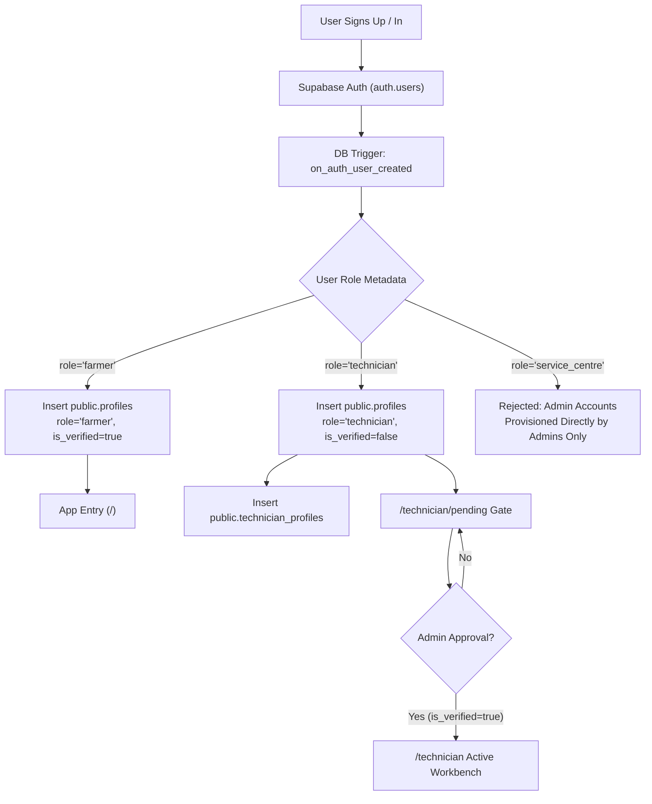
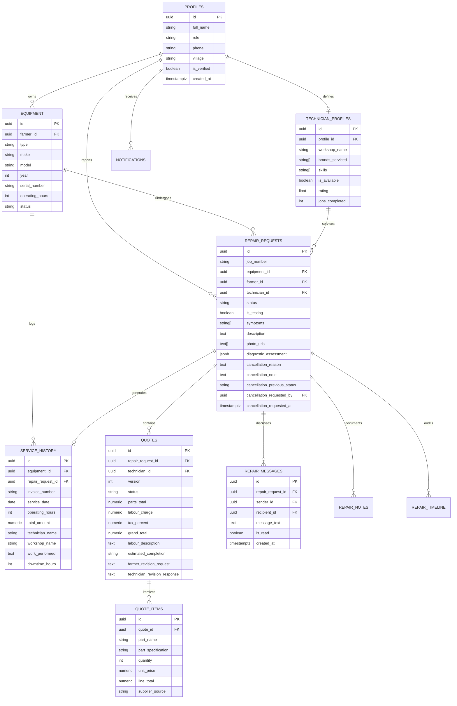
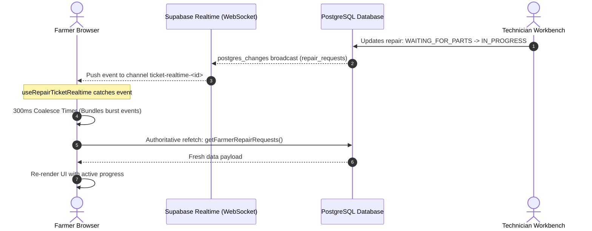

# TerraByte — System Architecture & Engineering Specification

This document details the architectural topology, data design, security posture, and lifecycle state machines powering **TerraByte** for the **Nagpur RISE 2026** Stage 1 submission.

---

## 1. High-Level Architecture Topology

TerraByte is architected as an integrated full-stack web application designed for high responsiveness, low-latency updates, and strict data isolation:

```mermaid
flowchart TD
    subgraph Client Tier ["Client Tier (Browser / PWA)"]
        F_UI["Farmer Interface (/farmer)"]
        T_UI["Technician Workbench (/technician)"]
        A_UI["Service Centre Command (/admin)"]
        Hooks["Domain Hooks (useRepairTicketRealtime, useRepairListRealtime)"]
        Store["Local Form State & TanStack Query Cache"]
    end

    subgraph App Server Tier ["Application Server Tier (TanStack Start / Nitro)"]
        SSR["Server-Side Rendering & Streaming"]
        Router["TanStack Router (File-Based Routes & RoleGuards)"]
        MCP["MCP Server Endpoint (/mcp via @lovable.dev/mcp-js)"]
    end

    subgraph Backend Infrastructure Tier ["Supabase Managed Cloud Tier"]
        Auth["Supabase Auth (JWT, Email/Password, Recovery)"]
        Realtime["Supabase Realtime (WebSockets / postgres_changes)"]
        
        subgraph PostgreSQL Engine ["PostgreSQL 17 Relational Engine"]
            RLS["Row Level Security (RLS Policies)"]
            Triggers["Integrity Triggers (Privilege Guard, Notifications)"]
            RPC["Secure Database RPCs (reset_demo_data, delete_user_account)"]
            Tables["Domain Tables (11 Entities)"]
        end
    end

    F_UI & T_UI & A_UI --> Router
    Router --> SSR
    F_UI & T_UI & A_UI --> Hooks
    Hooks --> Realtime
    Hooks --> Store
    Store --> Tables
    F_UI & T_UI & A_UI --> Auth
    App Server Tier --> MCP
    MCP --> Tables
    Tables --> RLS
    RLS --> Triggers
    Triggers --> RPC
```

### Architectural Principles:
1. **Database as the Sole Source of Truth**: Live PostgreSQL 17 in Supabase manages all canonical domain records. Client stores provide optimistic local feedback but never supplant authoritative database queries.
2. **Actor Privilege Separation at the Database**: Authorization is not solely enforced at the UI router; every PostgreSQL table is secured with Row Level Security (RLS) evaluating native `auth.uid()`.
3. **Reactive WebSocket Signaling with Authoritative Refetch**: Real-time websocket events serve as lightweight invalidation signals; clients coalesce rapid bursts via debouncing and execute authoritative queries to guarantee consistent state.
4. **Governed Decision Boundaries**: High-risk operations (such as cancelling in-flight repairs with dispatches underway or registering new technician workshops) mandate human-in-the-loop review by Service Centre dispatchers.

---

## 2. Identity, Authentication & Role Hierarchy



### Role Model:
- **`farmer`**: Owners of agricultural machinery. Granted permissions to register machines, report breakdowns, review/approve quotes, communicate on tickets, and inspect service history.
- **`technician`**: Field and workshop mechanics. Granted permissions to update workshop profiles, accept dispatched jobs, formulate itemized quotes, pause for parts, conduct load testing, and sign off repairs. Blocked from workbench until verified.
- **`admin` (`service_centre`)**: Central command operators. Granted permissions to triage and assign requests, verify technicians, approve cancellation requests, oversee district parts holds, and moderate ticket communications.

### Tamper-Proofing Triggers:
- **`guard_profile_privileges`**: An `AFTER UPDATE` trigger on `public.profiles` that raises an exception (`42501`) if a non-admin user attempts to alter their own `role` or `is_verified` columns.
- **`trg_notify_admin_on_technician_registration`**: An `AFTER INSERT` trigger on `public.technician_profiles` that dispatches an immediate administrative notification whenever a new mechanic registers for verification.

---

## 3. Relational Schema & Domain Data Model

The application operates across 11 core relational tables in the `public` PostgreSQL schema:



---

## 4. Row Level Security (RLS) Policy Architecture

Every table enforces PostgreSQL Row Level Security. Security boundaries are evaluated via two internal SQL helper functions:
- `public.current_profile_id()`: Returns `profiles.id` corresponding to `auth.uid()`.
- `public.current_user_role()`: Returns `profiles.role` (`farmer`, `technician`, or `admin`).

### Security Matrix by Table

| Table | Operation | Enforced Policy Rules |
| :--- | :---: | :--- |
| **`equipment`** | SELECT | Owner (`farmer_id = current_profile_id()`), assigned technician on active repair, or Service Centre Admin. |
| | INSERT | Authenticated farmer only (`farmer_id = current_profile_id()`). |
| | UPDATE | Equipment owner or Service Centre Admin. |
| | DELETE | Equipment owner ONLY if `status != 'In Repair'` (protects ongoing ticket integrity). |
| **`repair_requests`**| SELECT | Ticket farmer, assigned technician, eligible technician feed (for `REQUESTED`), or Admin. |
| | INSERT | Authenticated farmer only (`farmer_id = current_profile_id()`). |
| | UPDATE | **Split across 4 purpose-driven policies**: <br/>• Farmer: may update breakdown details; can directly cancel ONLY if unassigned; must transition active tickets via `CANCELLATION_REQUESTED`. <br/>• Technician: may accept `REQUESTED` ticket, update progression (`ACCEPTED` $\rightarrow$ `QUOTE_PENDING` $\rightarrow$ `IN_PROGRESS` $\rightarrow$ `TESTING` $\rightarrow$ `COMPLETED`), or decline. Strictly prohibited from setting `CANCELLED`. <br/>• Admin: unrestricted management, manual dispatch, and cancellation resolution. <br/>• Lock: tickets in `CANCELLATION_REQUESTED` are locked against non-admin status mutation. |
| **`quotes`** | SELECT | Farmer owning ticket, assigned technician, or Admin. |
| | INSERT | Assigned technician or Admin. Must reference valid in-flight repair. |
| | UPDATE | Assigned technician (modifying draft or building revision) or Farmer (transitioning `status` to `APPROVED` or `REVISED`). |
| **`repair_messages`**| SELECT | Ticket participants (`sender_id = current_profile_id()` OR `recipient_id = current_profile_id()`) or Admin. |
| | INSERT | Anti-spoofing check: `sender_id = current_profile_id()` AND sender is participant on `repair_request_id`. |
| | UPDATE | Recipient ONLY: allowed exclusively to update `is_read = true` (read receipts). |
| **`service_history`** | SELECT | Equipment owner, repairing technician, or Admin. |
| | INSERT | Service Centre Admin or Technician upon repair completion sign-off. |
| | UPDATE / DELETE| **BLOCKED**: Service history records are permanent, immutable ledgers. |

---

## 5. State Machine & Lifecycle Invariants

The repair process follows a deterministic state machine modeled around real-world agricultural breakdown dynamics:

```mermaid
stateDiagram-v2
    direction TB
    
    [*] --> REQUESTED: Breakdown Reported (Unassigned)
    
    REQUESTED --> CANCELLED: Farmer Cancels (Direct)
    REQUESTED --> ACCEPTED: Technician Accepts / Admin Assigns
    
    ACCEPTED --> QUOTE_PENDING: Technician Arrives & Formulates Quote
    
    QUOTE_PENDING --> QUOTE_REVISED: Farmer Requests Revision (v1)
    QUOTE_REVISED --> QUOTE_PENDING: Technician Submits Revised Quote (v2)
    
    QUOTE_PENDING --> IN_PROGRESS: Farmer Approves Quote
    
    IN_PROGRESS --> WAITING_FOR_PARTS: Spare Part Procurement Hold
    WAITING_FOR_PARTS --> IN_PROGRESS: Part Delivered, Work Resumes
    
    IN_PROGRESS --> TESTING: Mechanical Fix Complete; Field Load Testing
    TESTING --> COMPLETED: Load Verification Passes; Sign-Off
    
    ACCEPTED --> CANCELLATION_REQUESTED: Farmer Submits Cancellation
    QUOTE_PENDING --> CANCELLATION_REQUESTED: Farmer Submits Cancellation
    QUOTE_REVISED --> CANCELLATION_REQUESTED: Farmer Submits Cancellation
    IN_PROGRESS --> CANCELLATION_REQUESTED: Farmer Submits Cancellation
    WAITING_FOR_PARTS --> CANCELLATION_REQUESTED: Farmer Submits Cancellation
    
    CANCELLATION_REQUESTED --> CANCELLED: Admin Approves Cancellation
    CANCELLATION_REQUESTED --> ACCEPTED: Admin Rejects (Reverts to Previous State)
    
    COMPLETED --> [*]: Service Record Created, Equipment Operational
```

### Invariant Rules Enforced:
1. **Quotation Before Disassembly**: No ticket may transition from `ACCEPTED` directly to `IN_PROGRESS`. It must transition to `QUOTE_PENDING` and receive explicit farmer approval.
2. **Work-Hold on Cancellation Review**: While a ticket is in `CANCELLATION_REQUESTED`, technician actions (advancing status, submitting quotes, testing) are disabled in the UI and rejected by RLS.
3. **Automatic Ledger Creation**: Transitioning to `COMPLETED` requires passing testing verification and automatically generates an immutable `service_history` record with a calculated invoice number (`INV-TB-xxxx`).
4. **Equipment Availability State**: Equipment is marked `In Repair` upon breakdown creation and restored to `Operational` ONLY when all active repairs for that equipment reach `COMPLETED` or `CANCELLED`.

---

## 6. Concurrency Hardening & Mutation Safety

To handle multi-device access and race conditions (e.g., two technicians attempting to accept the same unassigned repair simultaneously, or a farmer approving a quote while a technician submits a revision):

### Optimistic Concurrency Control (OCC)
Service mutations in [`src/lib/services/repair-requests.ts`](file:///d:/Projects/TerraByte/src/lib/services/repair-requests.ts) and [`src/lib/services/quotes.ts`](file:///d:/Projects/TerraByte/src/lib/services/quotes.ts) verify row state preconditions:

```typescript
// Example: Accept repair request concurrency guard
const { data, error } = await supabase
  .from("repair_requests")
  .update({
    technician_id: techProfileId,
    status: "ACCEPTED",
  })
  .eq("id", repairId)
  .is("technician_id", null)       // Guarantees ticket has not been claimed
  .eq("status", "REQUESTED")       // Guarantees ticket is in REQUESTED status
  .select();

if (!data || data.length === 0) {
  throw new Error("Job has already been accepted by another technician or reassigned.");
}
```

---

## 7. Supabase Realtime Architecture

TerraByte uses dedicated ticket-level and list-level real-time synchronization hooks built on Supabase WebSockets:



### Key Engineering Attributes:
- **Change Signaling Only**: Real-time payloads are treated as signals, not data payloads. The client triggers an authoritative database query, preventing out-of-order partial state bugs.
- **Debounced Coalescing (300ms Window)**: When a mutation generates multiple database changes in rapid succession (e.g., `repair_requests` status change + `repair_timeline` insert + `notifications` dispatch), the client coalesces these into a single refetch.
- **Window Focus Recovery**: Reconnection listeners ensure stale tabs immediately refresh when the user brings the window back into focus.

---

## 8. Assistive Diagnostic Rules & Model Context Protocol (MCP)

### Diagnostic Intake Engine
Located in [`src/lib/assessment.ts`](file:///d:/Projects/TerraByte/src/lib/assessment.ts), the engine maps combinations of symptoms and contextual keywords to:
- Affected subsystem (Fuel injection, Hydraulics, Cooling, Transmission, Electrical, Steering/Brakes)
- Preliminary severity rating (`Low`, `Moderate`, `Moderate to High`, `High`)
- Likely parts categories required for procurement
- Urgent field safety advice (e.g., *"Do not operate under heavy load"*, *"Do NOT drive on roads until inspected"*)
- Explicit disclaimer: *"This is an assistive preliminary assessment, not a confirmed diagnosis. The technician will inspect and confirm the cause on site."*

### Model Context Protocol (MCP) Endpoint
TerraByte implements the open **Model Context Protocol** at `/mcp` via `@lovable.dev/mcp-js`, exposing tools for external LLMs, agentic inspectors, and voice assistants:
- `list_symptoms`: Returns the canonical enumeration of recognized equipment symptoms.
- `assess_breakdown`: Evaluates symptom combinations and returns structured preliminary diagnostics.
- `match_technicians`: Evaluates equipment brand, affected system, and technician database to return objectively ranked technician matches with scoring explanations.

---

## 9. Demo Data Isolation & Atomic Reset Architecture

To allow seamless evaluation during hackathons and demonstrations without polluting real data:
1. **Canonical Persona Identification**: The system detects whether the logged-in user belongs to the 5 designated demo accounts (`isDesignatedDemoAccount(email)`).
2. **Dual-Key Authorization**: The PostgreSQL RPC `public.reset_demo_data()` enforces dual-key security:
   - Caller must be an authenticated user whose email is in the designated demo set.
   - The record must have `demo_code IS NOT NULL`.
3. **Atomic Transaction**: The reset RPC resets canonical tickets (`TB-8841`, `TB-8902`, `TB-8898`, `TB-4489`) and equipment back to baseline states within a single atomic PostgreSQL transaction.
4. **Real User Isolation**: Real user records (such as accounts created by judges or farmers like Ankit Chamke) have `demo_code IS NULL` and are completely untouched by any demo reset operation.

---

## 10. Rural Network Resilience & Mobile UX Considerations

Given unpredictable 3G/4G connectivity in rural agricultural talukas:
- **Visual Feedback & Optimistic Cues**: Immediate visual state updates upon clicking actions while network queries resolve.
- **Bounded Payloads**: Active-only query filtering (`{ activeOnly: true }`) eliminates historical records from initial page loads, reducing mobile data transfer by over 90%.
- **High-Contrast Agricultural Design**: Optimized for direct sunlight usage in the field using high-contrast typography, large touch targets (min 48px), and distinct color semantics (`forestgreen`, `soil amber`, `warning crimson`).
