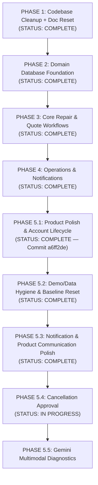

# TerraByte — Phased Implementation Plan

## Architectural Principles

1. **Strict Phased Discipline**: Build ONE phase at a time. Each phase must be verified, audited, and committed before beginning the next.
2. **Current Baseline As Source of Truth**: The active TanStack Start codebase and native Supabase Auth setup represent the permanent application baseline.
3. **No Clerk**: Clerk is permanently excluded. All identity, authorization, and database logic are built on Supabase.
4. **No Destructive Operations**: As the repository is connected to Lovable, published Git history is never rewritten (no force pushing, rebasing, or amending).
5. **Clear State Separation**: All documentation and code strictly distinguish between live Supabase data and mock/local store data. Supabase is the live source of truth.

---

## Master Roadmap

---

## Phase Breakdown

### PHASE 5.1 — Product Polish & Account Lifecycle
- **Status**: **COMPLETE** (Committed and pushed: `a6ff2de`)
- **Deliverables**:
  1. Proper Home experience with role-based dashboard shortcuts (`/farmer`, `/technician`, `/admin`).
  2. Contextual back navigation preserving state across views.
  3. Profile management (name, phone, village/workshop, brand specializations).
  4. Password management (forgot password, recovery token flow, branded reset password email template, change password).
  5. Permanent account deletion via atomic PostgreSQL RPC `public.delete_user_account()` with active-repair and demo-account protections.

---

### PHASE 5.2 — Demo / Data Hygiene & Baseline Reset
- **Status**: **COMPLETE**
- **Objective**: Implement a safe, atomic, deterministic "Reset Demo" capability for evaluation personas, isolate demo farmer data, and enforce Nagpur geography.
- **Key Deliverables Completed**:
  1. Canonical Demo Reset RPC (`public.reset_demo_data()`) with dual-key authorization (`email` in designated set + `demo_code IS NOT NULL`) and atomic fixture upsert.
  2. Dedicated client authorization service (`src/lib/services/demo.ts`) gating reset strictly to 5 demo evaluation accounts.
  3. Responsive frontend reset confirmation dialog (`AlertDialog`) with loading states and 7-step post-reset cache synchronization.
  4. Full farmer data isolation separating real users and each demo account (`farmer`, `farmer2`, `farmer3`) to their own machines and tickets.
  5. Nagpur geography synchronization across all fixtures, profiles, and repair locations.
  6. Completed-repair separation from active workspace triage; reserved "Action needed" exclusively for genuine pending actions (`QUOTE_PENDING`, `QUOTE_REVISED`, unassigned `REQUESTED`).
  7. Startup auth deduplication, session fast-path caching, and database-level active-only repair queries (`{ activeOnly: true }`).

---

### PHASE 5.3 — Notification & Product Communication Polish
- **Status**: **COMPLETE**
- **Objective**: Audit and refine notification delivery, lifecycle status communication, demo technician alert fixtures, and notification state performance across all roles.

#### Step 1 — Notification & Communication Audit
- **Status**: **COMPLETE**
- Complete end-to-end audit of notification creation, retrieval, RLS policies, unread badge calculation, real-time channels, and role-specific communication copy.

#### Step 2 — Core Notification Correctness & Safe Performance Fixes
- **Status**: **COMPLETE**
1. **Fix QUOTE_REVISED Label Conflict**:
   - Updated `FARMER_LABEL["QUOTE_REVISED"]` to `"Revised Quote Ready"` in `src/lib/tb-store.ts`.
   - Resolved contradiction with orange "Action needed" status card and quote revision notification copy.
2. **Resolve Handover / Completion Contradiction**:
   - Aligned copy across farmer view (*"Repair Complete & Saved to Service History"*), technician view (*"Repair completed and recorded in equipment service history"*), admin view (*"Repair complete & saved to service history"*), and completion notification copy (*"Repair TB-xxxx has been completed and saved to service history."*).
   - Accurately reflects that technician completion immediately auto-generates permanent service history without claiming a separate pending handover confirmation.
3. **Fix Demo Technician Notification Fixture**:
   - Reassigned seeded notification `c7fdc083-fce0-4a73-afb8-f63aa84faf2e` to Ramesh Kumar (`t1` / `00000000-0000-0000-0002-000000000001`) on repair `TB-8841` in `supabase/seed.sql`.
   - Created forward migration `supabase/migrations/20261003160000_phase5_3_demo_technician_notification_fix.sql` updating live database row and `public.reset_demo_data()` RPC.
4. **Clear Notification State on User Switch / Sign-Out**:
   - Updated `Shell` in `src/components/tb.tsx` to immediately clear notifications array, error state, and popover state when `userId` becomes null or changes before loading the next user's data.
   - Guaranteed that User A's notifications never display under User B during same-session user switching.
5. **Safe Notification Query Limiting & Duplicate Fetch Cleanup**:
   - Bounded initial and polled notification queries to `limit: 25` in `src/components/tb.tsx`, preserving newest entries.
   - Added safe SQL limit bounding (`Math.max(limit * 4, 100)`) for admin notifications in `src/lib/services/notifications.ts`.
   - Throttled bell toggle refresh with a 5-second timestamp freshness guard to eliminate redundant queries on rapid opening.
   - Preserved Supabase Realtime live subscriptions and 15-second background fallback polling.

#### Step 3 — Notification Triggers, Copy Standardization & Visual Hierarchy
- **Status**: **COMPLETE**
1. **Technician Verification Notification**:
   - Implemented `setTechnicianVerification()` in `src/lib/services/technicians.ts` wired to `src/routes/admin/technicians.tsx`.
   - Dispatches idempotent notification to technician upon admin approval (*"Your technician account has been approved by the Service Centre. You can now accept repair jobs."*, deep-link `/technician`).
2. **Technician Started-Work Notification**:
   - Updated `startRepair()` in `src/lib/services/repair-requests.ts` to notify the associated farmer when physical repair work begins.
   - Enforces idempotency check preventing duplicate notifications on repeated clicks or updates (*"Technician started repair work on TB-xxxx."*, deep-link `/farmer/repair/:id`).
3. **New Technician Registration Admin Notification**:
   - Created forward migration `supabase/migrations/20261003170000_phase5_3_technician_registration_notification.sql` with trigger `trg_notify_admin_on_technician_registration` executing upon `technician_profiles` insert.
   - Added service helper `notifyAdminOnTechnicianRegistration()` in `src/lib/services/technicians.ts`.
   - Included technician registration patterns in `isActionableServiceCentreNotification()` in `src/lib/services/notifications.ts` (*"New technician registration: <name> (<workshop>). Pending verification."*, deep-link `/admin/technicians`).
4. **Notification Copy Standardization**:
   - Audited and standardized all notification copy across quotes, repair requests, and technician operations.
   - Enforced consistent sentence casing, concise action-oriented tone, and proper ending punctuation across all system notifications.
5. **Notification Popover Visual Hierarchy**:
   - Redesigned Shell bell popover in `src/components/tb.tsx` with semantic category pill badges and icons (`Breakdown`, `Quote`, `Parts`, `Testing`, `Repair`, `Account`, `Assignment`, `Alert`, `Notice`), distinct unread indicator dot with subtle focus ring, unread background highlight (`bg-primary/[0.04]`), and actionable "View details" cue, preserving all existing interactions.

> [!NOTE]
> **Realtime Scope Boundary**: Realtime notification delivery in Phase 5.3 is strictly scoped to the existing Supabase Realtime channel (`postgres_changes` on `public.notifications`) and 15-second background polling fallback. Broad multi-user interactive realtime state synchronization across boards, active forms, and technician assignments is explicitly deferred to **Phase 7 (Realtime Sync & Production Hardening)**.

---

### PHASE 5.4 — Cancellation Approval
- **Status**: **IN PROGRESS**
- **Objective**: Establish a governed repair cancellation workflow providing structured farmer cancellation requests, work-hold pauses for assigned technicians, and administrative review/resolution by the Service Centre.

#### Step 1 — Database & State Foundation
- **Status**: **COMPLETE** (Manually deployed and verified in Supabase; forward migration `20261004100000_phase5_4_cancellation_approval_foundation.sql` preserved as canonical source)
- **Deliverables**:
  1. Forward migration `supabase/migrations/20261004100000_phase5_4_cancellation_approval_foundation.sql`.
  2. Extended `public.repair_status` enum with `CANCELLATION_REQUESTED`.
  3. Added cancellation tracking columns to `public.repair_requests`:
     - `cancellation_reason` (text)
     - `cancellation_note` (text)
     - `cancellation_requested_by` (uuid)
     - `cancellation_requested_at` (timestamptz)
     - `cancellation_previous_status` (public.repair_status)
     - `cancellation_admin_response` (text)
  4. Partial index on `repair_requests(status)` for `CANCELLATION_REQUESTED`.
  5. Hardened RLS `UPDATE` policies on `public.repair_requests`:
     - Four granular policies: Admins (full operational access), Farmers Direct Cancel (strictly unassigned `REQUESTED`), Farmers Active Lifecycle (quote revision, quote approval, cancellation requests; blocks direct `CANCELLED` and `COMPLETED`), and Technicians (job acceptance, repair progress; blocks `CANCELLED` and `CANCELLATION_REQUESTED`).
     - Tickets in `CANCELLATION_REQUESTED` locked against non-admin edits.
     - Only `admin` can approve (`CANCELLED`) or reject (`cancellation_previous_status`).
  6. Updated `public.reset_demo_data()` to nullify cancellation metadata across all four canonical demo repairs while strictly preserving their Phase 5.2 baseline statuses (`TB-8841` $\rightarrow$ `WAITING_FOR_PARTS`, `TB-8902` $\rightarrow$ `QUOTE_PENDING`, `TB-8898` $\rightarrow$ `REQUESTED`, `TB-4489` $\rightarrow$ `QUOTE_REVISED`), keeping real user accounts (such as `Ankit Chamke`) untouched.
  7. Synchronized TypeScript types across `src/integrations/supabase/types.ts`, `src/lib/tb-store.ts`, `src/components/tb.tsx`, and `src/lib/services/repair-requests.ts`.

#### Step 2 — Service Layer & Notification Workflow
- **Status**: **PENDING**
- Service functions for `requestRepairCancellation`, `approveRepairCancellation`, `rejectRepairCancellation`, and multi-party notification dispatch.

#### Step 3 — Farmer Cancellation UI & Dialog
- **Status**: **PENDING**
- Farmer cancellation modal with structured reason dropdown, holding banner, and Stepper status alignment.

#### Step 4 — Admin Approval Workbench & Operations Filter
- **Status**: **PENDING**
- Cancellation review card on admin repair detail, approve/reject confirmation flows, and operations pipeline filter.

#### Step 5 — Technician Work-Hold UI & Assignment Termination
- **Status**: **PENDING**
- Work-hold banner on technician workbench, action button suppression while under review, and assignment termination notice.

#### Step 6 — End-to-End Verification
- **Status**: **PENDING**
- Execution of verification suite `P5.4-01` through `P5.4-06`.

