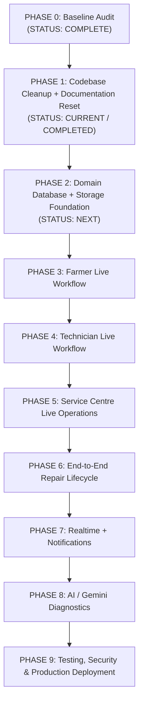

# TerraByte — Phased Implementation Plan

## Architectural Principles

1. **Strict Phased Discipline**: Build ONE phase at a time. Each phase must be verified, audited, and committed before beginning the next.
2. **Current Baseline As Source of Truth**: The active TanStack Start codebase and native Supabase Auth setup represent the permanent application baseline.
3. **No Clerk**: Clerk is permanently excluded. All identity, authorization, and database logic are built on Supabase.
4. **No Destructive Operations**: As the repository is connected to Lovable, published Git history is never rewritten (no force pushing, rebasing, or amending).
5. **Clear State Separation**: All documentation and code strictly distinguish between live Supabase data and mock/local store data.

---

## Master Roadmap

---

## Phase Breakdown

### PHASE 0 — Baseline Codebase Audit
- **Status**: **COMPLETE**
- **Objective**: Conduct comprehensive inspection of the fresh Lovable project post-reset.
- **Completed Deliverables**:
  1. Identified active framework (TanStack Start, React 19, Vite 8, Tailwind CSS 4, `@lovable.dev/mcp-js`).
  2. Verified active Supabase project (`fmnzoovazqpyaebqmqyo`) and confirmed 100% absence of Clerk in application runtime.
  3. Audited active migrations (`20261001100255`, `20261001100308`, `20261001100632`) creating `profiles`, `technician_profiles`, and role enforcement triggers.
  4. Cataloged obsolete files (`src/lib/supabase.ts`, `src/types/database.ts`, stale 2026-09-30 migrations, `.env.local`).

---

### PHASE 1 — Codebase Cleanup + Documentation Reset
- **Status**: **CURRENT / COMPLETED**
- **Objective**: Purge obsolete legacy code, isolate legacy migration artifacts, clean configuration, and align the five primary documentation files to the real codebase.
- **Deliverables**:
  1. Deleted obsolete unused files: `src/lib/supabase.ts` and `src/types/database.ts`.
  2. Purged stale `.env.local` containing obsolete project keys and Clerk variables.
  3. Cleaned legacy CLI cache in `supabase/.temp/`.
  4. Empirically verified remote active database schema (confirmed only `profiles` and `technician_profiles` exist).
  5. Moved legacy migrations (`20260930000001`–`20260930000005`) into `supabase/migrations_legacy_archive/` to prevent migration chain corruption.
  6. Preserved `supabase/seed.sql` for replacement in Phase 2.
  7. Overhauled core documentation (`PROJECT_STATE.md`, `TRD.md`, `APP_FLOW.md`, `IMPLEMENTATION_PLAN.md`, `TESTING.md`).

---

### PHASE 2 — Domain Database + Storage Foundation
- **Status**: **PLANNED (NEXT)**
- **Objective**: Establish the relational PostgreSQL schema and Supabase Storage buckets for the complete agricultural repair business domain.
- **Prerequisites**: Phase 1 completed and verified.
- **Key Deliverables**:
  1. **New Migration: Domain Relational Schema**:
     - `public.equipment`: Farmer machinery assets (`farmer_id` referencing `profiles(id)`, `type`, `make`, `model`, `year`, `serial_number`, `operating_hours`, `status`).
     - `public.repairs` / `breakdowns`: Breakdown incidents and lifecycle status (`equipment_id`, `farmer_id`, `technician_id`, `status`, `symptoms`, `description`, `location`, `assessment`, `testing`).
     - `public.repair_timeline`: State transition audit trail (`repair_id`, `status`, `note`, `actor_id`).
     - `public.quotes` & `public.quote_parts`: Itemized quote formulations and parts line-items.
     - `public.parts_holds`: Tracking records for jobs paused on `WAITING_FOR_PARTS`.
     - `public.service_records`: Permanent maintenance ledgers bound to equipment serials.
     - `public.notifications`: User alert records.
  2. **Row Level Security Policies**: Granular SELECT/INSERT/UPDATE policies across all new tables for `farmer`, `technician`, and `service_centre`.
  3. **Supabase Storage Setup**: Provision buckets (`equipment-photos`, `breakdown-photos`, `repair-photos`) with authenticated upload and public read RLS.
  4. **TypeScript Typings Generation**: Regenerate `src/integrations/supabase/types.ts` via Supabase CLI.
  5. **Realistic Regional Seed Script**: Create replacement `supabase/seed.sql` populated with Nashik agricultural equipment, workshops, and sample repairs linked to seed user accounts.

---

### PHASE 3 — Farmer Live Workflow Integration
- **Status**: **PLANNED**
- **Objective**: Connect the Farmer Portal to live Supabase queries and mutations using TanStack Query.
- **Prerequisites**: Phase 2 completed.
- **Key Deliverables**:
  1. Replace `tb-store` in `/farmer/` with live Supabase queries for farmer fleet and active repair jobs.
  2. Wire `/farmer/equipment/*` to fetch real equipment details and immutable service history records.
  3. Wire `/farmer/report-breakdown` to upload breakdown photos to Supabase Storage and insert real tickets into `public.repairs`.
  4. Wire `/farmer/repair/$id` to display live repair status, photo evidence, and enable quote approval/revision mutations.

---

### PHASE 4 — Technician Live Workflow Integration
- **Status**: **PLANNED**
- **Objective**: Connect the Technician Portal to live Supabase queries and mutations.
- **Prerequisites**: Phase 3 completed.
- **Key Deliverables**:
  1. Wire `/technician/` job feed to query real unassigned or assigned repairs matching technician specialization.
  2. Wire `/technician/job/$id` to:
     - Accept/decline jobs with live status updates.
     - Draft and submit itemized quotes into `public.quotes` and `public.quote_parts`.
     - Trigger `WAITING_FOR_PARTS` status and record parts hold details.
     - Complete repairs with load-test verification and maintenance notes.
  3. Update technician operational profile (availability toggle, brands, skills) via Supabase mutations.

---

### PHASE 5 — Service Centre Live Operations
- **Status**: **PLANNED**
- **Objective**: Connect the Service Centre / Admin Portal to live operational data.
- **Prerequisites**: Phase 4 completed.
- **Key Deliverables**:
  1. Wire `/admin/` dashboard to aggregate live repair tickets, identify SLA breaches (>30m unassigned), and track regional parts delays.
  2. Wire `/admin/repair/$id` to manually assign or reassign repair orders to verified technicians.
  3. Fully retire `src/lib/tb-store.ts` from all production views.

---

### PHASE 6 — End-to-End Repair Lifecycle Validation
- **Status**: **PLANNED**
- **Objective**: Conduct comprehensive multi-user simulation across the complete 7-step repair state machine.
- **Prerequisites**: Phase 5 completed.
- **Key Deliverables**:
  1. Execute full unbroken lifecycle: Farmer Breakdown $\rightarrow$ Service Centre Triage $\rightarrow$ Tech Assignment $\rightarrow$ On-Site Quote $\rightarrow$ Farmer Approval $\rightarrow$ Parts Hold $\rightarrow$ Resumption $\rightarrow$ Completion $\rightarrow$ Permanent Service History.
  2. Validate quote revision and cancellation alternate paths.
  3. Implement **Quick Demo Login** on `/login` (`[ Farmer Demo ]`, `[ Technician Demo ]`, `[ Service Centre Demo ]`) that autofills real Supabase credentials into the form.

---

### PHASE 7 — Realtime Subscriptions & In-App Notifications
- **Status**: **PLANNED**
- **Objective**: Enable instant status synchronization without page refreshes.
- **Prerequisites**: Phase 6 completed.
- **Key Deliverables**:
  1. Enable Supabase Realtime replication on `repairs` and `notifications`.
  2. Wire client listeners so farmer screens update instantly when technician updates status or sends quotes.
  3. Realtime notifications dropdown in the header shell.

---

### PHASE 8 — AI Diagnostic Integration (Google Gemini API)
- **Status**: **PLANNED**
- **Objective**: Elevate the preliminary diagnostic assessment from deterministic rules to generative multimodal AI.
- **Prerequisites**: Phase 7 completed.
- **Key Deliverables**:
  1. Integrate Google Gemini 2.0 API via a secure backend handler / Supabase Edge Function.
  2. Analyze farmer symptoms, text description, and breakdown photos to output structured JSON: suspected mechanical fault, severity, required parts categories, and immediate safety advice.
  3. Maintain deterministic rule engine (`src/lib/assessment.ts`) as a resilient offline fallback.

---

### PHASE 9 — Hardening, Security Audit & Production Deployment
- **Status**: **PLANNED**
- **Objective**: Finalize security hardening, accessibility, and production deployment.
- **Prerequisites**: Phase 8 completed.
- **Key Deliverables**:
  1. Complete RLS penetration testing (verifying farmers cannot inspect other fleets; technicians cannot edit unassigned jobs).
  2. Automated test suite execution across all critical user journeys.
  3. Production build optimization and deployment to Vercel with clean headers and SPA routing.
  4. Final demo presentation package.
