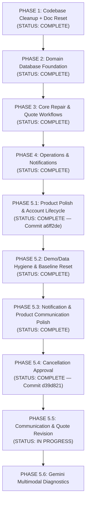

# TerraByte — Phased Implementation Plan

## Architectural Principles

1. **Strict Phased Discipline**: Build ONE phase at a time. Each phase must be verified, audited, and committed before beginning the next.
2. **Current Baseline As Source of Truth**: The active TanStack Start codebase and native Supabase Auth setup represent the permanent application baseline.
3. **No Clerk**: Clerk is permanently excluded. All identity, authorization, and database logic are built on Supabase.
4. **No Destructive Operations**: As the repository is connected to Lovable, published Git history is never rewritten (no force pushing, rebasing, or amending).
5. **Clear State Separation**: All documentation and code strictly distinguish between live Supabase data and mock/local store data. Supabase is the live source of truth.

---

## Master Roadmap

---

## Phase Breakdown

### PHASE 5.1 — Product Polish & Account Lifecycle
- **Status**: **COMPLETE** (Committed and pushed: `a6ff2de`)
- **Deliverables**:
  1. Proper Home experience with role-based dashboard shortcuts (`/farmer`, `/technician`, `/admin`).
  2. Contextual back navigation preserving state across views.
  3. Profile management (name, phone, village/workshop, brand specializations).
  4. Password management (forgot password, recovery token flow, branded reset password email template, change password).
  5. Permanent account deletion via atomic PostgreSQL RPC `public.delete_user_account()` with active-repair and demo-account protections.

---

### PHASE 5.2 — Demo / Data Hygiene & Baseline Reset
- **Status**: **COMPLETE**
- **Objective**: Implement a safe, atomic, deterministic "Reset Demo" capability for evaluation personas, isolate demo farmer data, and enforce Nagpur geography.
- **Key Deliverables Completed**:
  1. Canonical Demo Reset RPC (`public.reset_demo_data()`) with dual-key authorization (`email` in designated set + `demo_code IS NOT NULL`) and atomic fixture upsert.
  2. Dedicated client authorization service (`src/lib/services/demo.ts`) gating reset strictly to 5 demo evaluation accounts.
  3. Responsive frontend reset confirmation dialog (`AlertDialog`) with loading states and 7-step post-reset cache synchronization.
  4. Full farmer data isolation separating real users and each demo account (`farmer`, `farmer2`, `farmer3`) to their own machines and tickets.
  5. Nagpur geography synchronization across all fixtures, profiles, and repair locations.
  6. Completed-repair separation from active workspace triage; reserved "Action needed" exclusively for genuine pending actions (`QUOTE_PENDING`, `QUOTE_REVISED`, unassigned `REQUESTED`).
  7. Startup auth deduplication, session fast-path caching, and database-level active-only repair queries (`{ activeOnly: true }`).

---

### PHASE 5.3 — Notification & Product Communication Polish
- **Status**: **COMPLETE**
- **Objective**: Audit and refine notification delivery, lifecycle status communication, demo technician alert fixtures, and notification state performance across all roles.

#### Step 1 — Notification & Communication Audit
- **Status**: **COMPLETE**
- Complete end-to-end audit of notification creation, retrieval, RLS policies, unread badge calculation, real-time channels, and role-specific communication copy.

#### Step 2 — Core Notification Correctness & Safe Performance Fixes
- **Status**: **COMPLETE**
1. **Fix QUOTE_REVISED Label Conflict**:
   - Updated `FARMER_LABEL["QUOTE_REVISED"]` to `"Revised Quote Ready"` in `src/lib/tb-store.ts`.
   - Resolved contradiction with orange "Action needed" status card and quote revision notification copy.
2. **Resolve Handover / Completion Contradiction**:
   - Aligned copy across farmer view (*"Repair Complete & Saved to Service History"*), technician view (*"Repair completed and recorded in equipment service history"*), admin view (*"Repair complete & saved to service history"*), and completion notification copy (*"Repair TB-xxxx has been completed and saved to service history."*).
   - Accurately reflects that technician completion immediately auto-generates permanent service history without claiming a separate pending handover confirmation.
3. **Fix Demo Technician Notification Fixture**:
   - Reassigned seeded notification `c7fdc083-fce0-4a73-afb8-f63aa84faf2e` to Ramesh Kumar (`t1` / `00000000-0000-0000-0002-000000000001`) on repair `TB-8841` in `supabase/seed.sql`.
   - Created forward migration `supabase/migrations/20261003160000_phase5_3_demo_technician_notification_fix.sql` updating live database row and `public.reset_demo_data()` RPC.
4. **Clear Notification State on User Switch / Sign-Out**:
   - Updated `Shell` in `src/components/tb.tsx` to immediately clear notifications array, error state, and popover state when `userId` becomes null or changes before loading the next user's data.
   - Guaranteed that User A's notifications never display under User B during same-session user switching.
5. **Safe Notification Query Limiting & Duplicate Fetch Cleanup**:
   - Bounded initial and polled notification queries to `limit: 25` in `src/components/tb.tsx`, preserving newest entries.
   - Added safe SQL limit bounding (`Math.max(limit * 4, 100)`) for admin notifications in `src/lib/services/notifications.ts`.
   - Throttled bell toggle refresh with a 5-second timestamp freshness guard to eliminate redundant queries on rapid opening.
   - Preserved Supabase Realtime live subscriptions and 15-second background fallback polling.

#### Step 3 — Notification Triggers, Copy Standardization & Visual Hierarchy
- **Status**: **COMPLETE**
1. **Technician Verification Notification**:
   - Implemented `setTechnicianVerification()` in `src/lib/services/technicians.ts` wired to `src/routes/admin/technicians.tsx`.
   - Dispatches idempotent notification to technician upon admin approval (*"Your technician account has been approved by the Service Centre. You can now accept repair jobs."*, deep-link `/technician`).
2. **Technician Started-Work Notification**:
   - Updated `startRepair()` in `src/lib/services/repair-requests.ts` to notify the associated farmer when physical repair work begins.
   - Enforces idempotency check preventing duplicate notifications on repeated clicks or updates (*"Technician started repair work on TB-xxxx."*, deep-link `/farmer/repair/:id`).
3. **New Technician Registration Admin Notification**:
   - Created forward migration `supabase/migrations/20261003170000_phase5_3_technician_registration_notification.sql` with trigger `trg_notify_admin_on_technician_registration` executing upon `technician_profiles` insert.
   - Added service helper `notifyAdminOnTechnicianRegistration()` in `src/lib/services/technicians.ts`.
   - Included technician registration patterns in `isActionableServiceCentreNotification()` in `src/lib/services/notifications.ts` (*"New technician registration: <name> (<workshop>). Pending verification."*, deep-link `/admin/technicians`).
4. **Notification Copy Standardization**:
   - Audited and standardized all notification copy across quotes, repair requests, and technician operations.
   - Enforced consistent sentence casing, concise action-oriented tone, and proper ending punctuation across all system notifications.
5. **Notification Popover Visual Hierarchy**:
   - Redesigned Shell bell popover in `src/components/tb.tsx` with semantic category pill badges and icons (`Breakdown`, `Quote`, `Parts`, `Testing`, `Repair`, `Account`, `Assignment`, `Alert`, `Notice`), distinct unread indicator dot with subtle focus ring, unread background highlight (`bg-primary/[0.04]`), and actionable "View details" cue, preserving all existing interactions.

> [!NOTE]
> **Realtime Scope Boundary**: Realtime notification delivery in Phase 5.3 is strictly scoped to the existing Supabase Realtime channel (`postgres_changes` on `public.notifications`) and 15-second background polling fallback. Broad multi-user interactive realtime state synchronization across boards, active forms, and technician assignments is explicitly deferred to **Phase 7 (Realtime Sync & Production Hardening)**.

---

### PHASE 5.4 — Cancellation Approval
- **Status**: **IN PROGRESS**
- **Objective**: Establish a governed repair cancellation workflow providing structured farmer cancellation requests, work-hold pauses for assigned technicians, and administrative review/resolution by the Service Centre.

#### Step 1 — Database & State Foundation
- **Status**: **COMPLETE** (Manually deployed and verified in Supabase; forward migration `20261004100000_phase5_4_cancellation_approval_foundation.sql` preserved as canonical source)
- **Deliverables**:
  1. Forward migration `supabase/migrations/20261004100000_phase5_4_cancellation_approval_foundation.sql`.
  2. Extended `public.repair_status` enum with `CANCELLATION_REQUESTED`.
  3. Added cancellation tracking columns to `public.repair_requests`:
     - `cancellation_reason` (text)
     - `cancellation_note` (text)
     - `cancellation_requested_by` (uuid)
     - `cancellation_requested_at` (timestamptz)
     - `cancellation_previous_status` (public.repair_status)
     - `cancellation_admin_response` (text)
  4. Partial index on `repair_requests(status)` for `CANCELLATION_REQUESTED`.
  5. Hardened RLS `UPDATE` policies on `public.repair_requests`:
     - Four granular policies: Admins (full operational access), Farmers Direct Cancel (strictly unassigned `REQUESTED`), Farmers Active Lifecycle (quote revision, quote approval, cancellation requests; blocks direct `CANCELLED` and `COMPLETED`), and Technicians (job acceptance, repair progress; blocks `CANCELLED` and `CANCELLATION_REQUESTED`).
     - Tickets in `CANCELLATION_REQUESTED` locked against non-admin edits.
     - Only `admin` can approve (`CANCELLED`) or reject (`cancellation_previous_status`).
  6. Updated `public.reset_demo_data()` to nullify cancellation metadata across all four canonical demo repairs while strictly preserving their Phase 5.2 baseline statuses (`TB-8841` $\rightarrow$ `WAITING_FOR_PARTS`, `TB-8902` $\rightarrow$ `QUOTE_PENDING`, `TB-8898` $\rightarrow$ `REQUESTED`, `TB-4489` $\rightarrow$ `QUOTE_REVISED`), keeping real user accounts (such as `Ankit Chamke`) untouched.
  7. Synchronized TypeScript types across `src/integrations/supabase/types.ts`, `src/lib/tb-store.ts`, `src/components/tb.tsx`, and `src/lib/services/repair-requests.ts`.

#### Step 2 — Service Layer & Notification Workflow
- **Status**: **COMPLETE**
- **Deliverables**:
  1. Updated `cancelRepairRequest(id, options)` in `src/lib/services/repair-requests.ts`: strictly restricts direct client cancellation to unassigned `REQUESTED` tickets (`status === 'REQUESTED' && !technician_id`), preserving administrative direct cancellation while throwing informative errors for assigned/in-progress tickets guiding callers to governed review.
  2. Implemented `requestCancellation(id, input)` in `src/lib/services/repair-requests.ts`: captures structured cancellation reason and freeform note, snapshotting `cancellation_previous_status`, transitioning active/assigned tickets to `CANCELLATION_REQUESTED`, delegating unassigned `REQUESTED` tickets immediately to cancellation, recording timeline events, preserving `"In Repair"` equipment status, and dispatching actionable alerts to Service Centre admins.
  3. Implemented `approveCancellation(id, input)` in `src/lib/services/repair-requests.ts`: restricted strictly to Service Centre admins, transitions `CANCELLATION_REQUESTED` to `CANCELLED`, records administrative response remarks, restores equipment to `"Operational"` (if no other active repairs exist), and dispatches notifications to both farmer and assigned technician.
  4. Implemented `rejectCancellation(id, input)` in `src/lib/services/repair-requests.ts`: restricted strictly to Service Centre admins with required explanation, restores ticket from `CANCELLATION_REQUESTED` back to `cancellation_previous_status` (or `ACCEPTED`), maintains equipment in `"In Repair"`, and dispatches resumption notifications to farmer and assigned technician.
  5. Updated `LEGAL_REPAIR_TRANSITIONS` in `src/lib/services/repair-requests.ts` allowing transitions between `REQUESTED` and `CANCELLATION_REQUESTED`.
  6. Expanded `isActionableServiceCentreNotification()` and `getNotificationCategory()` in `src/lib/services/notifications.ts` to recognize cancellation events as actionable Service Centre alerts.

#### Step 3 — Farmer Cancellation UI & Dialog
- **Status**: **COMPLETE**
- **Deliverables**:
  1. Accessible Radix Dialog (`@/components/ui/dialog`) implemented in `src/routes/farmer/repair/$id.tsx`, replacing the legacy browser `confirm()` dialogue with focus-trapped, keyboard-accessible modal interactions.
  2. Dynamic button routing: renders "Cancel request" for unassigned `REQUESTED` repairs and "Request cancellation" for active/assigned repairs (`ACCEPTED`, `QUOTE_PENDING`, `QUOTE_REVISED`, `IN_PROGRESS`, `WAITING_FOR_PARTS`, and assigned `REQUESTED`).
  3. Structured reason picker using `CANCELLATION_REASONS` with an optional freeform explanation textarea and form validation.
  4. Integration with Step 2 service functions: calls `cancelRepairRequest(r.id, { reason, note })` for unassigned tickets (immediate cancellation, toast, and redirection to `/farmer`) and `requestCancellation(r.id, { reason, note })` for assigned/active tickets (governed review, toast, and in-place reload).
  5. Dedicated status banners:
     - `CANCELLATION_REQUESTED`: Prominent warning banner with clock icon, submission reason, optional note, timestamp, and clear explanation that work is on hold pending Service Centre review.
     - `CANCELLED`: Closed status banner with `XCircle` icon, cancellation reason, optional note, administrative resolution remarks, and direct link to machine record.
  6. Interaction suppression: Suppressed technician call actions and active repair controls on cancelled tickets.
  7. Stepper alignment: Updated `stepIndex()` and `Stepper` in `src/components/tb.tsx` to handle `CANCELLATION_REQUESTED` and `CANCELLED`, rendering `"Cancellation Pending Review"` with warning pulse on the active step while preserving prior progression history.

#### Step 4 — Admin Approval Workbench & Operations Filter
- **Status**: **COMPLETE**
- **Deliverables**:
  1. Operations Pipeline Filter & Alert Banner (`src/routes/admin/index.tsx`):
     - Added `"Cancellation Requests"` to dashboard `FILTERS` array and filter predicate.
     - Implemented an actionable top amber alert banner displaying pending cancellation requests with ticket job number, farmer name, cancellation reason, elapsed time, and quick-link chips directly navigating to the review card.
     - Updated operations table row rendering: highlights `CANCELLATION_REQUESTED` rows with an amber pulse dot, displays the cancellation reason preview beneath the farmer's name, and renders a distinct `"Review"` CTA button.
  2. Admin Cancellation Review Card (`src/routes/admin/repair/$id.tsx`):
     - Renders a prominent amber review workbench card when `status === "CANCELLATION_REQUESTED"` displaying ticket ID, farmer name, equipment details, previous status snapshot, cancellation reason, farmer context note, request timestamp, assigned technician, and active work-hold indicator.
     - Suppressed the generic bottom `"Cancel repair"` action button whenever a repair is in `CANCELLATION_REQUESTED` to avoid UI ambiguity.
  3. Approve Cancellation Flow:
     - Accessible Radix `Dialog` detailing cancellation effects (notifies farmer and assigned technician, releases equipment back to `Operational`).
     - Includes optional administrative response remarks textarea and loading indicator (`reviewActionBusy === "approve"`).
     - Calls `approveCancellation(r.id, { adminResponse })`, displays success toast, and refreshes ticket state in-place.
  4. Reject Cancellation Flow:
     - Accessible Radix `Dialog` detailing rejection effects (reverts ticket back to `cancellation_previous_status`, resumes repair work, notifies parties).
     - Enforces non-empty administrative justification with form validation (`adminResponse: string`).
     - Calls `rejectCancellation(r.id, { adminResponse })`, displays info toast, and refreshes ticket state in-place.
  5. Resolution & Resumption UI Banners:
     - Renders a closed banner for `CANCELLED` tickets displaying the administrative resolution note.
     - Renders an informative resumption notice on active tickets that previously had a cancellation request declined, showing the admin explanation and date.
  6. Activity Log Timeline Recognition:
     - Updated `getActivityAction()` to render clear timeline labels for cancellation events (`"Cancellation requested by farmer"`, `"Cancellation approved by Service Centre"`, `"Cancellation request declined"`).

#### Step 5 — Technician Work-Hold UI & Cancellation Awareness
- **Status**: **COMPLETE**
- **Deliverables**:
  1. Technician Dashboard Work-Hold Isolation (`src/routes/technician/index.tsx`):
     - Partitioned `CANCELLATION_REQUESTED` repairs out of `Active jobs` to eliminate accidental work progression.
     - Added dedicated `"On hold · Cancellation pending (N)"` section with amber visual styling, animated pulse dot, cancellation reason preview, and hold explanation.
     - Added dedicated `"Cancelled (N)"` section with muted styling to preserve closed repair visibility and audit history.
  2. Technician Job Detail Work-Hold Banner (`src/routes/technician/job/$id.tsx`):
     - Rendered prominent amber work-hold card when `status === "CANCELLATION_REQUESTED"` displaying job number, farmer name, equipment model, cancellation reason, farmer context note, request timestamp, and previous status snapshot.
     - Provided explicit operational instructions clarifying that diagnostics, parts procurement, and repairs are suspended pending Service Centre review.
  3. Action Suppression & Context Preservation:
     - Strictly suppressed all repair progression actions (quote formulation/revision, start repair, parts hold, testing, complete repair) while under review.
     - Maintained read-only quotation and parts-hold context cards so existing diagnostic and parts specifications remain visible without mutation controls.
     - Preserved outbound calling access on held tickets for direct farmer coordination while suppressing call CTA on closed/cancelled tickets.
  4. Post-Resolution Technician Awareness:
     - Rendered muted **Repair Cancelled** closed banner on `CANCELLED` tickets detailing cancellation reason, farmer note, and admin resolution remarks.
     - Rendered informative **Cancellation Request Declined · Work Resumed** notice when a cancellation request is declined, showing admin justification and re-enabling standard progression controls.
     - Updated route assignment check (`r.technician_id !== profile?.id && r.status !== "COMPLETED" && r.status !== "CANCELLED"`) to allow technicians to view cancelled historical jobs assigned to them.

#### Step 6 — End-to-End Verification
- **Status**: **COMPLETE** (Verification suite P5.4-01 through P5.4-30 passed and committed in baseline commit `d39d821`)

---

### PHASE 5.5 — Communication & Quote Revision Workflow
- **Status**: **IN PROGRESS** (Step 1 Implemented)
- **Objective**: Implement ticket-scoped farmer–technician messaging with unread tracking, real-time sync, and notification dispatch, alongside the quote revision request/resubmission lifecycle with version comparison.

#### Step 1 — Database Foundation & Canonical Demo Fixture Completion
- **Status**: **COMPLETE**
- **Deliverables**:
  1. Forward migration `supabase/migrations/20261005100000_phase5_5_communication_foundation.sql`:
     - Creates `public.repair_messages` table with `id`, `repair_request_id`, `sender_id`, `recipient_id`, `message_text`, `created_at`, and `is_read`.
     - Adds composite performance index on `(repair_request_id, created_at ASC)` and unread partial index on `(recipient_id, is_read) WHERE is_read = false`.
     - Hardened RLS policies: SELECT for participants/admins, INSERT with caller anti-spoofing (`sender_id = current_profile_id()`), UPDATE strictly for recipient read status, and DELETE reserved for administrative moderation.
     - Idempotent realtime publication hook for `public.repair_messages`.
     - Updated `public.reset_demo_data()` to clean disposable test messages and extra test quotes, preserving canonical repairs (`TB-8841`, `TB-8902`, `TB-8898`, `TB-4489`), and restored canonical Quote v1 fixture for `TB-4489` (status `REVISED`, v1, Rotavator seal kit ₹1,400 + EP-90 Gearbox oil ₹600 + Labour ₹800 = ₹2,800).
  2. Synchronized `src/integrations/supabase/types.ts` with `repair_messages` table row, insert, update, and relationship types.

#### Step 2 — Service Layer & State Machine (Quote Revision & Communication)
- **Status**: **COMPLETE**
- **Deliverables**:
  1. `src/lib/services/repair-messages.ts` with `getRepairMessages()`, `sendRepairMessage()`, `markMessagesAsRead()`, `getUnreadMessageCount()`, anti-spoofing validation, bounded text limits, counterpart verification, and recipient notifications.
  2. Fixed `reviseQuote()` in `src/lib/services/quotes.ts` to preserve the farmer's original `clarification_note` on `repair_requests` intact without overwriting, storing technician explanations separately in `repair_timeline` audit events across all revision reasons.
  3. Added `getQuoteVersions()` and `compareQuoteVersions()` in `src/lib/services/quotes.ts` providing structured version history and item/labour/total diff comparisons for the future UI.
  4. Added `getRepairActionOwnership()` in `src/lib/services/repair-requests.ts` defining actor action obligations (`QUOTE_REVISED`: technician action required, farmer waiting).
  5. Corrected inverted `FARMER_LABEL.QUOTE_REVISED` in `src/lib/tb-store.ts` to `"Revision Requested · Awaiting Technician"` and `STAFF_LABEL.QUOTE_REVISED` to `"Quote revision requested"`.

#### Step 3 — Farmer–Technician Communication UI & Notification Wiring
- **Status**: PENDING
- **Deliverables**:
  - Embedded ticket chat UI on `/farmer/repair/:id` and `/technician/job/:id`.
  - Unread indicators, message timestamps, sender badges, and Realtime subscriptions with fallback polling.

#### Step 4 — Quote Revision Flow & Version Comparison UI
- **Status**: PENDING
- **Deliverables**:
  - Quote version history (`version: 1` $\rightarrow$ `version: 2`), diff comparison, revision reason surfacing, and quote resubmission.

#### Step 5 — End-to-End Verification
- **Status**: PENDING
- **Deliverables**:
  - Verification suite `P5.5-01` through `P5.5-30`.

