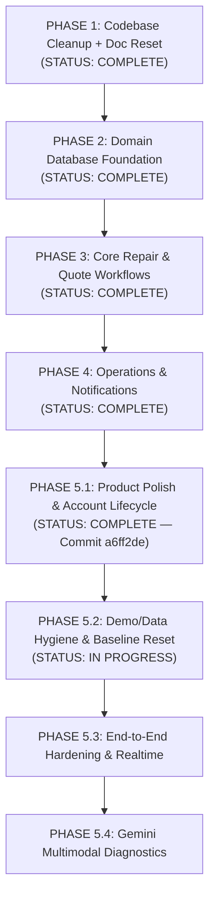

# TerraByte — Phased Implementation Plan

## Architectural Principles

1. **Strict Phased Discipline**: Build ONE phase at a time. Each phase must be verified, audited, and committed before beginning the next.
2. **Current Baseline As Source of Truth**: The active TanStack Start codebase and native Supabase Auth setup represent the permanent application baseline.
3. **No Clerk**: Clerk is permanently excluded. All identity, authorization, and database logic are built on Supabase.
4. **No Destructive Operations**: As the repository is connected to Lovable, published Git history is never rewritten (no force pushing, rebasing, or amending).
5. **Clear State Separation**: All documentation and code strictly distinguish between live Supabase data and mock/local store data. Supabase is the live source of truth.

---

## Master Roadmap

---

## Phase Breakdown

### PHASE 5.1 — Product Polish & Account Lifecycle
- **Status**: **COMPLETE** (Committed and pushed: `a6ff2de`)
- **Deliverables**:
  1. Proper Home experience with role-based dashboard shortcuts (`/farmer`, `/technician`, `/admin`).
  2. Contextual back navigation preserving state across views.
  3. Profile management (name, phone, village/workshop, brand specializations).
  4. Password management (forgot password, recovery token flow, branded reset password email template, change password).
  5. Permanent account deletion via atomic PostgreSQL RPC `public.delete_user_account()` with active-repair and demo-account protections.

---

### PHASE 5.2 — Demo / Data Hygiene & Baseline Reset
- **Status**: **IN PROGRESS**
- **Objective**: Implement a safe, atomic, deterministic "Reset Demo" capability for evaluation personas, isolate demo farmer data, and enforce Nagpur geography.

#### Completed Deliverables
1. **Canonical Demo Reset RPC (`public.reset_demo_data()`)**:
   - Zero client parameters; security definer with explicit `search_path`.
   - Dual-key backend authorization (`auth.uid()` mapped to designated evaluation email set AND `demo_code IS NOT NULL`).
   - Clean deletion of accumulated non-seed demo records (`repairs`, `equipment`, `service_history`, `notifications`).
   - Atomic upsert of canonical baseline fixtures (`f1`, `f2`, `f3`, `t1`, `t2`, `t3`, `t4`, `t5`, `admin`, `TB-8841`, `TB-8902`, `TB-8898`).
   - Preservation of TB-4489 fixture for future Phase 5.5 demonstration.
   - Strict isolation: real user rows and foreign keys are never altered or removed.
2. **Secure Demo Authorization**:
   - Dedicated client service [`src/lib/services/demo.ts`](file:///d:/Projects/TerraByte/src/lib/services/demo.ts) validating the 5 designated accounts.
   - Unauthorized attempts return safe translated error messages (`42501` mapped to `"Demo reset is not available for this account."`).
3. **Frontend Reset Demo Action & Confirmation Dialog**:
   - `RotateCcw` reset button in Shell header visible **only** to the 5 designated demo accounts.
   - Accessible Radix `AlertDialog` confirmation modal with destructive action styling, spinner during execution, and >=44px mobile touch targets.
4. **Post-Reset State Synchronization**:
   - Deterministic 7-step sequence: RPC call $\rightarrow$ `resetDemo()` store sync $\rightarrow$ `refreshProfile()` $\rightarrow$ `fetchNotifications()` $\rightarrow$ `router.invalidate()` $\rightarrow$ route component remount $\rightarrow$ success toast.

#### Pending Deliverables
1. **Farmer Demo Data Isolation Correction**:
   - Disconnected `FarmerHome` from mock `tb-store` active repairs.
   - Wired live Supabase queries via `getFarmerRepairRequests()` and `getFarmerEquipment()`.
   - Added explicit `.eq("farmer_id", profile.id)` filters in services.
   - Bound `RoleGuard` `actions.login` to dynamic farmer identity (`demo_code || id`).
   - *Status*: Implemented in codebase, pending manual testing verification.
2. **Nagpur Geography Cleanup**:
   - Updated Service Centre identity to `"Nagpur Service Centre"` and `"Nagpur Central Command"`.
   - Updated all demo profile villages and repair locations to Nagpur agricultural talukas (Katol, Saoner, Umred).
   - Re-applied updated `reset_demo_data()` RPC to linked remote database.
   - *Status*: Implemented in codebase and remote DB, pending manual testing verification.
3. **Completed-Repair & Action-Needed Classification Correction**:
   - Excluded `COMPLETED` and `CANCELLED` tickets from farmer home active repairs card stack.
   - Reserved "Action needed" styling strictly for genuine pending actions (`QUOTE_PENDING`, `QUOTE_REVISED`).
   - Solved scalability: farmers with multiple completed repairs only see genuine active work; completed records stay in Service History.
   - *Status*: Implemented in codebase, pending manual testing verification.
4. **Dashboard Loading Performance Remediation**:
   - Implemented session-check fast path and 60-second in-memory profile cache in `getAuthenticatedProfile()` across services to eliminate redundant auth/profile network roundtrips.
   - Enabled `getFarmerEquipment(farmerId)` and `getFarmerRepairRequests(farmerId)` to accept already-resolved `profile.id` directly.
   - Concurrentized independent section loading in `FarmerHome`.
   - Rendered stable header immediately in Service Centre dashboard and removed completed repairs from open triage queue.
   - *Status*: Implemented in codebase, pending manual testing verification.
5. **Startup Waterfall & Farmer Query Optimization**:
   - In-flight promise deduplication on `loadProfile()` in `auth.ts` preventing double auth network roundtrips during initial app mount.
   - Session-check fast path and profile caching in `notifications.ts`.
   - Database-level active-only filtering in `getFarmerRepairRequests(farmerId, { activeOnly: true })` using `.not("status", "in", '("COMPLETED","CANCELLED")')`, cutting 90% of data transfer for farmers with extensive service history.
   - *Status*: Implemented in codebase, pending manual testing verification.
6. **TB-4545 Unassigned Request Action State**:
   - Accurately represented repair lifecycle: newly reported breakdown tickets with `status === "REQUESTED"` and `technician_id === null` classified as `needsAction = true`.
   - Updated `StatusPill` to render *"Send request to technician"* with accent tone when `audience === "farmer"` and technician is unassigned.
   - Updated Farmer Home card CTA button to *"Send request to technician"*.
   - *Status*: Implemented in codebase, pending manual testing verification.
7. **Explicit Real vs Demo Identity (`DemoTag`)**:
   - Gated `DemoTag` strictly to `isDesignatedDemoAccount(email)` to guarantee real accounts (such as Ankit Chamke) never render the `"DEMO DATA"` badge.
   - Preserved `"DEMO DATA"` badge visibility strictly for the 5 canonical demo evaluation personas.
   - *Status*: Implemented in codebase, pending manual testing verification.
8. **Final Manual Verification**:
   - Execute complete verification test matrix in [`TESTING.md`](file:///d:/Projects/TerraByte/TESTING.md).
9. **Final Regression & Pre-Commit Audit**:
   - Clean build verification (`npm run build`) and git diff inspection.
10. **Phase 5.2 Commit & Push**:
   - Single atomic commit for Phase 5.2 once manual verification passes.
