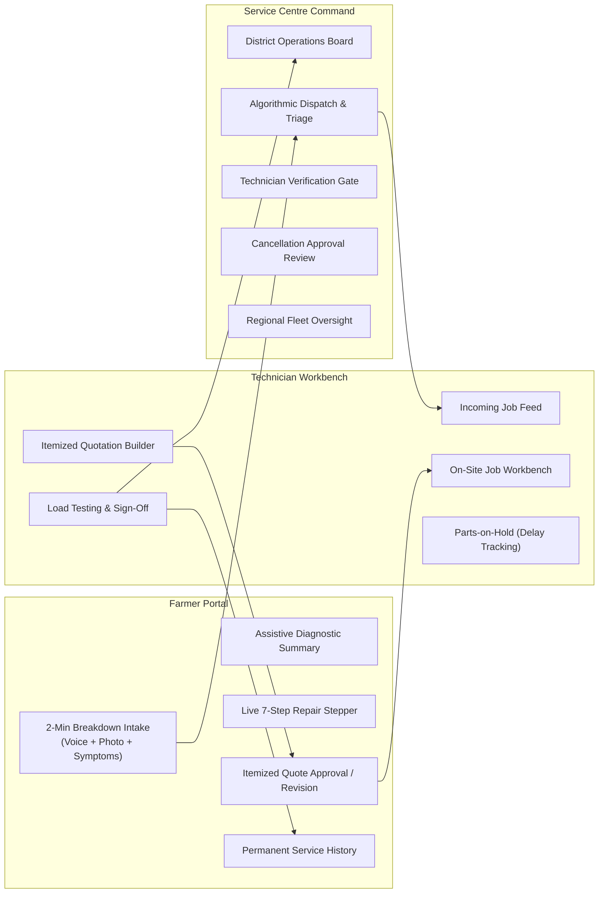
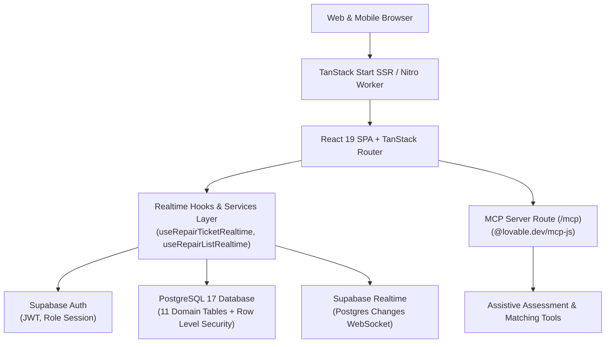

# TerraByte — One-Stop Agricultural Equipment Repair Ecosystem

[](https://github.com/ankitchamke/TerraByte)
[](https://tanstack.com/start)
[](https://supabase.com)
[](https://modelcontextprotocol.io)
[-darkgreen?style=for-the-badge)]()

---

## 🚀 Live Prototype

**Live Demo:** https://terra-byte-woad.vercel.app

> **Note:** TerraByte is currently an evolving prototype under active development. Core Farmer, Technician, and Service Centre workflows are functional.

---

## 🌾 Official Problem Statement Alignment

- **Competition**: Nagpur RISE 2026 — Stage 1
- **Domain**: Agricultural Technology (AgriTech) · Machinery Maintenance & Rural Operational Coordination
- **Problem Statement**: **"One-Stop Agricultural Equipment Repair"**
- **Core Mission**: **Dramatically compress the time between machinery breakdown and getting back to work in the field.**

In rural agriculture—particularly across Vidarbha's cotton, soybean, and citrus belts—machinery breakdown (tractors, harvesters, power tillers, irrigation pumps) during critical sowing (*kharif*) and harvest windows causes catastrophic yield and financial loss. The conventional repair process is fragmented across unvetted local mechanics, lack of diagnostic clarity, opaque parts markups, zero downtime visibility, and nonexistent service records.

**TerraByte** solves this by delivering an integrated, role-tailored digital coordination operating system connecting **Farmers**, **Certified Field Technicians**, and **Central Service Centres** into a transparent, accountable repair lifecycle.

---

## 📑 Quick Navigation

- [Live Prototype](#-live-prototype)
- [Key Capabilities & Portals](#-key-capabilities--portals)
- [System Architecture & Tech Stack](#-system-architecture--tech-stack)
- [The 7-Step Repair Lifecycle](#-the-7-step-repair-lifecycle)
- [Implemented vs. Roadmap Boundaries](#-implemented-vs-roadmap-boundaries)
- [Evaluation & Demo Guide (5-Minute Test)](#-evaluation--demo-guide-5-minute-test)
- [Database & Security Hardening](#-database--security-hardening)
- [Development Setup & Environment Variables](#-development-setup--environment-variables)
- [Project Directory Structure](#-project-directory-structure)
- [Nagpur RISE Submission Package](#-nagpur-rise-submission-package)

---

## 🚜 Key Capabilities & Portals

TerraByte is architected around three dedicated operational portals sharing a unified real-time database and state machine:



### 1. 🧑‍🌾 Farmer Portal (`/farmer`)
- **Rapid 2-Minute Breakdown Intake**: Select broken equipment from registered fleet, toggle symptom chips, record voice description via Web Speech API (with Indian English support), and upload field photo evidence.
- **Assistive Diagnostic Assessment**: Instant rule-based preliminary analysis evaluating likely affected mechanical systems, parts categories, urgency level, and immediate safety guidance.
- **Ranked Technician Matching**: Objective ranking based on equipment brand specialization, technical expertise, availability, and travel ETA.
- **Transparent Quotation Authorization**: Full line-item breakdown (parts, specifications, distributor origin, labour charge, warranty, completion ETA). **No repair work can start without explicit farmer authorization.**
- **Quote Revision & Discussion**: Request revisions with specific explanations and photos, side-by-side Quote v1 vs v2 comparison, and ticket-scoped real-time messaging with the technician.
- **Live 7-Step Repair Stepper**: Real-time stage tracking with dedicated visibility into spare-part delays (`WAITING_FOR_PARTS`).
- **Governed Cancellation**: Direct cancellation for unassigned requests; structured cancellation review through the Service Centre once a technician is assigned.
- **Permanent Equipment Service History**: Immutable digital maintenance logbook bound to machinery chassis numbers, preserving resale value and guiding recurring servicing.

### 2. 🔧 Technician Workbench (`/technician`)
- **Verification Gate**: Newly registered technicians are held at `/technician/pending` until verified by a Service Centre Administrator.
- **Incoming Job Feed**: Filtered dispatch queue with machine specs, reported symptoms, farmer field location, and assistive assessment cues.
- **Itemized Quotation Formulation**: Add spare parts with specification, quantity, unit price, distributor source, labour description, and revised completion time.
- **Universal Quote Revision Engine**: Handles revision requests with farmer explanation reviews and side-by-side previous quote reference.
- **Parts-on-Hold Mechanism**: Place active repairs on hold when awaiting parts (`WAITING_FOR_PARTS`), logging missing component, distributor delay reason, and revised completion ETA.
- **Testing Run & Final Sign-Off**: Shift repair into operational load testing, record final completion notes, and execute **"Complete & sign off"**, automatically archiving the repair into permanent service history and restoring equipment to `Operational`.

### 3. 🏢 Service Centre Central Command (`/admin`)
- **District Operations Board**: Real-time district-wide repair pipeline across Nagpur talukas (Katol, Saoner, Umred), separating active operational triage from historical completed and cancelled records.
- **Technician Verification Portal**: Inspect credentials and approve or revoke technician field authorization.
- **Cancellation Review Workbench**: Review and resolve cancellation requests on active in-flight jobs, ensuring accountability and preventing stranded work.
- **Direct Dispatch & Manual Triage**: Assign or reassign unassigned breakdown requests to optimal technicians.

---

## 🏛 System Architecture & Tech Stack



### Technology Stack Summary

| Layer | Technology | Purpose & Implementation Details |
| :--- | :--- | :--- |
| **Frontend Framework** | **TanStack Start v1 + React 19** | Full-stack React framework with SSR, streaming, and Vite 8 bundler. |
| **Routing** | **TanStack Router v1** | Type-safe, file-based routing with layout nesting, search params validation, and route guards. |
| **Styling & UI** | **Tailwind CSS 4 + Radix UI** | Accessible headless UI primitives, agricultural high-contrast color system, Lucide icons. |
| **State & Cache** | **TanStack Query v5 + React Hooks** | Optimistic UI updates, caching, and state synchronization. |
| **Backend & Database**| **Supabase (PostgreSQL 17)** | Relational database, transactional RPCs, automated triggers, and Row Level Security (RLS). |
| **Authentication** | **Supabase Auth (Native)** | Secure email/password authentication, JWT token persistence, and role-based redirect guards. |
| **Realtime Sync** | **Supabase Realtime (WebSocket)** | Live postgres changes broadcast with 300ms client debounced coalescing and 15s fallback polling. |
| **Agent / Protocol** | **Model Context Protocol (MCP)** | `@lovable.dev/mcp-js` server exposing diagnostic assessment and technician matching at `/mcp`. |
| **Hosting Target** | **Cloudflare Workers / Node.js** | Nitro production build preset (`cloudflare-module` compatible). |

---

## 🔄 The 7-Step Repair Lifecycle

All repair tickets transition through a strictly governed state machine:

```mermaid
stateDiagram-v2
    [*] --> REQUESTED: Farmer reports breakdown
    REQUESTED --> ACCEPTED: Technician accepts / Admin assigns
    ACCEPTED --> QUOTE_PENDING: Technician inspects machine & prepares quote
    QUOTE_PENDING --> QUOTE_REVISED: Farmer requests quote revision
    QUOTE_REVISED --> QUOTE_PENDING: Technician submits revised quote v2
    QUOTE_PENDING --> IN_PROGRESS: Farmer approves quote
    IN_PROGRESS --> WAITING_FOR_PARTS: Spare part procurement delay
    WAITING_FOR_PARTS --> IN_PROGRESS: Part received, repair resumes
    IN_PROGRESS --> TESTING: Mechanical work done; testing under load
    TESTING --> COMPLETED: Final load test passes & technician signs off

    REQUESTED --> CANCELLED: Farmer cancels unassigned request
    ACCEPTED --> CANCELLATION_REQUESTED: Farmer submits cancellation request
    QUOTE_PENDING --> CANCELLATION_REQUESTED: Farmer submits cancellation request
    QUOTE_REVISED --> CANCELLATION_REQUESTED: Farmer submits cancellation request
    IN_PROGRESS --> CANCELLATION_REQUESTED: Farmer submits cancellation request
    WAITING_FOR_PARTS --> CANCELLATION_REQUESTED: Farmer submits cancellation request

    CANCELLATION_REQUESTED --> CANCELLED: Admin approves cancellation
    CANCELLATION_REQUESTED --> ACCEPTED: Admin declines cancellation (reverts to previous status)

    COMPLETED --> [*]: Auto-commits permanent Service Record, equipment set to Operational
```



### Lifecycle Status Matrix

| Stage | Database Status | Semantic Farmer Display | Primary Actor Action |
| :---: | :--- | :--- | :--- |
| **1a** | `REQUESTED` (`technician_id == null`) | **Action Needed** · *"Send request to technician"* | Farmer selects and requests matched technician |
| **1b** | `REQUESTED` (dispatched) | **Active Repair** · *"Finding Your Technician"* | Technician reviews incoming feed |
| **2** | `ACCEPTED` | **Active Repair** · *"Technician Assigned"* | Technician travels to field location |
| **3** | `QUOTE_PENDING` | **Action Needed** · *"Quote Ready"* | Farmer reviews itemized parts and labour |
| **4** | `QUOTE_REVISED` | **Awaiting Technician** · *"Revision Requested"* | Technician builds revised quote with diff |
| **5** | `IN_PROGRESS` | **Active Repair** · *"Repair in Progress"* | Technician conducts physical repairs |
| **--** | `WAITING_FOR_PARTS` | **Paused** · *"Waiting for Parts"* | Distributor supplies parts; ETA tracked |
| **6** | `TESTING` (`is_testing = true`) | **Active Repair** · *"Testing in Progress"* | Technician runs implement under load |
| **7** | `COMPLETED` | **Service History** · *"Repair Complete & Saved"* | Immutable `service_history` record generated |
| **--** | `CANCELLATION_REQUESTED` | **Under Review** · *"Cancellation Pending Review"* | Service Centre Admin reviews reason |
| **--** | `CANCELLED` | **Closed** · *"Repair Cancelled"* | Work halted, equipment restored |

---

## ⚖ Implemented vs. Roadmap Boundaries

To ensure complete academic and hackathon honesty, TerraByte explicitly documents what is **fully implemented** versus what is on the **future roadmap**:

### ✅ What is ACTUALLY Implemented (Production Ready):
1. **Multi-Role Authentication & Access Control**: Complete Supabase Auth implementation with database role enforcement (`farmer`, `technician`, `admin`), unverified technician gates, and tamper-proof triggers.
2. **PostgreSQL Relational Schema & 11 Tables**: Fully migrated database with foreign keys, indexes, and comprehensive Row Level Security (RLS) policies.
3. **Core Repair State Machine**: Full lifecycle support from breakdown intake through quote approval, revision comparison, parts delay holds, testing, and completion.
4. **Governed Cancellation Workflow**: Strict separation between instant unassigned cancellation and governed administrative review for active tickets.
5. **Real-Time Ticket Messaging & Comparisons**: Ticket-scoped chat (`repair_messages`) with unread tracking, real-time broadcasts, and visual Quote v1 vs v2 diffing (`quote-comparison.tsx`).
6. **Deterministic Diagnostic Rules Engine**: Symptom-to-system mapping with severity scores, recommended parts categories, safety advice, and explicit assistive disclaimer.
7. **Model Context Protocol (MCP) Server**: Active HTTP endpoint at `/mcp` exposing `assess_breakdown`, `list_symptoms`, and `match_technicians` tools.
8. **Real-time Event Coalescing**: Custom React hooks (`useRepairTicketRealtime`, `useRepairListRealtime`) with debounced refetching.
9. **Atomic Demo Reset RPC**: `public.reset_demo_data()` allowing evaluation personas to restore deterministic baseline states without touching real user accounts.

### 🔮 Future Roadmap (Post-Stage 1 Enhancements):
1. **Multimodal Computer Vision (Gemini 2.5/Flash)**: Replacing rule-based assessment with live multimodal image/audio analysis of damaged mechanical components.
2. **Payment Gateway Integration**: Direct UPI / Razorpay escrow integration for quote payments and warranty disbursements.
3. **Telemetry & IoT Telematics**: Direct integration with tractor CAN bus (J1939) diagnostic dongles for automated fault code (DTC) ingestion.
4. **SMS / WhatsApp Fallback**: Twilio / Gupshup webhook notifications for rural farmers without active smartphone data connections.
5. **Offline PWA Sync**: Full ServiceWorker Background Sync for drafting repair requests in zero-connectivity fields.

---

## 🎯 Evaluation & Demo Guide (5-Minute Test)

For judges, evaluators, and reviewers, TerraByte includes pre-configured canonical demo personas representing realistic field scenarios in **Nagpur District, Maharashtra**:

### Pre-Configured Demo Accounts

> [!TIP]
> On the `/login` screen, use the quick demo selector buttons or enter the credentials below. All passwords are set to `terrabyte2026`.

| Role | Demo Email | Persona Name | Location | Seeded Scenario / Ticket |
| :--- | :--- | :--- | :--- | :--- |
| **Farmer 1** | `farmer.nagpur@terrabyte.demo` | **Balasaheb Patil** | Katol, Nagpur | `TB-8841` (Mahindra 575 DI) — Paused on `WAITING_FOR_PARTS` (Bosch injector nozzle). |
| **Farmer 2** | `farmer2.nagpur@terrabyte.demo` | **Suresh Jadhav** | Saoner, Nagpur | `TB-8902` (John Deere 5050D) — `QUOTE_PENDING` (Quote ready for approval). |
| **Farmer 3** | `farmer3.nagpur@terrabyte.demo` | **Anil Pawar** | Umred, Nagpur | `TB-8898` (Swaraj 744 FE) — Newly `REQUESTED` breakdown (Unassigned). |
| **Technician** | `tech.nagpur@terrabyte.demo` | **Ramesh Kumar** | Nagpur Mobile Repairs | Active assigned jobs (`TB-8841`, `TB-8902`), quote builder, and load testing sign-off. |
| **Admin** | `admin.nagpur@terrabyte.demo` | **Nagpur Service Centre** | Nagpur Central Command | District dispatch board, cancellation reviews, and technician verification. |

### 5-Minute Evaluator Test Walkthrough

1. **Step 1: Test the Farmer Experience (Quote Review & Comparison)**
   - Log in as `farmer.nagpur@terrabyte.demo` (or click `[Farmer Demo]`).
   - Notice the active ticket `TB-8841` showing "Waiting for Parts" with missing part details and ETA.
   - Click ticket `TB-4489` (or `TB-8902`) to inspect the **Itemized Quote Table** and **Quote Comparison Diff**.
   - Test the real-time **Ticket Discussion** thread to send a message to the technician.
2. **Step 2: Test the Technician Workbench (Parts & Completion)**
   - Sign out and log in as `tech.nagpur@terrabyte.demo`.
   - Open job `TB-8841`.
   - Click **"Resume repair"** to transition from parts hold back to active work.
   - Advance repair to **"Start testing"** (machine placed under load).
   - Click **"Complete & sign off"** with final work notes.
   - Observe immediate auto-generation of the immutable `service_history` record and restoration of equipment to `Operational`.
3. **Step 3: Test Service Centre Command & Cancellation**
   - Sign out and log in as `admin.nagpur@terrabyte.demo`.
   - View the District Operations Board: inspect the live triage queue and switch between `Active`, `Completed`, and `Cancelled` tabs.
   - Open `/admin/technicians` to view verified vs. pending field mechanics.
4. **Step 4: Safe Demo Reset**
   - In any demo account's top header, click the **Reset Demo** icon (`RotateCcw`).
   - Confirm the dialog. The atomic PostgreSQL RPC `reset_demo_data()` restores all canonical tickets (`TB-8841`, `TB-8902`, `TB-8898`, `TB-4489`) back to baseline within 500ms, while leaving real user accounts 100% untouched.

---

## 🛡 Database & Security Hardening

TerraByte enforces least-privilege security directly within PostgreSQL:

### PostgreSQL Row Level Security (RLS) Matrix

| Table | SELECT | INSERT | UPDATE | DELETE |
| :--- | :--- | :--- | :--- | :--- |
| `profiles` | Own profile or Admin | Database trigger only | Self (name, phone, village) | Admin RPC only |
| `technician_profiles` | Verified publicly; unverified by Admin | Database trigger only | Own workshop/brands/availability | Admin only |
| `equipment` | Farmer owns; Admin; assigned Tech | Farmer only (`farmer_id = uid`) | Farmer owns; Admin | Farmer owns (no active repair) |
| `repair_requests` | Ticket participants & Admin | Farmer only | Strict status-bound policies per role | Prohibited (Audit integrity) |
| `quotes` | Ticket participants & Admin | Assigned Tech & Admin | Assigned Tech (draft/revise); Farmer (approve) | Prohibited |
| `quote_items` | Ticket participants & Admin | Assigned Tech & Admin | Assigned Tech & Admin | Prohibited |
| `repair_messages` | Ticket participants & Admin | Caller with anti-spoofing | Recipient (read receipts only) | Admin moderation |
| `repair_timeline` | Ticket participants & Admin | Ticket participants & Admin | Prohibited (Immutable log) | Prohibited |
| `service_history` | Equipment owner, Tech, Admin | System RPC upon completion | Prohibited (Immutable log) | Prohibited |
| `notifications` | Recipient only | System services & triggers | Recipient (mark as read) | Recipient |

### Security Guardrails:
- **No Self-Privilege Escalation**: PostgreSQL trigger `guard_profile_privileges` blocks client requests from modifying `role` or `is_verified`.
- **Caller Anti-Spoofing**: All message and ticket operations validate that `sender_id = current_profile_id()`.
- **Optimistic Concurrency Control**: Status transitions verify row timestamps/statuses before applying mutations, preventing race conditions.

---

## 💻 Development Setup & Environment Variables

### Prerequisites
- **Node.js**: v20.x or higher (LTS recommended)
- **npm**: v10.x or higher

### 1. Clone & Install
```bash
git clone https://github.com/ankitchamke/TerraByte.git
cd TerraByte
npm install
```

### 2. Configure Environment Variables
Copy `.env.example` to `.env`:
```bash
cp .env.example .env
```
Fill in your Supabase project credentials:
```env
# Supabase API Configuration (Supabase Dashboard -> Project Settings -> API)
VITE_SUPABASE_URL=https://your-project-id.supabase.co
VITE_SUPABASE_ANON_KEY=your-anon-key-here
```

### 3. Run Development Server
```bash
npm run dev
```
The application starts at `http://localhost:8080/`.

### 4. Build for Production
```bash
npm run build
```
Generates production server and client bundles under `.output/` with Nitro SSR presets.

---

## 📁 Project Directory Structure

```text
TerraByte/
├── public/                     # Static assets (favicons, brand logos, robots.txt)
├── src/
│   ├── components/             # Reusable UI primitives & domain widgets
│   │   ├── ui/                 # Radix UI + Tailwind base components
│   │   ├── auth-ui.tsx         # Shared authentication form components
│   │   ├── quote-comparison.tsx# Line-by-line Quote v1 vs v2 diff component
│   │   ├── repair-chat.tsx     # Real-time ticket discussion component
│   │   ├── repair-parts.tsx    # Diagnostic assessment & quote breakdown tables
│   │   └── tb.tsx              # Shell layout, status pills, stepper, guards
│   ├── hooks/
│   │   └── use-repair-realtime.ts # Realtime synchronization hooks with debouncing
│   ├── integrations/
│   │   └── supabase/           # Supabase client, SSR helpers & generated types
│   ├── lib/
│   │   ├── assessment.ts       # Assistive diagnostic rules engine & symptom mappings
│   │   ├── auth.ts             # Auth store, session restoration, role helpers
│   │   ├── matching.ts         # Multi-factor technician scoring algorithm
│   │   ├── tb-store.ts         # Domain types, formatters, and seed mock fixtures
│   │   ├── mcp/                # Model Context Protocol server tools (/mcp)
│   │   └── services/           # Supabase domain service layer
│   │       ├── demo.ts         # Dual-key demo reset caller
│   │       ├── equipment.ts    # Machinery fleet management
│   │       ├── notifications.ts# Role-specific alert dispatches & categorization
│   │       ├── quotes.ts       # Itemized quote creation, approval, and versioning
│   │       ├── repair-messages.ts # Ticket chat service with unread tracking
│   │       ├── repair-requests.ts # Core state machine & lifecycle mutations
│   │       ├── service-history.ts # Permanent maintenance ledger service
│   │       └── technicians.ts  # Technician discovery, verification & availability
│   └── routes/                 # TanStack Start file-based route tree
│       ├── __root.tsx          # Master application shell & error boundaries
│       ├── index.tsx           # Unified entry point & role redirection
│       ├── login.tsx           # Authentication screen with Quick Demo buttons
│       ├── mcp.ts              # MCP JSON-RPC protocol endpoint
│       ├── profile.tsx         # User profile & account security settings
│       ├── farmer/             # Farmer portal (Fleet, Intake, Tracking)
│       ├── technician/         # Technician portal (Workbench, Jobs, Verification)
│       └── admin/              # Service Centre Command (Dispatch, Verifications)
├── supabase/
│   ├── migrations/             # Timestamped PostgreSQL schema & RLS migrations
│   └── seed.sql                # Canonical seed dataset for Vidarbha personas
├── AGENTS.md                   # Lovable sync rules & repository guardrails
├── APP_FLOW.md                 # Detailed user journey maps & lifecycle flows
├── ARCHITECTURE.md             # Deep-dive architecture & RLS security specification
├── IMPLEMENTATION_PLAN.md      # Phased engineering roadmap & milestone tracker
├── PROJECT_STATE.md            # Engineering status & technical decisions log
├── TESTING.md                  # Comprehensive verification matrix & demo scripts
├── TRD.md                      # Technical Requirements Document
├── package.json                # Dependencies & build scripts
└── vite.config.ts              # Vite 8 + TanStack Start configuration
```

---

## 🏆 Nagpur RISE Submission Package

| Submission Requirement | Project Value / Location |
| :--- | :--- |
| **Project Title** | **TerraByte** |
| **Problem Statement** | **One-Stop Agricultural Equipment Repair** |
| **Domain** | Agricultural Technology (AgriTech) · Machinery Maintenance |
| **Target Geography** | Nagpur District & Vidarbha Region, Maharashtra |
| **GitHub Repository** | `https://github.com/ankitchamke/TerraByte` |
| **Prototype Demo Video** | *Unlisted YouTube Video Link (To be inserted by submitter)* |
| **Presentation Deck** | *PPT / PDF Submission Deck (Accompanied with submission form)* |
| **Primary Method** | Full-stack digital operating system coordinating intake, assessment, dispatch, transparent quotation, load testing, and permanent asset records. |

---

## 📄 License & Intellectual Property

Copyright © 2026 TerraByte. Prepared exclusively for Nagpur RISE 2026. All rights reserved.
