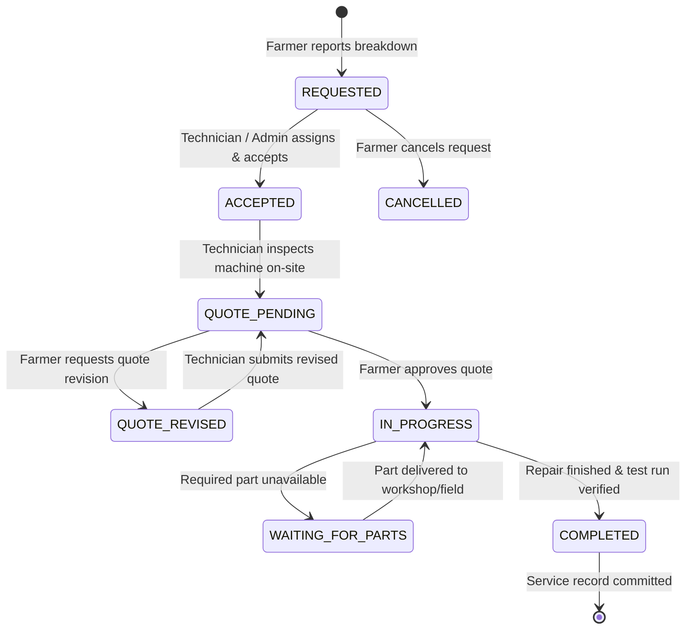

# TerraByte — Technical Requirements Document (TRD)

## 1. Project Overview

TerraByte is a specialized digital agricultural equipment repair ecosystem designed to coordinate the complete journey from machinery breakdown to verified repair and back into the field.

- **Core Problem**: In rural agriculture, machinery breakdown (tractors, harvesters, power tillers, irrigation pumps) causes devastating field downtime during narrow seasonal sowing and harvest windows. The conventional repair process is severely fragmented across unvetted mechanics, lack of diagnostic clarity, opaque parts pricing, and zero permanent service documentation.
- **Core Outcome**: **REDUCE THE TIME BETWEEN EQUIPMENT BREAKDOWN AND GETTING BACK TO WORK.**
- **Product Positioning**: TerraByte is **not** a generic mechanic marketplace. It is an end-to-end repair coordination operating system linking farmers, certified technicians, and central service centres. It coordinates structured intake, assistive diagnostic assessment, qualified technician assignment, transparent quotation with mandatory farmer authorization, live repair tracking with parts blocker visibility, and permanent equipment service history.

---

## 2. Technical Goals

1. **Deterministic Repair Coordination**: Enforce deterministic status transitions across the multi-actor repair lifecycle between Farmers, Field Technicians, and Service Centre Dispatchers.
2. **Asset-Bound Service Records**: Permanently attach verified service logs to equipment assets (by chassis/serial identifier), creating an immutable maintenance ledger that preserves resale value and aids recurring diagnostics.
3. **Role-Based Access & Security**: Enforce strict least-privilege data access via PostgreSQL Row Level Security (RLS) driven by native Supabase Auth identities.
4. **Transparent Quotation Gate**: Require explicit farmer authorization of itemized quotes before billable repair work begins, eliminating surprise billing.
5. **Downtime & Blocker Transparency**: Provide instant, proactive visibility when repairs are held up by spare parts procurement (`WAITING_FOR_PARTS`), providing revised completion ETAs.
6. **Assistive AI Diagnostic Intake**: Translate farmer symptoms, audio descriptions, and photos into preliminary diagnostic hypotheses and required parts categories, clearly bounded as assistive guidance rather than an infallible diagnosis.
7. **Rural Network Resilience**: Support low-connectivity rural environments through client-side offline draft persistence, downscaled photo uploads, and clear connectivity status indicators.
8. **Maintainable Modern Architecture**: TanStack Start SSR + React 19 SPA hybrid backed by Supabase cloud infrastructure without unnecessary framework sprawl.

---

## 3. Technology Stack & Implementation Status

| Layer | Technology | Status | Implementation Details |
| :--- | :--- | :--- | :--- |
| **Frontend Framework** | TanStack Start v1 / React 19 | **Implemented** | Modern React SSR-ready framework with Vite 8 bundler |
| **Routing** | TanStack Router v1 | **Implemented** | 14 client/server routes with type-safe route trees and guards |
| **Language & Typings** | TypeScript 5 | **Implemented** | Strict typing across components, stores, and Supabase client |
| **Styling & Design System** | Tailwind CSS 4 | **Implemented** | High-contrast palette (`soil`, `primary`, `accent`, `warning`) |
| **UI Components** | Radix UI + Lucide React | **Implemented** | Accessible headless primitives and agricultural iconography |
| **State & Cache Management**| TanStack Query v5 + Local Store | **Hybrid** | Local store (`tb-store.ts`) for business demo; Query ready for live data |
| **Authentication** | Supabase Auth (Native) | **Implemented** | Email/Password, auto-restored sessions, database trigger profile creation |
| **Identity Database** | Supabase (PostgreSQL 17) | **Implemented** | `profiles`, `technician_profiles`, `app_role` enum, RLS policies |
| **Domain Database** | Supabase (PostgreSQL 17) | **Planned (Phase 2)** | `equipment`, `repairs`, `quotes`, `quote_parts`, `service_records` |
| **Object Storage** | Supabase Storage | **Planned (Phase 2)** | Buckets for equipment media, breakdown evidence, repair completion photos |
| **AI / Diagnostic Engine** | Deterministic Rules / Gemini | **Hybrid** | Local rules engine active; Google Gemini API integration planned (Phase 8) |
| **Model Context Protocol** | `@lovable.dev/mcp-js` | **Implemented** | MCP server at `/mcp` exposing symptoms, assessment, and matching tools |
| **Hosting & Deployment** | Cloudflare Workers / Vercel | **Planned (Phase 9)** | Production deployment with automated CI/CD build gates |

---

## 4. Functional Requirements

### 4.1 Authentication & Authorization Strategy (Supabase Auth ONLY)

TerraByte strictly adheres to a native Supabase Auth architecture:

- **Identity Provider**: Supabase Auth manages user registration, email verification, session tokens, and password authentication.
- **Strict Role Model**: Application roles are defined by the PostgreSQL enum `public.app_role`:
  - `'farmer'`: Agricultural machinery owners.
  - `'technician'`: Certified field and workshop mechanics.
  - `'service_centre'`: Central operations coordinators and administrators.
- **Tamper-Proof Role Assignment**:
  1. **Farmer (Public Onboarding)**: Standard signup at `/register/farmer`. Passes metadata `{ role: 'farmer', full_name, village, phone }`. A PostgreSQL database trigger (`on_auth_user_created`) inserts a row into `public.profiles` with `role = 'farmer'` and `is_verified = true`. Farmer enters `/farmer` immediately.
  2. **Technician (Application Gate)**: Public registration at `/register/technician`. Passes metadata `{ role: 'technician', full_name, workshop, village, phone }`. The database trigger provisions `public.profiles` with `role = 'technician'`, `is_verified = false`, and creates an entry in `public.technician_profiles`. Unverified technicians are redirected to `/technician/pending` and **blocked from viewing or accepting jobs until verified by a Service Centre Administrator**.
  3. **Service Centre (Administrator Provisioning Only)**: Zero public registration exists for `service_centre`. Accounts are provisioned exclusively by administrative administrators.
  4. **Privilege Guard Trigger**: The PostgreSQL trigger `guard_profile_privileges` raises an exception if any client request attempts to modify `role` or `is_verified` unless the user possesses the `service_centre` role.
- **Session Restoration & Route Protection**: `useAuth()` in [`src/lib/auth.ts`](file:///d:/Projects/TerraByte/src/lib/auth.ts) and `RoleGuard` in [`src/components/tb.tsx`](file:///d:/Projects/TerraByte/src/components/tb.tsx) protect workspace routes. Unauthenticated sessions redirect to `/login`.

### 4.2 Farmer Requirements

- **F-REQ-01 (Machinery Fleet Management)**: Farmer can register and monitor tractors, harvesters, power tillers, pumps, and sprayers with make, model, year, serial/chassis number, and operational status.
- **F-REQ-02 (Rapid Breakdown Intake)**: 2-minute breakdown reporting flow: machine selection, symptom chips, optional voice description via Web Speech API, and photo capture.
- **F-REQ-03 (Diagnostic Summary)**: Displays preliminary affected system, severity rating, and suggested parts categories alongside explicit maintenance advice.
- **F-REQ-04 (Technician Matching)**: Displays ranked technicians matched on brand experience, problem expertise, availability, and ETA.
- **F-REQ-05 (Quote Review & Approval)**: Explicit itemized quote review (parts list, labour, taxes, warranty, ETA). Work cannot begin without approval.
- **F-REQ-06 (Live Repair Stepper)**: Real-time visual progress across the 7 repair stages.
- **F-REQ-07 (Parts Blocker Visibility)**: Prominently alerts farmers when a repair is waiting on spare parts, detailing part name, procurement reason, and revised completion time.
- **F-REQ-08 (Direct Communication)**: 1-tap phone dialer button to contact the assigned technician.
- **F-REQ-09 (Permanent Service History)**: Machine-bound logbook detailing past repairs, replacing parts, invoices, and cumulative downtime hours.

### 4.3 Field Technician Requirements

- **T-REQ-01 (Job Intake Feed)**: View assigned incoming repair requests with breakdown location, machine details, symptoms, and assistive assessment summary.
- **T-REQ-02 (Accept / Decline)**: Accept assignments (setting initial arrival ETA) or decline with a reason to return the ticket to the triage queue.
- **T-REQ-03 (On-Site Job Workbench)**: Access farmer contact details, field location, and issue notes.
- **T-REQ-04 (Itemized Quote Formulator)**: Formulate quotes with line-item parts (name, specification, quantity, unit price, distributor source), labour description/charge, and expected completion time.
- **T-REQ-05 (Parts Hold Mechanism)**: Place a job in `WAITING_FOR_PARTS` status by specifying the missing part, procurement vendor/delay reason, and revised delivery schedule.
- **T-REQ-06 (Testing Run & Sign-Off)**: Advance repair to `IN_PROGRESS (Testing)` upon mechanical fix, perform field test run, record final completion notes/photos, and mark job as `COMPLETED`.
- **T-REQ-07 (Technician Profile Management)**: Maintain workshop name, brands serviced, technical skills, and live availability status.

### 4.4 Service Centre / Admin Requirements

- **A-REQ-01 (Operations Dispatch Board)**: Central overview of active repairs across the district, highlighting unassigned breakdowns, active repairs, and stalled jobs.
- **A-REQ-02 (Triage & Manual Assignment)**: Inspect new breakdown tickets and assign them to optimal technicians based on brand/skill match scoring.
- **A-REQ-03 (Parts Procurement Oversight)**: Track jobs on `WAITING_FOR_PARTS` hold, assisting rural workshops with taluka/district distributor fulfillment.
- **A-REQ-04 (Technician Verification Portal)**: Review registered technician workshop credentials, contact details, and approve (`is_verified = true`) or revoke account access.
- **A-REQ-05 (Fleet Management & Audit)**: Maintain registry of regional farm equipment and review historical service records.

---

## 5. Domain Logic & Engineering Rules

### 5.1 The 7-Step Repair Lifecycle

All repair tickets transition through a strictly enforced state machine:

| Step | State (`repair_status`) | Action Trigger / Actor | Semantic Farmer Visibility |
| :---: | :--- | :--- | :--- |
| **1a** | `REQUESTED` (`technician_id == null`) | Farmer logs breakdown report | **Action Needed** · *"Send request to technician"* |
| **1b** | `REQUESTED` (request dispatched) | Farmer submits tech request | **Active Repair** · *"Finding Your Technician"* |
| **2** | `ACCEPTED` | Technician accepts ticket | **Active Repair** · *"Technician Assigned"* |
| **3** | `QUOTE_PENDING` | Technician compiles quote | **Action Needed** · *"Quote Ready"* |
| **4** | `QUOTE_REVISED` | Farmer requests revision | **Action Needed** · *"Revised Quote"* |
| **5** | `IN_PROGRESS` | Farmer approves quote | **Active Repair** · *"Repair in Progress"* |
| **--**| `WAITING_FOR_PARTS` | Technician logs missing part delay | **Paused** · *"Waiting for Parts"* |
| **6** | `IN_PROGRESS (Testing)` | Technician verifies fix under load | **Active Repair** · *"Testing Your Machine"* |
| **7** | `COMPLETED` | Technician signs off; Farmer verifies | **Service History** · *"Repaired & Verified"* |

> [!IMPORTANT]
> **Lifecycle Semantic Guardrail**: The UI must NEVER falsely display *"Finding Your Technician"* until the farmer has actually initiated the technician request. A newly reported breakdown (`status = 'REQUESTED'`, `technician_id = null`) is an **Action Needed** state requiring farmer technician selection/dispatch.

### 5.2 Preliminary Diagnostic Assessment vs. Confirmed Diagnosis Boundary

TerraByte enforces an essential ethical and legal boundary:
- **Assistive, Preliminary Assessment**: Output produced by the diagnostic engine is explicitly designated as **assistive guidance** (`source: "demo-rules"` or `"gemini-ai"`). It helps non-technical farmers describe symptoms and helps dispatchers identify candidate parts and technician skills.
- **Confirmed Diagnosis**: Only a qualified technician inspecting the machine on site can establish a confirmed diagnosis and issue a binding quotation. The UI must always state: *"This is an assistive preliminary assessment, not a confirmed diagnosis. The technician will inspect and confirm the cause on site."*

### 5.3 Technician Matching Scoring Algorithm

Matching is calculated based on four objective dimensions:
$$\text{Score} = S_{\text{brand}} + S_{\text{skill}} + S_{\text{avail}} + S_{\text{distance}}$$
Where:
- $S_{\text{brand}} = 40$ points if technician specializes in the equipment brand (`make`).
- $S_{\text{skill}} = 30$ points if technician possesses expertise in the affected system.
- $S_{\text{avail}} = 20$ points if technician is currently marked available.
- $S_{\text{distance}} = \max\left(0, 10 - \frac{\text{ETA in minutes}}{10}\right)$ points based on travel time.

### 5.4 Planned Demo Login Improvement (Future Minor Feature)

To streamline hackathon and evaluator testing:
- **Buttons**: `[ Farmer Demo ]`, `[ Technician Demo ]`, `[ Service Centre Demo ]`.
- **Behavior**: Clicking a button injects the pre-configured credentials into the email and password fields on `/login` and immediately submits the form through standard `supabase.auth.signInWithPassword()`.
- **Constraint**: Must use real, active Supabase accounts; zero mocking or bypass of authentication tokens.

### 5.5 Data Scoping, Persisted State & Performance Architecture

TerraByte enforces rigorous data boundary isolation and presentation integrity between personas and storage tiers:
- **Authenticated Identity Scoping**: All farmer-facing business data (equipment, active repair requests, service records, itemized quotes) must be queried strictly scoped to the authenticated user's `profile.id` resolved from `auth.uid()`. Endpoints and UI hooks must never query unscoped equipment or fallback to arbitrary hardcoded demo IDs (`f1`).
- **Database as Sole Source of Truth**: The live Supabase PostgreSQL database is the definitive source of truth for all business operations, tickets, and user assets. Client-side mock state (`tb-store.ts`) must never overwrite, intercept, or substitute for live farmer database queries, nor may mock data be used as a shortcut for perceived performance.
- **Explicit Demo Identity Handling**:
  - The system enforces a strict, explicit distinction between canonical demo evaluation personas and real registered users.
  - The `"DEMO DATA"` badge (`DemoTag`) and the Reset Demo capability (`public.reset_demo_data()`) are restricted strictly to the 5 designated demo accounts: `farmer.nagpur@terrabyte.demo`, `farmer2.nagpur@terrabyte.demo`, `farmer3.nagpur@terrabyte.demo`, `tech.nagpur@terrabyte.demo`, and `admin.nagpur@terrabyte.demo`.
  - Real user accounts (such as `Ankit Chamke`) are never classified as demo accounts, never render `"DEMO DATA"` badges, and are protected from demo reset operations.
- **Performance Principle: Independent Data Must Not Block Rendering**:
  - Independent domain data (equipment fleet vs active repairs vs notifications) must load concurrently and render progressively.
  - Startup authentication waterfall is minimized through in-flight promise deduplication on `loadProfile()`, preventing redundant initial profile network calls.
  - Queries are optimized at the PostgreSQL level: `getFarmerRepairRequests` accepts `{ activeOnly: true }` to filter out completed/cancelled rows via `.not("status", "in", '("COMPLETED","CANCELLED")')`, eliminating 90% of data transfer for experienced farmers with extensive service histories.
  - Secondary or background operations (such as notification fetching or service history audits) must never block primary page usability.
- **Persisted Repair State Determines Presentation**:
  - The farmer home page strictly prioritizes genuinely active repairs and genuine pending farmer actions (`QUOTE_PENDING`, `QUOTE_REVISED`, and unassigned requested tickets).
  - Completed, verified repairs whose handover has been confirmed and committed to `service_history` are historical records. They belong in permanent equipment service history and machine logbooks, not in the active workspace or action-needed stack.
- **Demo Reset Isolation**: Reset operations (`public.reset_demo_data()`) are restricted via dual-key authorization to designated evaluation accounts, leaving registered real users and their associated records untouched.

---

## 6. Target Regional Context (Nagpur, Maharashtra)

All seed data, demonstrations, and crop calendars are anchored in the agricultural heartland of **Nagpur District, Maharashtra (Vidarbha region)**:
- **Key Agrarian Hubs**: Katol (citrus & orange belt, power tiller farming), Saoner (cotton & soybean processing and heavy tractor aggregation), Umred (chili, pulses, and paddy mechanization).
- **Core Equipment Models**: Mahindra 575 DI, Swaraj 744 FE, Mahindra Yuvo 575, VST Shakti 130 DI power tiller, John Deere W70 combine harvester, Kirloskar 5HP agricultural pumpsets.
- **Language & Cultural Context**: Professional English primary UI with Marathi regional terminology ("Namaskar", taluka parts distributors, Vidarbha mandi harvest seasons).
