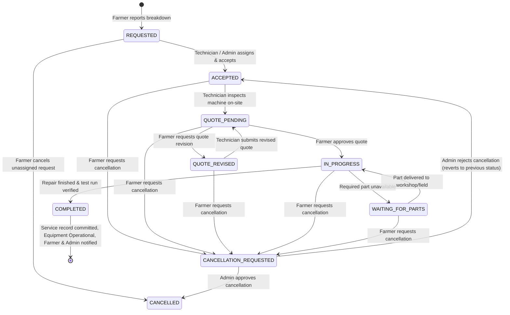

# TerraByte — Technical Requirements Document (TRD)

## 1. Project Overview

TerraByte is a specialized digital agricultural equipment repair ecosystem designed to coordinate the complete journey from machinery breakdown to verified repair and back into the field.

- **Core Problem**: In rural agriculture, machinery breakdown (tractors, harvesters, power tillers, irrigation pumps) causes devastating field downtime during narrow seasonal sowing and harvest windows. The conventional repair process is severely fragmented across unvetted mechanics, lack of diagnostic clarity, opaque parts pricing, and zero permanent service documentation.
- **Core Outcome**: **REDUCE THE TIME BETWEEN EQUIPMENT BREAKDOWN AND GETTING BACK TO WORK.**
- **Product Positioning**: TerraByte is **not** a generic mechanic marketplace. It is an end-to-end repair coordination operating system linking farmers, certified technicians, and central service centres. It coordinates structured intake, assistive diagnostic assessment, qualified technician assignment, transparent quotation with mandatory farmer authorization, live repair tracking with parts blocker visibility, and permanent equipment service history.

---

## 2. Technical Goals

1. **Deterministic Repair Coordination**: Enforce deterministic status transitions across the multi-actor repair lifecycle between Farmers, Field Technicians, and Service Centre Dispatchers.
2. **Asset-Bound Service Records**: Permanently attach verified service logs to equipment assets (by chassis/serial identifier), creating an immutable maintenance ledger that preserves resale value and aids recurring diagnostics.
3. **Role-Based Access & Security**: Enforce strict least-privilege data access via PostgreSQL Row Level Security (RLS) driven by native Supabase Auth identities.
4. **Transparent Quotation Gate**: Require explicit farmer authorization of itemized quotes before billable repair work begins, eliminating surprise billing.
5. **Downtime & Blocker Transparency**: Provide instant, proactive visibility when repairs are held up by spare parts procurement (`WAITING_FOR_PARTS`), providing revised completion ETAs.
6. **Assistive AI Diagnostic Intake**: Translate farmer symptoms, audio descriptions, and photos into preliminary diagnostic hypotheses and required parts categories, clearly bounded as assistive guidance rather than an infallible diagnosis.
7. **Rural Network Resilience**: Support low-connectivity rural environments through client-side offline draft persistence, downscaled photo uploads, and clear connectivity status indicators.
8. **Maintainable Modern Architecture**: TanStack Start SSR + React 19 SPA hybrid backed by Supabase cloud infrastructure without unnecessary framework sprawl.

---

## 3. Technology Stack & Implementation Status

| Layer | Technology | Status | Implementation Details |
| :--- | :--- | :--- | :--- |
| **Frontend Framework** | TanStack Start v1 / React 19 | **Implemented** | Modern React SSR-ready framework with Vite 8 bundler |
| **Routing** | TanStack Router v1 | **Implemented** | Type-safe route trees, dynamic segments, search params, and role-based guards |
| **Language & Typings** | TypeScript 5 | **Implemented** | Strict typing across components, service layer, and Supabase client |
| **Styling & Design System** | Tailwind CSS 4 | **Implemented** | High-contrast agricultural palette (`soil`, `primary`, `accent`, `warning`) |
| **UI Components** | Radix UI + Lucide React | **Implemented** | Accessible headless primitives and agricultural iconography |
| **State & Cache Management**| TanStack Query v5 + React Hooks | **Implemented** | Cache invalidation, query deduplication, and optimistic feedback |
| **Authentication** | Supabase Auth (Native) | **Implemented** | Email/Password, session restoration, role redirects, unverified tech gate |
| **Database & Schema** | Supabase (PostgreSQL 17) | **Implemented** | 11 relational tables, transactional RPCs, triggers, and comprehensive RLS |
| **Realtime Synchronization**| Supabase Realtime (WebSocket) | **Implemented** | Scoped `postgres_changes` subscriptions with 300ms client debouncing |
| **Object Storage** | Supabase Storage | **Implemented** | Storage URLs for equipment media, breakdown evidence, and completion photos |
| **Assistive Diagnostic Engine**| Deterministic Rules & Keywords | **Implemented** | Symptom assessment, urgency classification, and parts category recommendations |
| **Model Context Protocol** | `@lovable.dev/mcp-js` | **Implemented** | MCP server at `/mcp` exposing diagnostic and matching tools |
| **Hosting & Deployment** | Nitro / Cloudflare Workers | **Implemented** | SSR build preset (`cloudflare-module` compatible) via `vite build` |

---

## 4. Functional Requirements

### 4.1 Authentication & Authorization Strategy (Supabase Auth ONLY)

TerraByte strictly adheres to a native Supabase Auth architecture:

- **Identity Provider**: Supabase Auth manages user registration, email verification, session tokens, and password authentication.
- **Strict Role Model**: Application roles are defined by the PostgreSQL enum `public.app_role`:
  - `'farmer'`: Agricultural machinery owners.
  - `'technician'`: Certified field and workshop mechanics.
  - `'service_centre'`: Central operations coordinators and administrators.
- **Tamper-Proof Role Assignment**:
  1. **Farmer (Public Onboarding)**: Standard signup at `/register/farmer`. Passes metadata `{ role: 'farmer', full_name, village, phone }`. A PostgreSQL database trigger (`on_auth_user_created`) inserts a row into `public.profiles` with `role = 'farmer'` and `is_verified = true`. Farmer enters `/farmer` immediately.
  2. **Technician (Application Gate)**: Public registration at `/register/technician`. Passes metadata `{ role: 'technician', full_name, workshop, village, phone }`. The database trigger provisions `public.profiles` with `role = 'technician'`, `is_verified = false`, and creates an entry in `public.technician_profiles`. Unverified technicians are redirected to `/technician/pending` and **blocked from viewing or accepting jobs until verified by a Service Centre Administrator**.
  3. **Service Centre (Administrator Provisioning Only)**: Zero public registration exists for `service_centre`. Accounts are provisioned exclusively by administrative administrators.
  4. **Privilege Guard Trigger**: The PostgreSQL trigger `guard_profile_privileges` raises an exception if any client request attempts to modify `role` or `is_verified` unless the user possesses the `service_centre` role.
- **Session Restoration & Route Protection**: `useAuth()` in [`src/lib/auth.ts`](file:///d:/Projects/TerraByte/src/lib/auth.ts) and `RoleGuard` in [`src/components/tb.tsx`](file:///d:/Projects/TerraByte/src/components/tb.tsx) protect workspace routes. Unauthenticated sessions redirect to `/login`.

### 4.2 Farmer Requirements

- **F-REQ-01 (Machinery Fleet Management)**: Farmer can register and monitor tractors, harvesters, power tillers, pumps, and sprayers with make, model, year, serial/chassis number, and operational status.
- **F-REQ-02 (Rapid Breakdown Intake)**: 2-minute breakdown reporting flow: machine selection, symptom chips, optional voice description via Web Speech API, and photo capture.
- **F-REQ-03 (Diagnostic Summary)**: Displays preliminary affected system, severity rating, and suggested parts categories alongside explicit maintenance advice.
- **F-REQ-04 (Technician Matching)**: Displays ranked technicians matched on brand experience, problem expertise, availability, and ETA.
- **F-REQ-05 (Quote Review & Approval)**: Explicit itemized quote review (parts list, labour, taxes, warranty, ETA). Work cannot begin without approval.
- **F-REQ-06 (Live Repair Stepper)**: Real-time visual progress across the 7 repair stages.
- **F-REQ-07 (Parts Blocker Visibility)**: Prominently alerts farmers when a repair is waiting on spare parts, detailing part name, procurement reason, and revised completion time.
- **F-REQ-08 (Direct Communication)**: 1-tap phone dialer button to contact the assigned technician.
- **F-REQ-09 (Permanent Service History)**: Machine-bound logbook detailing past repairs, replacing parts, invoices, and cumulative downtime hours.

### 4.3 Field Technician Requirements

- **T-REQ-01 (Job Intake Feed)**: View assigned incoming repair requests with breakdown location, machine details, symptoms, and assistive assessment summary.
- **T-REQ-02 (Accept / Decline)**: Accept assignments (setting initial arrival ETA) or decline with a reason to return the ticket to the triage queue.
- **T-REQ-03 (On-Site Job Workbench)**: Access farmer contact details, field location, and issue notes.
- **T-REQ-04 (Itemized Quote Formulator)**: Formulate quotes with line-item parts (name, specification, quantity, unit price, distributor source), labour description/charge, and expected completion time.
- **T-REQ-05 (Parts Hold Mechanism)**: Place a job in `WAITING_FOR_PARTS` status by specifying the missing part, procurement vendor/delay reason, and revised delivery schedule.
- **T-REQ-06 (Testing Run & Sign-Off)**: Advance repair to `IN_PROGRESS (Testing)` upon mechanical fix, perform field test run under operational load, record final completion notes, and execute "Complete & sign off", auto-generating permanent service record, restoring equipment to Operational, and notifying farmer and Service Centre.
- **T-REQ-07 (Technician Profile Management)**: Maintain workshop name, brands serviced, technical skills, and live availability status.

### 4.4 Service Centre / Admin Requirements

- **A-REQ-01 (Operations Dispatch Board)**: Central overview of repair pipeline across the district, highlighting active repairs, exceptions, with dedicated Completed and Cancelled tabs isolating closed records from active operational triage.
- **A-REQ-02 (Triage & Manual Assignment)**: Inspect new breakdown tickets and assign them to optimal technicians based on brand/skill match scoring; suppress reassignment when repairs are closed.
- **A-REQ-03 (Parts Procurement Oversight)**: Track jobs on `WAITING_FOR_PARTS` hold, assisting rural workshops with taluka/district distributor fulfillment.
- **A-REQ-04 (Technician Verification Portal)**: Review registered technician workshop credentials, contact details, and approve (`is_verified = true`) or revoke account access.
- **A-REQ-05 (Fleet Management & Audit)**: Maintain registry of regional farm equipment and review historical service records.

---

## 5. Domain Logic & Engineering Rules

### 5.1 The 7-Step Repair Lifecycle

All repair tickets transition through a strictly enforced state machine:

| Step | State (`repair_status`) | Action Trigger / Actor | Semantic Farmer Visibility |
| :---: | :--- | :--- | :--- |
| **1a** | `REQUESTED` (`technician_id == null`) | Farmer logs breakdown report | **Action Needed** · *"Send request to technician"* |
| **1b** | `REQUESTED` (request dispatched) | Farmer submits tech request | **Active Repair** · *"Finding Your Technician"* |
| **2** | `ACCEPTED` | Technician accepts ticket | **Active Repair** · *"Technician Assigned"* |
| **3** | `QUOTE_PENDING` | Technician compiles quote | **Action Needed** · *"Quote Ready"* |
| **4** | `QUOTE_REVISED` | Farmer requests revision | **Action Needed** · *"Revised Quote Ready"* |
| **5** | `IN_PROGRESS` | Farmer approves quote | **Active Repair** · *"Repair in Progress"* |
| **--**| `WAITING_FOR_PARTS` | Technician logs missing part delay | **Paused** · *"Waiting for Parts"* |
| **6** | `IN_PROGRESS (Testing)` | Technician verifies fix under load | **Active Repair** · *"Testing in Progress"* |
| **7** | `COMPLETED` | Technician completes & signs off | **Service History** · *"Repair Complete & Saved to Service History"* |
| **--**| `CANCELLATION_REQUESTED` | Farmer submits cancellation on assigned ticket | **Under Review** · *"Cancellation Pending Review"* |
| **--**| `CANCELLED` | Immediate (if unassigned) or Admin approved | **Closed** · *"Repair Cancelled"* |

> [!IMPORTANT]
> **Lifecycle Semantic Guardrail**: The UI must NEVER falsely display *"Finding Your Technician"* until the farmer has actually initiated the technician request. A newly reported breakdown (`status = 'REQUESTED'`, `technician_id = null`) is an **Action Needed** state requiring farmer technician selection/dispatch. Assigned or in-progress tickets cannot be directly cancelled by the farmer; they transition to `CANCELLATION_REQUESTED` for Service Centre administrative approval.

### 5.2 Preliminary Diagnostic Assessment vs. Confirmed Diagnosis Boundary

TerraByte enforces an essential ethical and legal boundary:
- **Assistive, Preliminary Assessment**: Output produced by the diagnostic engine is explicitly designated as **assistive guidance** (`source: "demo-rules"` or `"gemini-ai"`). It helps non-technical farmers describe symptoms and helps dispatchers identify candidate parts and technician skills.
- **Confirmed Diagnosis**: Only a qualified technician inspecting the machine on site can establish a confirmed diagnosis and issue a binding quotation. The UI must always state: *"This is an assistive preliminary assessment, not a confirmed diagnosis. The technician will inspect and confirm the cause on site."*

### 5.3 Technician Matching Scoring Algorithm

Matching is calculated based on four objective dimensions:
$$\text{Score} = S_{\text{brand}} + S_{\text{skill}} + S_{\text{avail}} + S_{\text{distance}}$$
Where:
- $S_{\text{brand}} = 40$ points if technician specializes in the equipment brand (`make`).
- $S_{\text{skill}} = 30$ points if technician possesses expertise in the affected system.
- $S_{\text{avail}} = 20$ points if technician is currently marked available.
- $S_{\text{distance}} = \max\left(0, 10 - \frac{\text{ETA in minutes}}{10}\right)$ points based on travel time.

### 5.4 Planned Demo Login Improvement (Future Minor Feature)

To streamline hackathon and evaluator testing:
- **Buttons**: `[ Farmer Demo ]`, `[ Technician Demo ]`, `[ Service Centre Demo ]`.
- **Behavior**: Clicking a button injects the pre-configured credentials into the email and password fields on `/login` and immediately submits the form through standard `supabase.auth.signInWithPassword()`.
- **Constraint**: Must use real, active Supabase accounts; zero mocking or bypass of authentication tokens.

### 5.5 Data Scoping, Persisted State & Performance Architecture

TerraByte enforces rigorous data boundary isolation and presentation integrity between personas and storage tiers:
- **Authenticated Identity Scoping**: All farmer-facing business data (equipment, active repair requests, service records, itemized quotes) must be queried strictly scoped to the authenticated user's `profile.id` resolved from `auth.uid()`. Endpoints and UI hooks must never query unscoped equipment or fallback to arbitrary hardcoded demo IDs (`f1`).
- **Database as Sole Source of Truth**: The live Supabase PostgreSQL database is the definitive source of truth for all business operations, tickets, and user assets. Client-side mock state (`tb-store.ts`) must never overwrite, intercept, or substitute for live farmer database queries, nor may mock data be used as a shortcut for perceived performance.
- **Explicit Demo Identity Handling**:
  - The system enforces a strict, explicit distinction between canonical demo evaluation personas and real registered users.
  - The `"DEMO DATA"` badge (`DemoTag`) and the Reset Demo capability (`public.reset_demo_data()`) are restricted strictly to the 5 designated demo accounts: `farmer.nagpur@terrabyte.demo`, `farmer2.nagpur@terrabyte.demo`, `farmer3.nagpur@terrabyte.demo`, `tech.nagpur@terrabyte.demo`, and `admin.nagpur@terrabyte.demo`.
  - Real user accounts (such as `Ankit Chamke`) are never classified as demo accounts, never render `"DEMO DATA"` badges, and are protected from demo reset operations.
- **Performance Principle: Independent Data Must Not Block Rendering**:
  - Independent domain data (equipment fleet vs active repairs vs notifications) must load concurrently and render progressively.
  - Startup authentication waterfall is minimized through in-flight promise deduplication on `loadProfile()`, preventing redundant initial profile network calls.
  - Queries are optimized at the PostgreSQL level: `getFarmerRepairRequests` accepts `{ activeOnly: true }` to filter out completed/cancelled rows via `.not("status", "in", '("COMPLETED","CANCELLED")')`, eliminating 90% of data transfer for experienced farmers with extensive service histories.
  - Secondary or background operations (such as notification fetching or service history audits) must never block primary page usability.
- **Persisted Repair State Determines Presentation**:
  - The farmer home page strictly prioritizes genuinely active repairs and genuine pending farmer actions (`QUOTE_PENDING`, `QUOTE_REVISED`, and unassigned requested tickets).
  - Completed, verified repairs whose handover has been confirmed and committed to `service_history` are historical records. They belong in permanent equipment service history and machine logbooks, not in the active workspace or action-needed stack.
- **Demo Reset Isolation**: Reset operations (`public.reset_demo_data()`) are restricted via dual-key authorization to designated evaluation accounts, leaving registered real users and their associated records untouched.

### 5.6 Notification Architecture & Product Communication Semantics

TerraByte implements a high-integrity, real-time notification and communication subsystem:
- **Supabase-Backed Persistence**: Notification state is stored exclusively in live PostgreSQL `public.notifications` rows, synchronized via Supabase Realtime websocket channels (`postgres_changes`) alongside a 15-second polling fallback. Alerts are never generated or stored in ephemeral local mock state.
- **Recipient-Scoped Identity & RLS Enforcement**: Every notification query resolves caller profile ID and role, filtering exclusively for target records (`recipient_user_id = profile.id OR (recipient_user_id IS NULL AND recipient_role = profile.role)`). PostgreSQL RLS strictly blocks any caller from reading or updating other users' private notifications.
- **Bounded History Ingestion & Safe Limiting**:
  - Initial and recurring notification queries enforce a strict 25-record history limit (`options.limit = 25`), ordered newest-first by `created_at DESC`.
  - Non-admin queries apply `.limit(25)` directly in SQL. Admin queries safely apply `.limit(Math.max(limit * 4, 100))` in SQL before operational chatter filtering, preventing unbounded database scans while guaranteeing actionable alert delivery.
  - Redundant query suppression: opening the notification bell suppresses duplicate fetches if an update succeeded within the preceding 5 seconds.
- **User-Switch State Isolation**: The Shell component (`src/components/tb.tsx`) enforces immediate state flushing on `userId` change or sign-out. Local notification arrays, unread counts, and popover state reset to zero before the next user's query executes, preventing any cross-user data leakage.
- **Completion Communication Aligned with Persisted Lifecycle**:
  - The repair completion mutation auto-commits equipment status to `Operational` and immediately writes an immutable record to `public.service_history`.
  - Copy across all roles aligns with this persisted reality:
    - Farmer detail: *"Repair Complete & Saved to Service History"*
    - Technician workbench: *"Repair completed and recorded in equipment service history"*
    - Admin command: *"Repair complete & saved to service history"*
    - Completion alert: *"Repair TB-xxxx has been completed and saved to service history."*
  - Contradictory claims of pending separate handover confirmation are eliminated from the user experience.
- **Role-Specific Notification Lifecycle Triggers**:
  - **Technician Verification Approval**: Admin approval on `/admin/technicians` issues an idempotent notification to the technician (*"Your technician account has been approved by the Service Centre. You can now accept repair jobs."*, deep-link `/technician`), granting access to the job workbench.
  - **Physical Repair Commencement**: When a technician starts physical disassembly or repair work (`startRepair()`), an idempotent notification is created for the farmer (*"Technician started repair work on TB-xxxx."*, deep-link `/farmer/repair/:id`).
  - **Technician Registration Dispatch**: When a new technician registers, database trigger `trg_notify_admin_on_technician_registration` generates an admin notification (*"New technician registration: <name> (<workshop>). Pending verification."*, deep-link `/admin/technicians`). Included in `isActionableServiceCentreNotification()` operational patterns.
- **Copy Standardization & Punctuation Integrity**:
  - All system notifications adhere to standard title/sentence casing, concise action-oriented tone, ticket identifier inclusion, and consistent trailing punctuation.
- **Notification Popover Visual Hierarchy & Taxonomy**:
  - Semantic categories (`Breakdown`, `Quote`, `Parts`, `Testing`, `Repair`, `Account`, `Assignment`, `Alert`, `Notice`) render with dedicated icons and color-coded badge pills.
  - Visual distinction between unread (background accent `bg-primary/[0.04]`, bold text, indicator dot with focus ring) and read (subdued text, clean background) items.
  - Actionable items provide an interactive "View details" chevron link with automatic role-appropriate route redirection.
- **Realtime Scope Boundary**:
  - Notification updates in Phase 5.3 operate strictly on the existing Supabase Realtime channel (`postgres_changes` on `public.notifications`) and 15-second background polling fallback.
  - Broader multi-user interactive realtime state synchronization across boards, active forms, and technician assignments is explicitly deferred to **Phase 7 (Realtime Sync & Production Hardening)**.

### 5.7 Governed Cancellation Approval Architecture (Phase 5.4)

TerraByte implements a dual-path repair cancellation governance workflow to prevent arbitrary abandonment of in-flight field repairs while preserving farmer autonomy for unassigned requests:

- **Unassigned Direct Cancellation**:
  - Breakdown tickets in `REQUESTED` status with no assigned technician (`technician_id IS NULL`) can be directly cancelled by the farmer to `CANCELLED`.
  - Immediate resolution prevents unnecessary administrative burden when a farmer self-resolves an issue prior to technician dispatch.
- **Assigned & Active Governed Cancellation**:
  - Once a ticket has been accepted by a technician or advanced (`ACCEPTED`, `QUOTE_PENDING`, `QUOTE_REVISED`, `IN_PROGRESS`, `WAITING_FOR_PARTS`), cancellation attempts transition the ticket to `CANCELLATION_REQUESTED`.
  - Direct transition to `CANCELLED` is blocked at the database RLS layer for farmers and technicians on assigned tickets.
- **Database Schema & Tracking Columns**:
  - Added `CANCELLATION_REQUESTED` to `public.repair_status` enum.
  - Extended `public.repair_requests` with six cancellation tracking columns:
    - `cancellation_reason text`: Standardized categorization code (e.g., `SELF_REPAIRED`, `DELAY`, `COST_CONCERN`, `ALTERNATE_ARRANGEMENT`, `EQUIPMENT_SOLD`).
    - `cancellation_note text`: Optional farmer freeform explanation.
    - `cancellation_requested_by uuid REFERENCES public.profiles(id)`: Identity of the requesting user.
    - `cancellation_requested_at timestamptz`: Request submission timestamp.
    - `cancellation_previous_status public.repair_status`: Snapshot of status prior to cancellation request, ensuring safe reversion upon admin rejection.
    - `cancellation_admin_response text`: Administrative review remarks, conditions, or rejection reason.
  - Created partial index `idx_repair_requests_cancellation_status` on `status = 'CANCELLATION_REQUESTED'`.
- **Database Security & RLS Policies**:
  - Four purpose-driven `UPDATE` policies on `public.repair_requests`:
    - **Admins**: Full operational update authority across all repair tickets and statuses.
    - **Farmers (Direct Cancellation)**: Strictly restricted by `USING (status = 'REQUESTED' AND technician_id IS NULL)` and `WITH CHECK (status = 'CANCELLED' AND technician_id IS NULL)`. The `USING` clause evaluates against the existing stored row (`OLD`), preventing clients from bypassing assignment guards.
    - **Farmers (Active Lifecycle & Cancellation Request)**: Allows advancing tickets (`QUOTE_REVISED`, `IN_PROGRESS`) and requesting governed cancellation (`CANCELLATION_REQUESTED`), while strictly prohibiting direct mutation to `CANCELLED` or `COMPLETED`, and locking tickets in `CANCELLATION_REQUESTED` against unauthorized edits.
    - **Technicians (Job Progress & Acceptance)**: Allows accepting unassigned tickets to `ACCEPTED`, updating diagnostic assessments, placing parts holds, resuming, and testing/completing repairs. Strictly prohibits setting `CANCELLED` or `CANCELLATION_REQUESTED`, and locks tickets while under administrative cancellation review.
- **Technician Work-Hold Semantics**:
  - While in `CANCELLATION_REQUESTED`, physical repair work and parts ordering are placed on hold. The technician workbench displays a work-hold banner with farmer cancellation rationale, suppressing diagnostic and repair mutation controls.
- **Administrative Review & Resolution**:
  - Service Centre review workbench on `/admin` enables operators to inspect reason, technician travel/disassembly status, and parts commitments.
  - **Approval**: Transitions ticket to `CANCELLED`, records response note, and notifies farmer and technician.
  - **Rejection**: Restores ticket to `cancellation_previous_status`, records admin explanation, and notifies farmer to resume workflow.
- **Canonical Demo Fixture Cleanliness & Baseline Preservation**:
  - `public.reset_demo_data()` resets all six cancellation tracking columns (`cancellation_reason = NULL`, etc.) alongside deterministic restoration of the four canonical demo repairs to their exact Phase 5.2 baseline statuses:
    - `TB-8841` $\rightarrow$ `WAITING_FOR_PARTS` (Balasaheb Patil, Mahindra 575 DI, parts hold)
    - `TB-8902` $\rightarrow$ `QUOTE_PENDING` (Suresh Jadhav, John Deere 5050 D, pending quote)
    - `TB-8898` $\rightarrow$ `REQUESTED` (Anil Pawar, Swaraj 744 FE, unassigned)
    - `TB-4489` $\rightarrow$ `QUOTE_REVISED` (Balasaheb Patil, VST Shakti 130 DI, revised quote)
  - Real user accounts (such as `Ankit Chamke`) remain strictly isolated and unaffected.
- **Service Layer & State Machine Implementation (Step 2)**:
  - `cancelRepairRequest(id, options)`: Strictly validates that farmers can only directly cancel unassigned `REQUESTED` tickets (`technician_id IS NULL`). Protects against accidental abandonment by throwing an informative redirection error for assigned or in-progress tickets. Automatically restores machinery to `Operational` if no other active repairs exist, and dispatches administrative alerts.
  - `requestCancellation(id, input)`: Allows farmers to request cancellation on active/assigned repairs (`ACCEPTED`, `QUOTE_PENDING`, `QUOTE_REVISED`, `IN_PROGRESS`, `WAITING_FOR_PARTS`, or assigned `REQUESTED`). Snapshots current status into `cancellation_previous_status`, records reason/note, transitions to `CANCELLATION_REQUESTED`, preserves equipment in `"In Repair"`, and notifies Service Centre admins. If invoked on an unassigned `REQUESTED` ticket, seamlessly delegates to immediate cancellation.
  - `approveCancellation(id, input)`: Admin-only operation transitioning `CANCELLATION_REQUESTED` $\rightarrow$ `CANCELLED`. Records administrative response, checks equipment integrity before setting status to `Operational`, and notifies both farmer and technician.
  - `rejectCancellation(id, input)`: Admin-only operation requiring explicit administrative justification. Reverts status to `cancellation_previous_status` (or `ACCEPTED`), maintains equipment in `"In Repair"`, and notifies both farmer and technician that work has resumed.
- **Farmer Cancellation Dialog & UI (Step 3)**:
  - `Farmer Repair Detail (src/routes/farmer/repair/$id.tsx)`: Replaced legacy browser `confirm()` with accessible Radix Dialog (`@/components/ui/dialog`). Includes keyboard focus trap, Esc dismissal, and form validation.
  - `Dynamic Action Routing`:
    - Unassigned `REQUESTED` (`technician_id IS NULL`): Displays bottom action `"Cancel request"`. Dialog informs farmer that cancellation is immediate. Requires structured reason from `CANCELLATION_REASONS` with optional context note. Submitting invokes `cancelRepairRequest()`, restores equipment to `Operational`, shows a success toast, and redirects to `/farmer`.
    - Assigned or Active (`ACCEPTED`, `QUOTE_PENDING`, `QUOTE_REVISED`, `IN_PROGRESS`, `WAITING_FOR_PARTS`, or assigned `REQUESTED`): Displays bottom action `"Request cancellation"`. Dialog explains that cancellation requires Service Centre review and pauses the repair. Requires structured reason with optional context note. Submitting invokes `requestCancellation()`, transitions status to `CANCELLATION_REQUESTED`, snapshots `cancellation_previous_status`, shows a success toast, and refreshes the ticket in-place.
  - `Holding Banner (CANCELLATION_REQUESTED)`: Renders prominent amber warning card under ticket header with clock icon, displaying submitted reason, note, timestamp, and hold explanation. Suppresses cancellation CTA.
  - `Closed Banner (CANCELLED)`: Renders muted closed card with `XCircle` icon displaying cancellation reason, farmer note, Service Centre resolution remarks, and link to machine record. Suppresses active actions like calling the technician.
  - `Progress Stepper Alignment`: Updated `stepIndex()` and `Stepper` in `src/components/tb.tsx` to handle `CANCELLATION_REQUESTED` using `cancellation_previous_status`, highlighting the active step with `"Cancellation Pending Review"` and a warning pulse while preserving prior progression history.
- **Admin Cancellation Review Workbench & Operations Filter (Step 4)**:
  - `Operations Dashboard (src/routes/admin/index.tsx)`:
    - Integrated `"Cancellation Requests"` into `FILTERS` array and filter predicate logic, enabling triage isolation of held repairs.
    - Added high-priority amber alert banner at the top of the dashboard whenever active `CANCELLATION_REQUESTED` repairs exist, presenting job number, farmer name, cancellation reason, elapsed time, and direct navigation links to the review card.
    - Updated operations table row rendering: displays amber pulse status dot, inline cancellation reason preview beneath the farmer's name, and a prominent `"Review"` action button directly routing to the review workbench.
  - `Admin Repair Detail (src/routes/admin/repair/$id.tsx)`:
    - Renders a prominent **Cancellation Review Card** when `status === "CANCELLATION_REQUESTED"` displaying ticket ID, farmer name, equipment details, previous status snapshot, cancellation reason, farmer context note, request timestamp, assigned technician, and work-hold status indicator.
    - Suppresses the generic bottom `"Cancel repair"` action button when a ticket is in `CANCELLATION_REQUESTED` to avoid conflicting paths.
    - **Approve Cancellation Dialog**: Radix Dialog explaining that approving sets the ticket to `CANCELLED`, notifies the farmer and assigned technician, and restores equipment to `Operational`. Allows optional administrative response remarks (`cancellation_admin_response`). Invokes `approveCancellation()`.
    - **Decline Cancellation Dialog**: Radix Dialog explaining that declining reverts the ticket to `cancellation_previous_status` and resumes repair work. Enforces mandatory administrative explanation (`adminResponse: string`). Invokes `rejectCancellation()`.
    - **Post-Resolution States**: Renders closed banner for `CANCELLED` tickets with administrative remarks; renders an informative resumption notice for tickets where cancellation was previously declined.
    - **Activity Log Mapping**: Extends activity timeline to record farmer cancellation requests, Service Centre approvals, and Service Centre rejections.
- **Technician Work-Hold UI & Cancellation Awareness (Step 5)**:
  - `Technician Dashboard (src/routes/technician/index.tsx)`:
    - Separates repairs in `CANCELLATION_REQUESTED` from standard active jobs to prevent unintended workflow progression.
    - Displays a dedicated `"On hold · Cancellation pending (N)"` section with amber visual styling, an animated warning pulse dot, cancellation reason preview, and clear notice that work is paused awaiting Service Centre review.
    - Displays a dedicated `"Cancelled (N)"` section with muted styling, providing technicians with full audit visibility of closed/cancelled jobs without cluttering active workbench queues.
  - `Technician Job Detail (src/routes/technician/job/$id.tsx)`:
    - **Work-Hold Banner (`CANCELLATION_REQUESTED`)**: Renders a prominent amber work-hold card under the job header detailing job number, farmer name, equipment model, cancellation reason, farmer context note, request timestamp, and previous status snapshot. Provides explicit operational guidance: *"The farmer has requested cancellation for this repair. All diagnostic and repair work is on hold pending review by the Service Centre. Please do not proceed with repairs, parts procurement, or testing until a decision is made."*
    - **Action Suppression**: Progression actions (quote formulation/revision, start repair, parts hold, testing, complete repair) are strictly suppressed while the ticket is under review.
    - **Read-Only Context Cards**: Preserves read-only quotation and parts-hold context cards so existing diagnostics and parts specifications remain visible to the technician without modification controls.
    - **Closed Banner (`CANCELLED`)**: Renders a muted closed status card displaying cancellation reason, farmer note, and administrative resolution remarks. Outbound calling action is suppressed on cancelled jobs.
    - **Resumption Notice**: When a cancellation request is declined by the Service Centre, displays an informative notice explaining that the request was declined with the administrator's justification, and restores the standard progression actions for the resumed status.
- **Communication & Quote Revision Foundation (Phase 5.5 Step 1)**:
  - **Repair Messages Table (`public.repair_messages`)**: Ticket-scoped communication entity capturing messages between farmers, technicians, and administrators directly tied to repair jobs.
    - Fields: `id` (uuid, primary key), `repair_request_id` (uuid, fk to `repair_requests` with cascading deletion), `sender_id` (uuid, fk to `profiles`), `recipient_id` (uuid, fk to `profiles`), `message_text` (text, non-empty check), `created_at` (timestamptz), and `is_read` (boolean, default false).
    - Composite Performance Index: `idx_repair_messages_ticket` on `(repair_request_id, created_at ASC)` ensuring fast chronology loading.
    - Partial Index for Unread Badges: `idx_repair_messages_unread` on `(recipient_id, is_read) WHERE is_read = false`.
  - **Hardened RLS Security Model**:
    - `SELECT`: Restricted to administrators and authorized ticket participants (the repair's farmer or assigned technician, or direct sender/recipient).
    - `INSERT`: Enforces strict caller identity anti-spoofing (`sender_id = public.current_profile_id()`) and mandates ticket participant or admin authorization.
    - `UPDATE`: Strictly restricted to message recipients updating read receipt status (`recipient_id = public.current_profile_id()`).
    - `DELETE`: Exclusively reserved for administrative moderation (`public.current_user_role() = 'admin'`).
  - **Canonical Quote v1 Fixture for `TB-4489`**:
    - Incorporated into `public.reset_demo_data()` with deterministic UUIDs: Quote ID `00000000-0000-0000-0030-000000004489`, status `'REVISED'`, version 1, labour ₹800, tax 0%, estimated completion `'Today, 6:00 PM'`, sent 4 hours ago.
    - Item 1 (`00000000-0000-0000-0031-000000000005`): Rotavator Oil Seal Kit (`VST 130DI-GS-22`), quantity 1, unit price ₹1,400.
    - Item 2 (`00000000-0000-0000-0031-000000000006`): EP-90 Gearbox Oil (`3.5L can`), quantity 1, unit price ₹600.
    - Total canonical quote value: ₹2,800. Fully idempotent upon reset; aligns with Balasaheb Patil's clarification note *"Can you finish by 3 PM instead of 6 PM?"*.

---

## 6. Target Regional Context (Nagpur, Maharashtra)

All seed data, demonstrations, and crop calendars are anchored in the agricultural heartland of **Nagpur District, Maharashtra (Vidarbha region)**:
- **Key Agrarian Hubs**: Katol (citrus & orange belt, power tiller farming), Saoner (cotton & soybean processing and heavy tractor aggregation), Umred (chili, pulses, and paddy mechanization).
- **Core Equipment Models**: Mahindra 575 DI, Swaraj 744 FE, Mahindra Yuvo 575, VST Shakti 130 DI power tiller, John Deere W70 combine harvester, Kirloskar 5HP agricultural pumpsets.
- **Language & Cultural Context**: Professional English primary UI with Marathi regional terminology ("Namaskar", taluka parts distributors, Vidarbha mandi harvest seasons).
